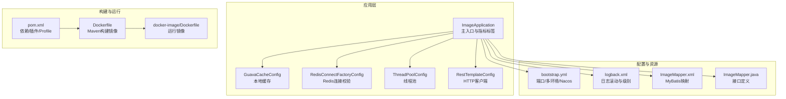
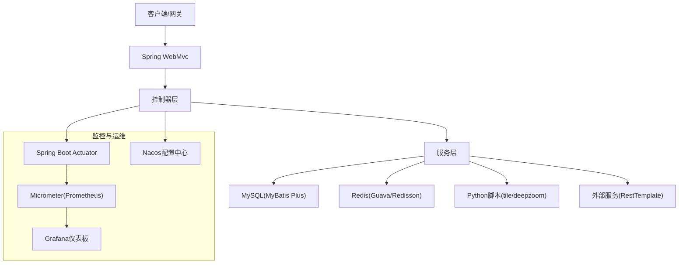
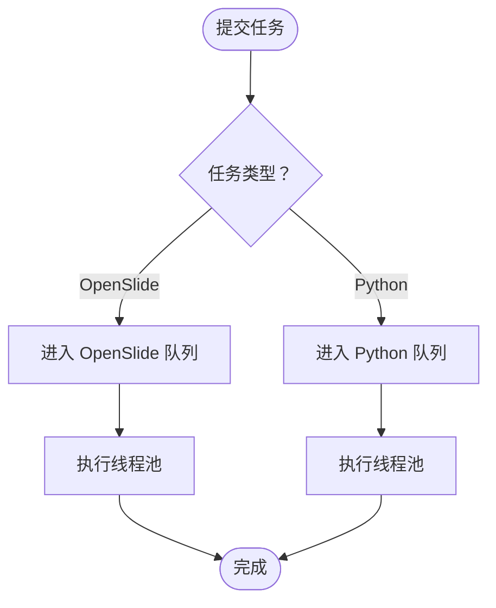
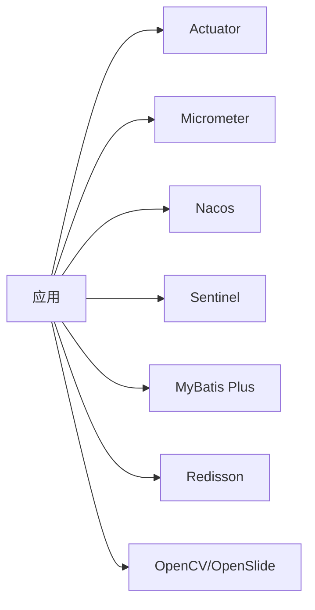

# 性能调优与监控

<cite>
**本文引用的文件**
- [ImageApplication.java](file://src/main/java/cn/staitech/ImageApplication.java)
- [bootstrap.yml](file://src/main/resources/bootstrap.yml)
- [pom.xml](file://pom.xml)
- [Dockerfile](file://Dockerfile)
- [GuavaCacheConfig.java](file://src/main/java/cn/staitech/file/config/GuavaCacheConfig.java)
- [RedisConnectFactoryConfig.java](file://src/main/java/cn/staitech/file/config/RedisConnectFactoryConfig.java)
- [ThreadPoolConfig.java](file://src/main/java/cn/staitech/file/config/ThreadPoolConfig.java)
- [RestTemplateConfig.java](file://src/main/java/cn/staitech/file/config/RestTemplateConfig.java)
- [logback.xml](file://src/main/resources/logback.xml)
- [ImageMapper.xml](file://src/main/resources/mapper/ImageMapper.xml)
- [ImageMapper.java](file://src/main/java/cn/staitech/file/mapper/ImageMapper.java)
- [docker-image/Dockerfile](file://docker/staitech/modules/image/Dockerfile)
</cite>

## 目录
1. [简介](#简介)
2. [项目结构](#项目结构)
3. [核心组件](#核心组件)
4. [架构总览](#架构总览)
5. [详细组件分析](#详细组件分析)
6. [依赖分析](#依赖分析)
7. [性能考虑](#性能考虑)
8. [故障排查指南](#故障排查指南)
9. [结论](#结论)
10. [附录](#附录)

## 简介
本指南围绕该 Java 图像处理服务的性能调优与监控展开，覆盖 JVM 参数调优、应用性能监控（Prometheus + Grafana）、数据库性能优化（索引与查询）、缓存性能优化（命中率与过期策略）、系统资源监控（CPU/内存/磁盘/网络），以及容量规划与扩容建议。文档结合现有代码与配置文件，给出可落地的优化策略与实施步骤。

## 项目结构
该项目为基于 Spring Boot 的微服务模块，负责图像处理与分块生成等任务，容器化部署并集成 Nacos 配置中心、Sentinel 流控、Actuator 监控、Micrometer Prometheus 指标导出等功能。

**图表来源**
- [ImageApplication.java:37-50](file://src/main/java/cn/staitech/ImageApplication.java#L37-L50)
- [GuavaCacheConfig.java:17-26](file://src/main/java/cn/staitech/file/config/GuavaCacheConfig.java#L17-L26)
- [RedisConnectFactoryConfig.java:11-24](file://src/main/java/cn/staitech/file/config/RedisConnectFactoryConfig.java#L11-L24)
- [ThreadPoolConfig.java:18-39](file://src/main/java/cn/staitech/file/config/ThreadPoolConfig.java#L18-L39)
- [RestTemplateConfig.java:24-48](file://src/main/java/cn/staitech/file/config/RestTemplateConfig.java#L24-L48)
- [bootstrap.yml:1-37](file://src/main/resources/bootstrap.yml#L1-L37)
- [logback.xml:1-116](file://src/main/resources/logback.xml#L1-L116)
- [ImageMapper.xml:1-65](file://src/main/resources/mapper/ImageMapper.xml#L1-L65)
- [ImageMapper.java:1-16](file://src/main/java/cn/staitech/file/mapper/ImageMapper.java#L1-L16)
- [pom.xml:1-385](file://pom.xml#L1-L385)
- [Dockerfile:1-16](file://Dockerfile#L1-L16)
- [docker-image/Dockerfile:1-46](file://docker/staitech/modules/image/Dockerfile#L1-L46)

**章节来源**
- [ImageApplication.java:37-50](file://src/main/java/cn/staitech/ImageApplication.java#L37-L50)
- [bootstrap.yml:1-37](file://src/main/resources/bootstrap.yml#L1-L37)
- [pom.xml:1-385](file://pom.xml#L1-L385)
- [Dockerfile:1-16](file://Dockerfile#L1-L16)
- [docker-image/Dockerfile:1-46](file://docker/staitech/modules/image/Dockerfile#L1-L46)

## 核心组件
- 应用主入口与指标标签：通过 Actuator 与 Micrometer 导出指标，统一 commonTags 标记应用名，便于 Prometheus 抓取与 Grafana 分类展示。
- 线程池：针对 OpenSlide 与 Python 脚本两类 CPU/IO 密集型任务分别配置独立线程池，避免相互干扰。
- 缓存：本地 Guava Cache 用于热点数据短时缓存；Redis 连接工厂开启连接校验，降低无效连接带来的开销。
- HTTP 客户端：RestTemplate 配置连接/读取超时与 JSON 转换器，保障外部调用稳定性。
- 日志：Logback 滚动策略与级别过滤，减少 IO 压力并保留关键错误信息。
- 数据访问：MyBatis Plus 接口 + XML 映射，便于 SQL 优化与慢查询定位。

**章节来源**
- [ImageApplication.java:47-50](file://src/main/java/cn/staitech/ImageApplication.java#L47-L50)
- [ThreadPoolConfig.java:18-64](file://src/main/java/cn/staitech/file/config/ThreadPoolConfig.java#L18-L64)
- [GuavaCacheConfig.java:19-25](file://src/main/java/cn/staitech/file/config/GuavaCacheConfig.java#L19-L25)
- [RedisConnectFactoryConfig.java:18-24](file://src/main/java/cn/staitech/file/config/RedisConnectFactoryConfig.java#L18-L24)
- [RestTemplateConfig.java:24-48](file://src/main/java/cn/staitech/file/config/RestTemplateConfig.java#L24-L48)
- [logback.xml:16-103](file://src/main/resources/logback.xml#L16-L103)
- [ImageMapper.xml:4-46](file://src/main/resources/mapper/ImageMapper.xml#L4-L46)

## 架构总览
应用采用“容器化 + 配置中心 + 指标导出”的监控体系，结合线程池隔离与缓存策略，支撑图像处理场景的高并发与低延迟需求。

**图表来源**
- [ImageApplication.java:37-50](file://src/main/java/cn/staitech/ImageApplication.java#L37-L50)
- [bootstrap.yml:18-34](file://src/main/resources/bootstrap.yml#L18-L34)
- [pom.xml:47-51](file://pom.xml#L47-L51)
- [pom.xml:192-194](file://pom.xml#L192-L194)

## 详细组件分析

### JVM 参数调优
- 时间区域与时区：已在主入口设置默认时区，避免时区相关异常与日志错位。
- 容器暴露端口：Dockerfile 中 EXPOSE 8080，需结合实际运行环境调整 JVM 运行参数与容器资源限制。
- 建议参数（示例性说明）
  - 堆内存：-Xms/-Xmx 设为物理内存的 60%-70%，避免频繁 GC。
  - 新生代比例：-XX:NewRatio 或 -XX:SurvivorRatio 控制新生代大小，平衡晋升压力。
  - GC 选择：优先 G1GC，设置 -XX:+UseG1GC；如存在大对象或长尾延迟敏感场景可评估 ZGC（JDK11+）。
  - GC 参数：-XX:MaxGCPauseMillis、-XX:G1HeapRegionSize、-XX:+G1MixedGCLiveThresholdPercent 等按压测结果迭代。
  - 元空间：-XX:MetaspaceSize、-XX:MaxMetaspaceSize，避免类元数据溢出。
  - 其他：-XX:+UseStringDeduplication（G1）、-XX:+ExitOnOutOfMemoryError、-XX:+PrintGC、-XX:+PrintGCDetails、-XX:+PrintGCTimeStamps。
- 容器资源：在 K8s 中设置 limits/requests，避免 OOM kill；结合 GC 日志与 Prometheus 指标观察堆使用趋势。

**章节来源**
- [ImageApplication.java:41-42](file://src/main/java/cn/staitech/ImageApplication.java#L41-L42)
- [Dockerfile:12-15](file://Dockerfile#L12-L15)
- [docker-image/Dockerfile:42-44](file://docker/staitech/modules/image/Dockerfile#L42-L44)

### 应用性能监控（Prometheus + Grafana）
- 指标导出：Actuator + Micrometer Prometheus 已引入依赖，应用启动后可通过 /actuator/prometheus 获取指标。
- 标签与命名：统一 commonTags 标记 application=staitech-image，便于 Grafana 多实例聚合与筛选。
- 建议指标维度
  - JVM：heap、non-heap、GC、线程数、类加载数。
  - 应用：请求 QPS/耗时、错误率、线程池队列长度、缓存命中率。
  - 数据库：连接池活跃/空闲/等待、SQL 执行耗时、慢查询计数。
  - 外部依赖：HTTP 调用耗时/错误、Python 脚本执行耗时。
- Grafana 面板建议
  - 后端：JVM 指标、应用指标、数据库指标。
  - 前端：接口 SLA、错误分布、缓存命中率趋势。
  - 告警：GC pause 超阈值、SQL 慢查询、线程池饱和、Redis 连接异常。

**章节来源**
- [ImageApplication.java:47-50](file://src/main/java/cn/staitech/ImageApplication.java#L47-L50)
- [pom.xml:47-51](file://pom.xml#L47-L51)
- [pom.xml:192-194](file://pom.xml#L192-L194)

### 数据库性能优化
- 索引优化
  - 基于实体字段与查询条件建立复合索引，如 image_code、topic_id、organization_id、create_time 等。
  - 使用 EXPLAIN 分析慢查询，避免全表扫描；对 LIKE '%xxx%' 场景考虑前缀索引或搜索引擎替代。
- 查询优化
  - MyBatis Plus 分页查询使用合理 page/size，避免一次性拉取大量数据。
  - 尽量使用 select 字段列表而非 SELECT *，减少网络与序列化开销。
  - 对高频统计查询建立物化视图或缓存中间表。
- 连接池调优
  - 结合线程池与数据库负载，设置合理的连接池大小（最小/最大连接数、空闲超时、获取超时）。
  - 开启连接有效性检测与自动重连，降低断连导致的失败。
- 监控与告警
  - 观察数据库连接池等待时间、活跃连接数、慢查询计数，及时扩容或优化 SQL。

**章节来源**
- [ImageMapper.xml:4-46](file://src/main/resources/mapper/ImageMapper.xml#L4-L46)
- [ImageMapper.java:14-16](file://src/main/java/cn/staitech/file/mapper/ImageMapper.java#L14-L16)

### 缓存性能优化
- 本地缓存（Guava Cache）
  - 当前配置：最大条目 100，写入后 1 小时过期。适用于轻量热点数据，避免频繁远程访问。
  - 建议：根据热点数据规模与访问频率调整 maximumSize；对长尾数据可设置 expireAfterAccess；结合缓存命中率指标动态优化。
- 远程缓存（Redis）
  - 连接工厂已开启 validateConnection，降低无效连接成本。
  - 建议：设置合适的 key 命名规范与过期策略；对热点数据设置预热；监控命中率与内存使用。
- 命中率提升策略
  - 预热：启动或定时任务预热热点 key。
  - 分层缓存：本地 + Redis 双缓存，先查本地再查远端。
  - 过期策略：区分短期临时数据与长期稳定数据，采用不同 TTL。

**章节来源**
- [GuavaCacheConfig.java:19-25](file://src/main/java/cn/staitech/file/config/GuavaCacheConfig.java#L19-L25)
- [RedisConnectFactoryConfig.java:18-24](file://src/main/java/cn/staitech/file/config/RedisConnectFactoryConfig.java#L18-L24)

### 线程池与异步处理
- OpenSlide 线程池
  - 核心线程数：CPU 核数 + 1；最大线程数：CPU 核数 * 2；队列：100000；拒绝策略：使用调用者线程执行，避免任务丢失。
  - 适用场景：图像解码/处理等 CPU 密集型任务。
- Python 脚本线程池
  - 核心/最大线程数按 CPU 核数比例缩放，确保至少 1/2 线程；队列同样较大，拒绝策略同上。
  - 适用场景：图像瓦片生成、DeepZoom 等外部脚本调用。
- 优化建议
  - 监控队列长度与拒绝次数，必要时扩容线程池或拆分任务类型。
  - 对 IO 密集型任务可考虑使用非阻塞模型（WebFlux）或事件驱动架构。

**图表来源**
- [ThreadPoolConfig.java:18-64](file://src/main/java/cn/staitech/file/config/ThreadPoolConfig.java#L18-L64)

**章节来源**
- [ThreadPoolConfig.java:18-64](file://src/main/java/cn/staitech/file/config/ThreadPoolConfig.java#L18-L64)

### HTTP 客户端与外部依赖
- RestTemplate 已启用负载均衡与超时控制，JSON 转换器支持 UTF-8。
- 建议
  - 针对不同下游服务设置差异化超时与重试策略。
  - 引入熔断与限流（Sentinel）保护依赖链路。
  - 记录外部调用耗时与错误，纳入 Prometheus 指标。

**章节来源**
- [RestTemplateConfig.java:24-48](file://src/main/java/cn/staitech/file/config/RestTemplateConfig.java#L24-L48)
- [pom.xml:41-45](file://pom.xml#L41-L45)

### 日志与可观测性
- Logback 配置了 INFO/WARN/ERROR/DEBUG 四档滚动日志，保留 60 天，控制磁盘占用。
- 建议
  - 生产环境降低 DEBUG 输出，避免 IO 压力。
  - 结合 ELK 或 Loki 收集日志，实现检索与告警。
  - 在关键链路埋点，输出结构化日志，便于指标化。

**章节来源**
- [logback.xml:16-103](file://src/main/resources/logback.xml#L16-L103)

## 依赖分析
- Actuator + Micrometer Prometheus：提供指标导出能力。
- Nacos：集中化配置管理，支持多环境切换。
- Sentinel：流量治理与熔断降级。
- MyBatis Plus：简化数据库访问与 SQL 管理。
- Redisson：分布式缓存与锁。
- OpenCV/OpenSlide：图像处理底层库。

**图表来源**
- [pom.xml:47-51](file://pom.xml#L47-L51)
- [pom.xml:192-194](file://pom.xml#L192-L194)
- [pom.xml:30-45](file://pom.xml#L30-L45)
- [pom.xml:132-143](file://pom.xml#L132-L143)
- [pom.xml:145-150](file://pom.xml#L145-L150)

**章节来源**
- [pom.xml:23-205](file://pom.xml#L23-L205)

## 性能考虑
- JVM 层
  - 堆大小与 GC 选择需结合业务吞吐与延迟目标压测确定。
  - 开启 GC 日志与堆转储，配合指标分析 GC 行为。
- 线程池层
  - 保持队列容量与拒绝策略平衡，避免饥饿与内存膨胀。
  - 对不同任务类型隔离线程池，防止互相影响。
- 缓存层
  - 动态调整缓存容量与过期策略，持续观测命中率与冷热数据变化。
- 数据库层
  - 通过 EXPLAIN 与慢查询日志识别瓶颈，逐步建立索引与重构 SQL。
- 外部依赖
  - 统一超时与重试策略，引入熔断与限流，避免级联故障。

[本节为通用指导，无需特定文件来源]

## 故障排查指南
- 指标异常
  - 观察 GC pause、堆使用、线程池饱和度、数据库等待时间、Redis 连接数。
- 日志定位
  - 利用 INFO/WARN/ERROR 滚动日志快速定位问题；生产环境避免 DEBUG。
- 线程池问题
  - 若队列持续增长或拒绝次数上升，检查任务耗时与线程池参数。
- 缓存问题
  - 命中率骤降检查过期策略与数据一致性；内存不足检查容量与淘汰策略。
- 外部依赖
  - HTTP 调用超时/错误增多检查下游 SLA 与限流策略。

**章节来源**
- [ThreadPoolConfig.java:28-37](file://src/main/java/cn/staitech/file/config/ThreadPoolConfig.java#L28-L37)
- [ThreadPoolConfig.java:54-62](file://src/main/java/cn/staitech/file/config/ThreadPoolConfig.java#L54-L62)
- [logback.xml:16-103](file://src/main/resources/logback.xml#L16-L103)

## 结论
通过 JVM 参数优化、线程池隔离、缓存策略与数据库索引/查询优化，结合 Prometheus 指标与 Grafana 可视化，可显著提升系统的吞吐与稳定性。建议以压测为依据持续迭代参数，并建立完善的监控与告警体系，保障在高并发图像处理场景下的可靠运行。

[本节为总结，无需特定文件来源]

## 附录

### 容量规划与扩容建议
- 业务量预测
  - 基于历史峰值 QPS、并发用户数、单请求资源消耗估算所需 CPU/内存/IO。
- 扩容策略
  - 垂直扩容：提升单实例规格，优先增加 CPU 与内存，结合 GC 与线程池参数优化。
  - 水平扩容：多副本部署，结合 Nacos 与网关实现流量分摊。
  - 存储扩容：数据库与对象存储（MinIO/FastDFS）容量预留 20%-30%。
- 监控阈值
  - CPU 使用率 > 80%、GC pause > 500ms、线程池队列 > 80%、数据库等待时间 > 1s、Redis 连接池耗尽等触发告警。

[本节为通用指导，无需特定文件来源]