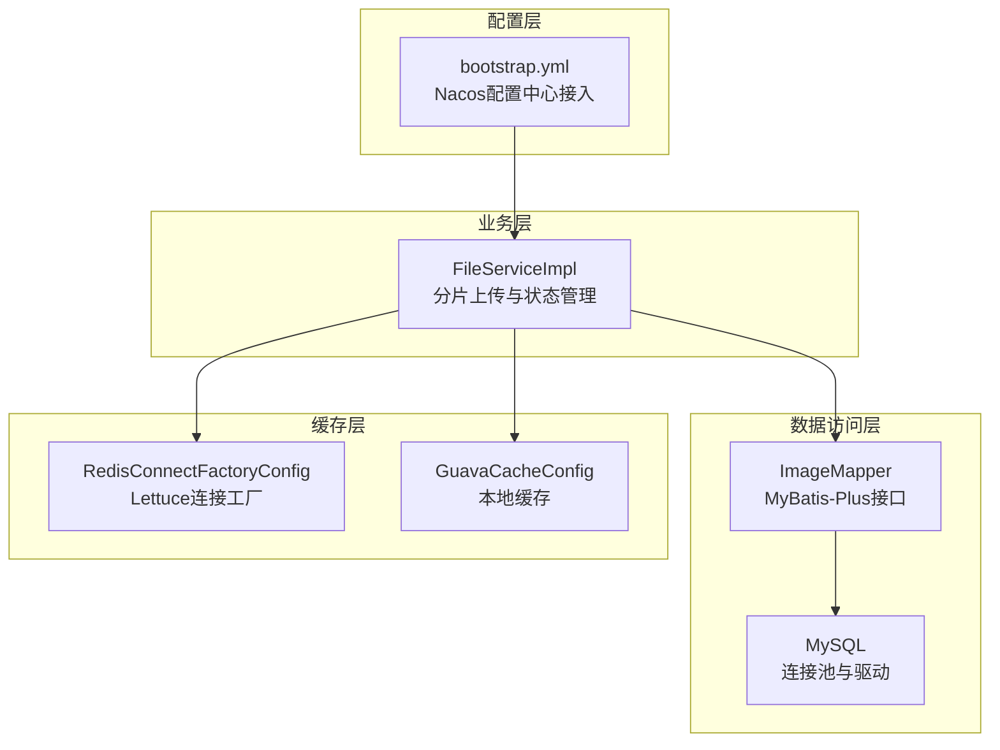
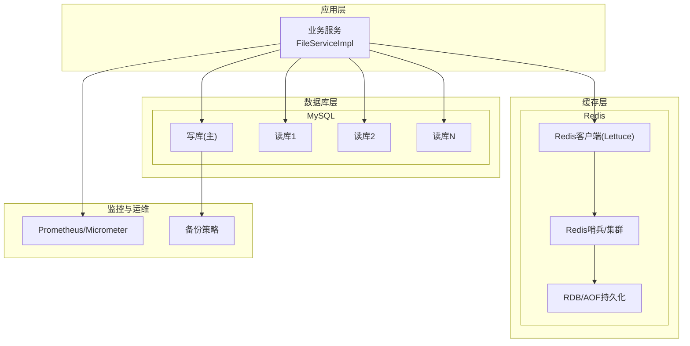
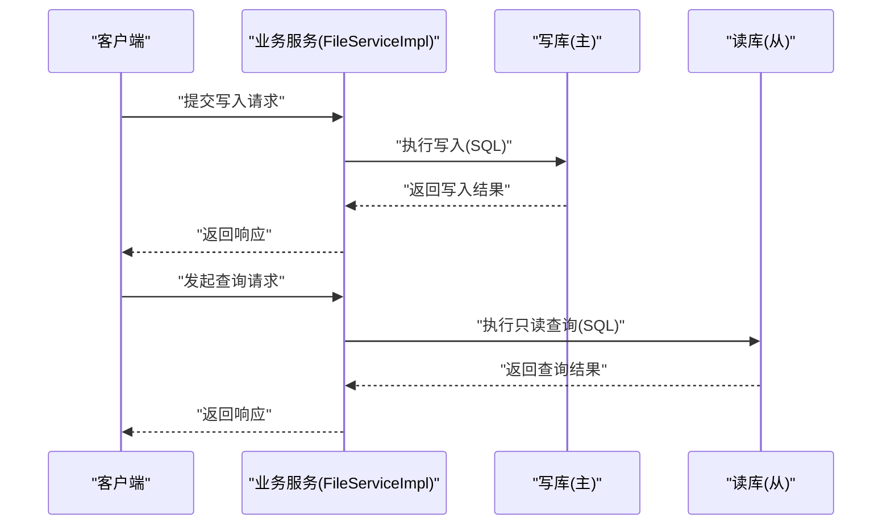
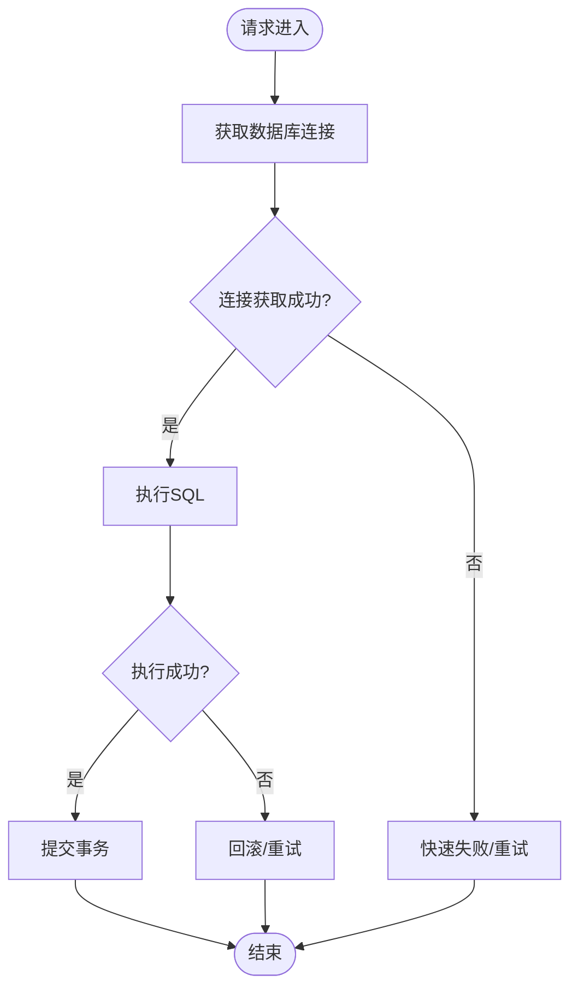
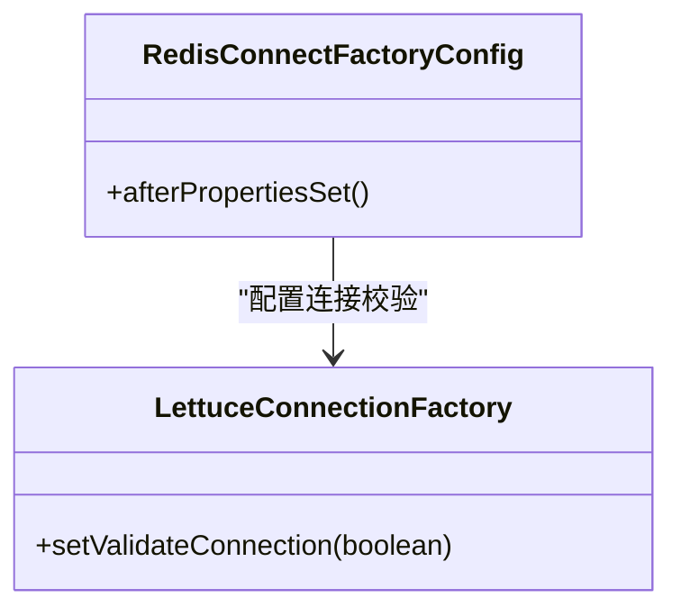
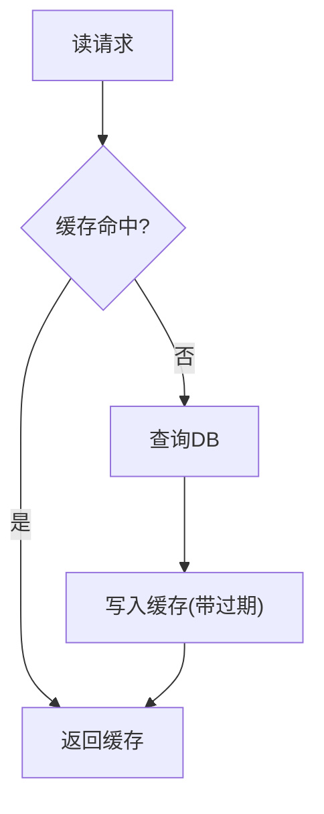
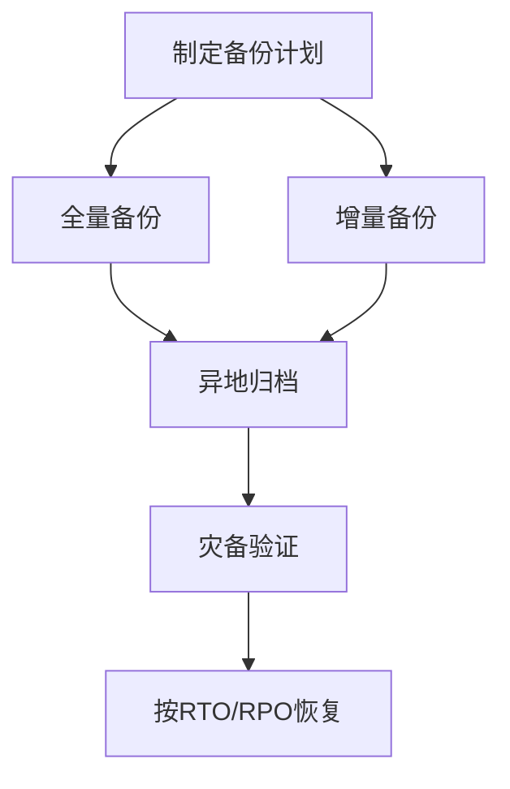
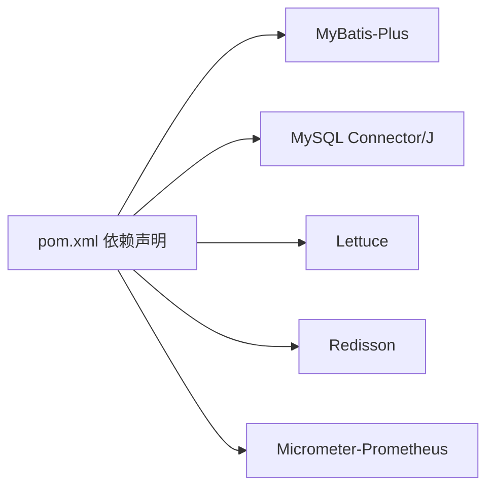

# 数据库与缓存配置

<cite>
**本文引用的文件**
- [bootstrap.yml](file://src/main/resources/bootstrap.yml)
- [GuavaCacheConfig.java](file://src/main/java/cn/staitech/file/config/GuavaCacheConfig.java)
- [RedisConnectFactoryConfig.java](file://src/main/java/cn/staitech/file/config/RedisConnectFactoryConfig.java)
- [ResourcesConfig.java](file://src/main/java/cn/staitech/file/config/ResourcesConfig.java)
- [RestTemplateConfig.java](file://src/main/java/cn/staitech/file/config/RestTemplateConfig.java)
- [pom.xml](file://pom.xml)
- [FileServiceImpl.java](file://src/main/java/cn/staitech/file/service/impl/FileServiceImpl.java)
- [ImageMapper.java](file://src/main/java/cn/staitech/file/mapper/ImageMapper.java)
- [Image.java](file://src/main/java/cn/staitech/file/domain/Image.java)
- [update_v2.5.2.sql](file://sql/update_v2.5.2.sql)
</cite>

## 目录
1. [简介](#简介)
2. [项目结构](#项目结构)
3. [核心组件](#核心组件)
4. [架构概览](#架构概览)
5. [详细组件分析](#详细组件分析)
6. [依赖分析](#依赖分析)
7. [性能考虑](#性能考虑)
8. [故障排查指南](#故障排查指南)
9. [结论](#结论)
10. [附录](#附录)

## 简介
本指南面向生产环境，围绕数据库与缓存系统提供可落地的配置与运维建议。结合仓库中现有的Spring Boot配置、MyBatis-Plus集成、Redis客户端与Guava缓存等组件，给出高可用数据库部署（主从复制、读写分离、集群）、连接池与超时优化、Redis集群与哨兵、缓存策略设计、备份恢复、性能监控与容量规划、连接字符串与SSL加密等实践要点。

## 项目结构
该项目采用Spring Boot工程，主要涉及以下与数据库/缓存相关的关键模块：
- 配置层：Nacos配置中心接入、应用基础配置
- 数据访问层：MyBatis-Plus + MySQL驱动
- 缓存层：Redis（Lettuce连接工厂）、Guava本地缓存
- 业务层：基于Mapper与Service的数据操作与定时任务

图表来源
- [bootstrap.yml:1-37](file://src/main/resources/bootstrap.yml#L1-L37)
- [FileServiceImpl.java:1-178](file://src/main/java/cn/staitech/file/service/impl/FileServiceImpl.java#L1-178)
- [ImageMapper.java:1-16](file://src/main/java/cn/staitech/file/mapper/ImageMapper.java#L1-16)
- [RedisConnectFactoryConfig.java:1-26](file://src/main/java/cn/staitech/file/config/RedisConnectFactoryConfig.java#L1-26)
- [GuavaCacheConfig.java:1-27](file://src/main/java/cn/staitech/file/config/GuavaCacheConfig.java#L1-27)

章节来源
- [bootstrap.yml:1-37](file://src/main/resources/bootstrap.yml#L1-L37)
- [pom.xml:1-385](file://pom.xml#L1-L385)

## 核心组件
- 数据库与连接池
  - MyBatis-Plus启动器与MySQL驱动已引入，实际连接池与参数需在配置中心或环境变量中定义。
  - 建议通过Spring配置（如application.yml）设置连接池大小、空闲超时、连接生命周期等。
- Redis缓存
  - 使用Lettuce连接工厂，默认开启连接校验，适合生产环境。
  - 提供Redisson依赖，可用于分布式锁、限流等高级特性。
- 本地缓存
  - Guava本地缓存，设置最大条目与过期时间，适用于轻量热点数据。
- 定时任务与状态管理
  - 业务层包含定时清理“上传中”超时记录的任务，体现数据库写入与状态流转。

章节来源
- [pom.xml:132-150](file://pom.xml#L132-L150)
- [RedisConnectFactoryConfig.java:1-26](file://src/main/java/cn/staitech/file/config/RedisConnectFactoryConfig.java#L1-L26)
- [GuavaCacheConfig.java:1-27](file://src/main/java/cn/staitech/file/config/GuavaCacheConfig.java#L1-L27)
- [FileServiceImpl.java:148-177](file://src/main/java/cn/staitech/file/service/impl/FileServiceImpl.java#L148-L177)

## 架构概览
下图展示生产环境推荐的数据库与缓存架构：MySQL主从复制+读写分离，Redis哨兵/集群+持久化，以及应用侧的连接池与缓存策略。

## 详细组件分析

### 数据库高可用与读写分离
- 主从复制
  - 在MySQL层面建立主从复制，确保至少1个从库，建议多从库以提升读扩展性。
  - 读库用于报表、查询类场景；写库承担事务性写入。
- 读写分离
  - 应用侧通过自定义路由或中间件（如ShardingSphere/JDBC代理）实现SQL路由：
    - 写操作路由至主库
    - 读操作轮询或按权重路由至从库
  - 结合连接池，为主/从分别配置独立连接池，避免连接争用。
- 集群配置
  - 对于超大规模，可采用MySQL Group Replication或Galera Cluster实现多主/多活。
  - 需要严格的网络与仲裁策略，确保脑裂防护与一致性。
- 事务与一致性
  - 跨库事务建议使用分布式事务框架（如Seata），或通过最终一致的事件驱动方案替代强一致。

### 数据库连接池配置与超时优化
- 连接池参数建议（示例）
  - 最大连接数：根据峰值QPS与平均事务时长估算
  - 最小空闲连接：维持低延迟的热连接
  - 连接生命周期：避免长时间占用导致的资源泄漏
  - 获取连接超时：快速失败，避免阻塞排队
  - 心跳检测：定期验证连接有效性
- 超时设置
  - 连接超时：10–30秒
  - 读取超时：根据查询复杂度设定（如10–60秒）
  - 事务超时：依据业务最长事务时长（如30–120秒）

### Redis缓存集群、哨兵与持久化
- 集群/哨兵选型
  - 高可用优先：推荐哨兵模式，简单可靠；若需水平扩展与高吞吐：采用Redis Cluster。
  - 至少3节点哨兵+2主从，保证故障切换与脑裂防护。
- 连接工厂
  - 已启用Lettuce连接工厂的连接校验，生产环境建议开启健康检查与重连策略。
- 持久化策略
  - RDB：周期快照，适合灾难恢复；AOF：更安全的写日志，可配置每秒刷盘兼顾性能。
  - 建议双策略配合，或在灾备节点开启AOF重写。
- 客户端缓存
  - 本地缓存（Guava）适合热点小对象，注意内存上限与过期策略。

图表来源
- [RedisConnectFactoryConfig.java:1-26](file://src/main/java/cn/staitech/file/config/RedisConnectFactoryConfig.java#L1-L26)

### 缓存策略设计与失效/更新机制
- 策略设计
  - 读多写少场景：优先读缓存，缓存未命中再查DB，异步回填缓存。
  - 写多场景：采用写后失效或写后更新，避免脏读。
  - 多级缓存：本地缓存(Guava)+Redis，减少跨进程/跨机房开销。
- 失效与更新
  - 单Key失效：写操作后删除对应缓存Key。
  - 批量失效：对列表/聚合数据采用版本号或标签位，批量淘汰。
  - 幂等更新：使用分布式锁或CAS，避免并发写导致的不一致。

### 数据备份与恢复策略
- 备份策略
  - 全量+增量：每日全量+每小时增量，保留7–14天滚动窗口。
  - 跨机房异地备份：确保主备数据中心隔离。
- 恢复策略
  - RTO/RPO：明确目标，制定演练计划。
  - MySQL：binlog+时间点恢复；Redis：AOF/RDB结合，验证恢复路径。
- 变更管理
  - DDL变更走灰度与回滚预案；参考迁移脚本的幂等性设计。

### 性能监控与容量规划
- 监控指标
  - 数据库：QPS、连接数、慢查询、锁等待、缓冲池命中率。
  - Redis：内存使用、命中率、连接数、命令耗时、持久化进度。
  - 应用：GC、堆栈、线程池、队列长度、错误率。
- 容量规划
  - 数据库：按行增长、索引与分区策略评估存储；IO瓶颈优先SSD。
  - 缓存：按峰值QPS与命中率反推容量，预留20%冗余。
- Prometheus集成
  - 已引入Micrometer与Prometheus适配，建议补充自定义指标与告警阈值。

章节来源
- [pom.xml:192-194](file://pom.xml#L192-L194)

### 连接字符串与SSL加密
- 连接字符串
  - MySQL：建议显式设置字符集、时区、连接池参数、超时与重试策略。
  - Redis：哨兵模式需提供哨兵地址列表；集群模式提供初始节点列表。
- SSL加密
  - MySQL：启用TLS，配置证书与CA；限制弱密码与明文传输。
  - Redis：启用TLS与认证，禁止公网暴露；严格ACL与网络隔离。

## 依赖分析
- 数据库与ORM
  - MyBatis-Plus启动器与Join增强，简化CRUD与联表查询。
  - MySQL驱动已引入，实际DS参数由配置中心注入。
- 缓存与中间件
  - Lettuce连接工厂与Redisson依赖，支持哨兵/集群与高级特性。
- 监控与可观测性
  - Micrometer与Prometheus集成，便于导出指标。

图表来源
- [pom.xml:132-150](file://pom.xml#L132-L150)
- [pom.xml:192-194](file://pom.xml#L192-L194)

章节来源
- [pom.xml:132-150](file://pom.xml#L132-L150)
- [pom.xml:192-194](file://pom.xml#L192-L194)

## 性能考虑
- 数据库
  - 合理索引与分区，避免全表扫描；慢查询分析与优化。
  - 连接池参数与超时设置需结合压测结果迭代。
- 缓存
  - 本地缓存容量与过期策略匹配业务热点；远端缓存开启压缩与序列化优化。
- 应用
  - 控制单次事务时长与范围；批量写入与异步化处理。

## 故障排查指南
- 数据库
  - 连接池耗尽：检查最大连接数与事务超时，定位慢查询与长事务。
  - 主从延迟：检查IO线程与SQL线程状态，评估大事务与DDL影响。
- 缓存
  - 命中率低：核对Key设计与过期策略；区分冷热数据分层。
  - 连接异常：确认哨兵/集群健康，检查ACL与网络策略。
- 应用
  - 定时任务未触发：检查调度配置与容器时区；关注异常日志。

章节来源
- [FileServiceImpl.java:148-177](file://src/main/java/cn/staitech/file/service/impl/FileServiceImpl.java#L148-L177)

## 结论
本指南基于现有代码与依赖，给出了数据库与缓存的生产配置建议。实际落地时应结合业务规模与SLA目标，完善监控、备份与演练体系，持续优化连接池与缓存策略，确保系统在高并发与高可用场景下的稳定性与性能。

## 附录

### 数据库DDL变更参考
- 表结构变更示例：新增字段、修改默认值、调整时间戳字段等。

章节来源
- [update_v2.5.2.sql:1-10](file://sql/update_v2.5.2.sql#L1-L10)

### 业务模型与状态
- 实体与状态字段：用于理解写入与状态流转逻辑。

章节来源
- [Image.java:1-216](file://src/main/java/cn/staitech/file/domain/Image.java#L1-L216)