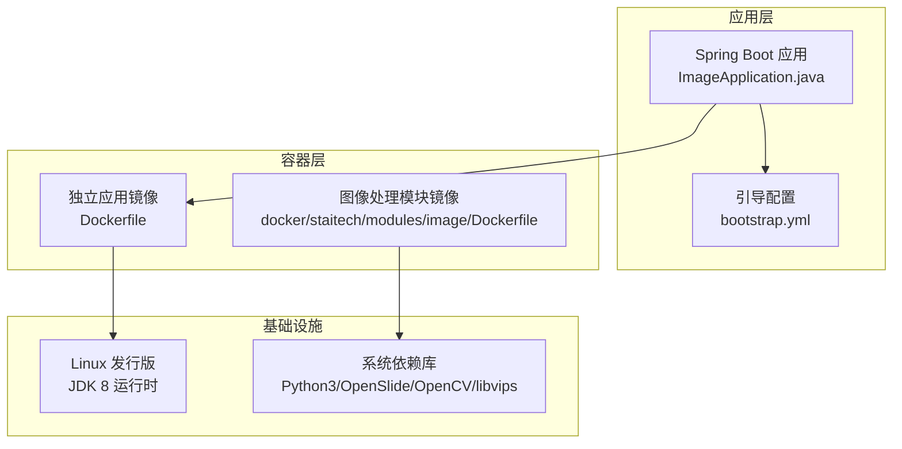
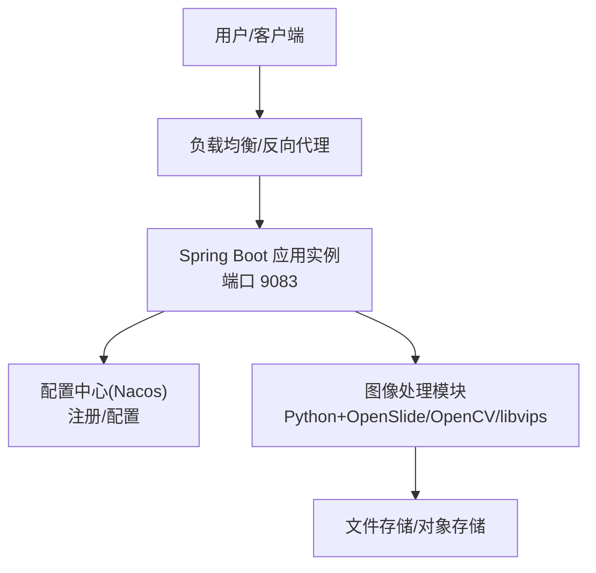
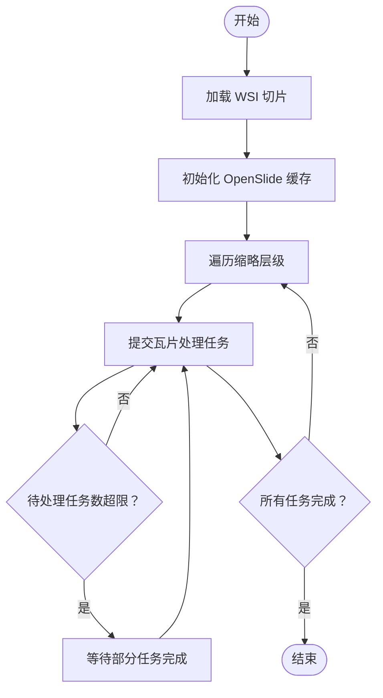
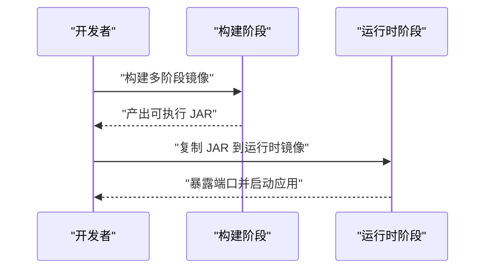
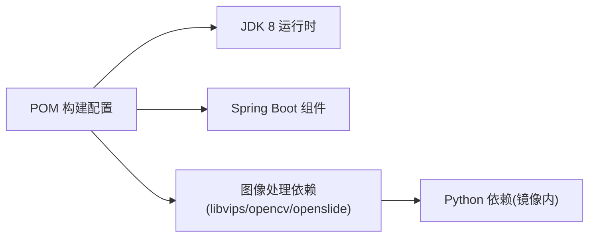

# 服务器配置

<cite>
**本文引用的文件**
- [Dockerfile](file://Dockerfile)
- [docker 模块 Dockerfile](file://docker\staitech\modules\image\Dockerfile)
- [POM 构建配置](file://pom.xml)
- [引导配置 bootstrap.yml](file://src\main\resources\bootstrap.yml)
- [应用入口 ImageApplication.java](file://src\main\java\cn\staitech\ImageApplication.java)
- [深度瓦片生成脚本 deepzoom_custom.py](file://docker\staitech\modules\image\script\deepzoom_custom.py)
- [瓦片生成主程序 tile.py](file://docker\staitech\modules\image\script\tile.py)
- [项目自述 README.md](file://README.md)
</cite>

## 目录
1. [简介](#简介)
2. [项目结构](#项目结构)
3. [核心组件](#核心组件)
4. [架构总览](#架构总览)
5. [详细组件分析](#详细组件分析)
6. [依赖分析](#依赖分析)
7. [性能考虑](#性能考虑)
8. [故障排查指南](#故障排查指南)
9. [结论](#结论)
10. [附录](#附录)

## 简介
本指南面向在生产环境中部署本项目（基于 Spring Boot 的图像处理服务）的运维与平台工程师，围绕以下主题提供可操作的配置建议与最佳实践：硬件资源规划（CPU、内存、存储、网络）、操作系统与运行时环境（Linux 发行版、JDK 版本、依赖库）、安全加固（防火墙、SSH 访问、系统服务）、容器化部署（镜像构建与暴露端口）、以及与图像处理相关的性能参数与并发策略。由于本仓库同时提供独立的 Spring Boot 应用与包含图像处理依赖的 Docker 模块镜像，本文将分别给出两类部署场景的配置要点。

## 项目结构
该项目采用多模块/多镜像的组织方式：
- 独立 Spring Boot 应用：通过 Maven 构建为可执行 JAR，容器镜像以 JDK 8 运行时为基础。
- 图像处理专用 Docker 模块：在 JDK 8 运行时基础上安装 Python 3、OpenSlide、OpenCV、libvips 等依赖，并对外暴露特定端口用于文件服务。

图表来源
- [Dockerfile:1-16](file://Dockerfile#L1-L16)
- [docker 模块 Dockerfile:1-46](file://docker\staitech\modules\image\Dockerfile#L1-L46)
- [引导配置 bootstrap.yml:1-37](file://src\main\resources\bootstrap.yml#L1-L37)
- [应用入口 ImageApplication.java:1-53](file://src\main\java\cn\staitech\ImageApplication.java#L1-L53)

章节来源
- [Dockerfile:1-16](file://Dockerfile#L1-L16)
- [docker 模块 Dockerfile:1-46](file://docker\staitech\modules\image\Dockerfile#L1-L46)
- [引导配置 bootstrap.yml:1-37](file://src\main\resources\bootstrap.yml#L1-L37)
- [应用入口 ImageApplication.java:1-53](file://src\main\java\cn\staitech\ImageApplication.java#L1-L53)

## 核心组件
- 应用端口与配置
  - 应用通过引导配置定义监听端口与 Nacos 注册/配置中心参数，支持按环境激活不同配置。
- 容器镜像
  - 独立应用镜像基于 JDK 8 运行时，暴露应用端口；图像处理模块镜像在运行时安装 Python 与图像处理依赖，并暴露文件服务端口。
- 运行时与依赖
  - JDK 8（Spring Boot 2.x 生态常用版本），结合 Maven 资源过滤与打包策略，确保本地依赖库正确打入最终镜像。
- 图像处理能力
  - 通过 Python 脚本与 OpenSlide、OpenCV、libvips 协作，实现 WSI 切片的瓦片化与导出，具备并发控制与缓存策略。

章节来源
- [引导配置 bootstrap.yml:1-37](file://src\main\resources\bootstrap.yml#L1-L37)
- [POM 构建配置:1-385](file://pom.xml#L1-L385)
- [docker 模块 Dockerfile:1-46](file://docker\staitech\modules\image\Dockerfile#L1-L46)
- [深度瓦片生成脚本 deepzoom_custom.py:1-177](file://docker\staitech\modules\image\script\deepzoom_custom.py#L1-L177)
- [瓦片生成主程序 tile.py:1-99](file://docker\staitech\modules\image\script\tile.py#L1-L99)

## 架构总览
下图展示了生产环境中的典型部署拓扑：客户端请求经由反向代理或负载均衡到达应用实例；应用通过 Nacos 进行服务发现与配置拉取；图像处理相关功能由独立的 Docker 模块提供，或在应用侧通过本地依赖与脚本协同工作。

图表来源
- [引导配置 bootstrap.yml:1-37](file://src\main\resources\bootstrap.yml#L1-L37)
- [docker 模块 Dockerfile:1-46](file://docker\staitech\modules\image\Dockerfile#L1-L46)

## 详细组件分析

### 硬件与系统环境要求
- CPU
  - 推荐：多核 CPU（至少 4 核），图像处理任务（瓦片生成）具有较强的并行计算需求，建议根据并发线程数与瓦片大小动态评估。
- 内存
  - 推荐：8 GB 及以上，图像处理涉及大尺寸 WSI 切片读取与缓存，需预留充足的堆外内存与系统缓存。
- 存储
  - 至少 500 GB 可用空间，图像数据体积通常较大；建议使用高性能磁盘（SSD）并为上传目录、输出目录与日志目录划分独立挂载点。
- 网络
  - 带宽取决于并发请求数与单次响应大小；建议为应用与文件服务端口预留稳定出口带宽，并开启必要的入站/出站限速策略。

说明
- 上述为通用建议，具体数值应结合业务规模、并发峰值与图像分辨率进行容量评估。

### 操作系统与运行时
- Linux 发行版
  - 推荐：CentOS 7+/Rocky 8+/Ubuntu 18.04+/Debian 10+；内核版本建议保持较新以获得更好的文件系统与网络栈性能。
- JDK 版本
  - 当前项目基于 JDK 8（Spring Boot 2.x 生态常用版本），建议使用官方 OpenJDK 8 或厂商提供的长期支持版本。
- 依赖库
  - 独立应用：无需额外系统依赖，仅需 JDK 8 运行时。
  - 图像处理模块：镜像中已内置 Python 3、OpenSlide、OpenCV、libvips 等依赖，生产部署时可直接使用该镜像。

章节来源
- [Dockerfile:1-16](file://Dockerfile#L1-L16)
- [docker 模块 Dockerfile:1-46](file://docker\staitech\modules\image\Dockerfile#L1-L46)

### 安全配置
- 防火墙
  - 仅开放应用端口（如 9083）与必要的管理端口；对来自可信网段的访问放通，其他来源一律拒绝。
- SSH 访问限制
  - 关闭密码认证，启用密钥认证；限制 root 登录；仅允许特定管理员网段访问；定期轮换密钥。
- 系统服务
  - 关闭不必要的系统服务与端口；启用 SELinux/AppArmor（如适用）；定期更新系统补丁与容器基础镜像。

说明
- 以上为通用安全基线，具体策略应结合企业安全政策与合规要求制定。

### Tomcat 服务器配置（Spring Boot 默认嵌入）
- 端口
  - 应用监听端口由引导配置指定；若需调整，请在相应环境配置文件中修改。
- 连接数限制
  - Spring Boot 默认使用嵌入式 Tomcat，可通过 JVM 参数与线程池配置限制并发连接数与请求队列长度。
- 性能参数调优
  - 建议开启压缩与静态资源缓存；合理设置 JVM 堆大小与 GC 参数；针对高并发场景启用异步处理与连接复用。

章节来源
- [引导配置 bootstrap.yml:1-37](file://src\main\resources\bootstrap.yml#L1-L37)
- [应用入口 ImageApplication.java:1-53](file://src\main\java\cn\staitech\ImageApplication.java#L1-L53)

### 环境变量与系统环境准备
- 环境变量
  - 时区：应用入口设置了 Asia/Shanghai 时区，确保日志与定时任务行为一致。
  - 配置中心：通过 Nacos 地址、命名空间与分组参数加载环境配置，需在部署时注入对应值。
- 系统环境准备
  - 安装 JDK 8；准备文件存储目录（上传、输出、附件等）；为应用与图像处理模块准备独立挂载点；确保网络连通性与 DNS 解析正常。

章节来源
- [应用入口 ImageApplication.java:1-53](file://src\main\java\cn\staitech\ImageApplication.java#L1-L53)
- [引导配置 bootstrap.yml:1-37](file://src\main\resources\bootstrap.yml#L1-L37)

### 图像处理模块与并发策略
- 并发模型
  - 瓦片生成脚本使用线程池与有界队列控制并发任务数量，最大工作线程数与待处理任务上限可根据 CPU 核数与内存容量调整。
- 缓存策略
  - 通过 OpenSlide 缓存对象限制内存占用，避免频繁 IO；根据图像分辨率与并发度选择合适的缓存容量。
- I/O 与存储
  - 输出目录建议使用高性能磁盘；注意磁盘空间监控与清理策略，防止因磁盘满导致服务异常。

图表来源
- [瓦片生成主程序 tile.py:1-99](file://docker\staitech\modules\image\script\tile.py#L1-L99)
- [深度瓦片生成脚本 deepzoom_custom.py:1-177](file://docker\staitech\modules\image\script\deepzoom_custom.py#L1-L177)

章节来源
- [瓦片生成主程序 tile.py:1-99](file://docker\staitech\modules\image\script\tile.py#L1-L99)
- [深度瓦片生成脚本 deepzoom_custom.py:1-177](file://docker\staitech\modules\image\script\deepzoom_custom.py#L1-L177)

### 容器化部署与端口暴露
- 独立应用镜像
  - 基于 JDK 8 运行时，暴露应用端口；适合在容器编排平台（Kubernetes/Docker Swarm）中部署。
- 图像处理模块镜像
  - 在运行时安装 Python 与图像处理依赖，并暴露文件服务端口；适合与应用解耦部署，便于扩展与维护。

图表来源
- [Dockerfile:1-16](file://Dockerfile#L1-L16)
- [docker 模块 Dockerfile:1-46](file://docker\staitech\modules\image\Dockerfile#L1-L46)

章节来源
- [Dockerfile:1-16](file://Dockerfile#L1-L16)
- [docker 模块 Dockerfile:1-46](file://docker\staitech\modules\image\Dockerfile#L1-L46)

## 依赖分析
- 运行时依赖
  - JDK 8、Spring Boot 生态组件（Web、Actuator、Nacos Discovery/Config、Sentinel 等）。
- 图像处理依赖
  - OpenSlide、OpenCV、libvips 通过系统依赖或镜像内置方式提供；Python 脚本负责瓦片生成流程。
- 构建与打包
  - Maven 资源过滤与打包插件确保本地依赖库被打包至最终镜像；多环境 Profile 用于区分开发/测试/生产配置。

图表来源
- [POM 构建配置:1-385](file://pom.xml#L1-L385)
- [docker 模块 Dockerfile:1-46](file://docker\staitech\modules\image\Dockerfile#L1-L46)

章节来源
- [POM 构建配置:1-385](file://pom.xml#L1-L385)
- [docker 模块 Dockerfile:1-46](file://docker\staitech\modules\image\Dockerfile#L1-L46)

## 性能考虑
- JVM 参数
  - 建议设置合理的堆大小与 GC 参数，结合应用吞吐与延迟目标进行调优；开启应用指标导出（Prometheus Micrometer）以便观测。
- 并发与线程池
  - 结合 CPU 核数与内存容量，合理设置线程池大小与队列长度；对图像处理任务采用有界队列与背压策略。
- 存储与 I/O
  - 使用 SSD 存储提升读写性能；为上传与输出目录配置独立挂载点并监控磁盘使用率。
- 网络与带宽
  - 对高并发场景进行带宽评估与限速策略，避免突发流量影响稳定性。

## 故障排查指南
- 端口冲突
  - 确认应用端口未被占用；检查容器映射与主机防火墙规则。
- 配置中心不可达
  - 校验 Nacos 地址、命名空间与分组参数；确认网络连通性与鉴权配置。
- 图像处理失败
  - 检查 OpenSlide、OpenCV、libvips 是否正确安装；查看瓦片生成日志与磁盘空间；调整并发与缓存参数。
- 容器启动异常
  - 查看镜像构建日志与运行时日志；确认 JDK 版本与依赖库版本匹配。

章节来源
- [引导配置 bootstrap.yml:1-37](file://src\main\resources\bootstrap.yml#L1-L37)
- [瓦片生成主程序 tile.py:1-99](file://docker\staitech\modules\image\script\tile.py#L1-L99)

## 结论
本指南提供了在生产环境中部署本项目所需的硬件、系统、安全与容器化配置要点。对于图像处理类应用，建议优先采用独立的 Docker 模块镜像以隔离依赖，并结合并发控制与缓存策略优化性能。同时，通过 Nacos 进行集中化配置管理与监控指标导出，有助于提升系统的可观测性与可维护性。

## 附录
- 项目自述与 CI/CD 说明
  - 项目自述文档指出该模板与 GitLab Auto DevOps 兼容，可参考其流水线配置进行自动化构建与部署。

章节来源
- [项目自述 README.md:1-11](file://README.md#L1-L11)