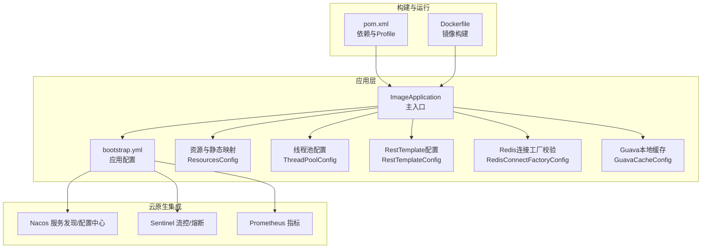
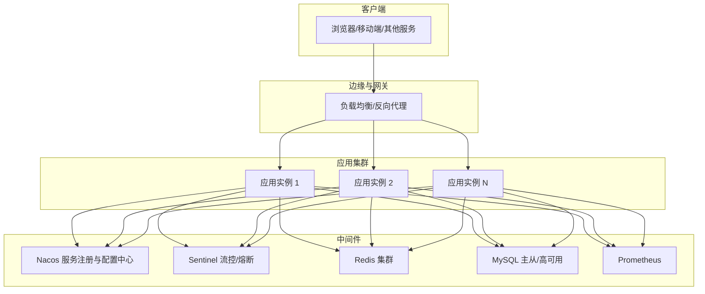
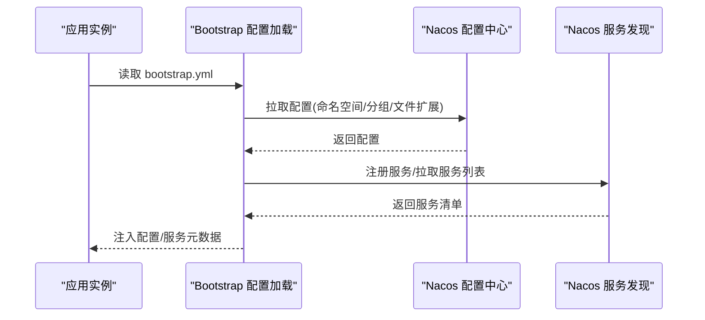
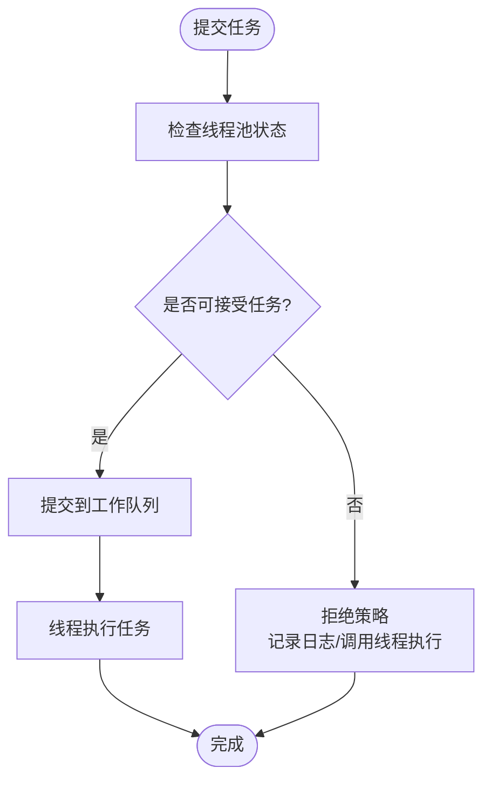
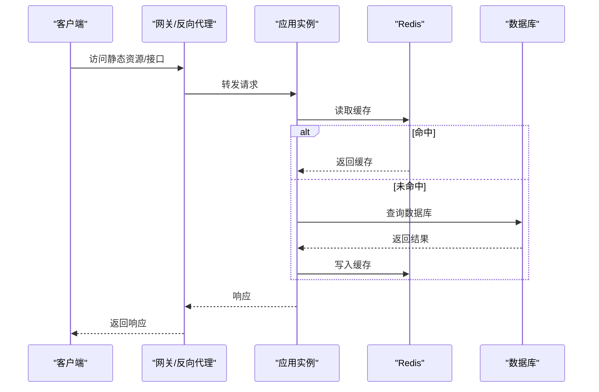
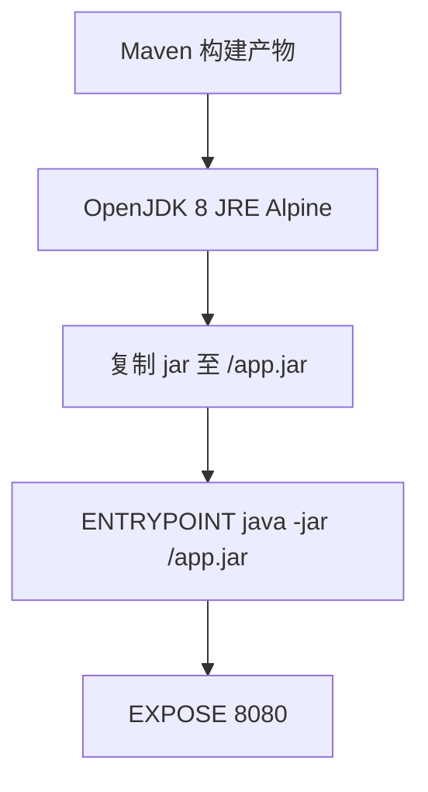
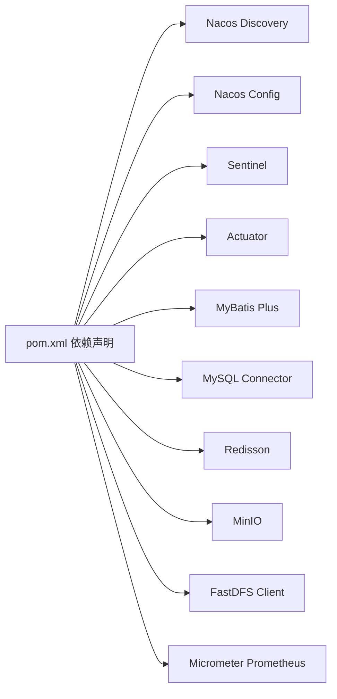

# 生产环境部署

<cite>
**本文引用的文件**
- [ImageApplication.java](file://src/main/java/cn/staitech/ImageApplication.java)
- [bootstrap.yml](file://src/main/resources/bootstrap.yml)
- [pom.xml](file://pom.xml)
- [Dockerfile](file://Dockerfile)
- [README.md](file://README.md)
- [GuavaCacheConfig.java](file://src/main/java/cn/staitech/file/config/GuavaCacheConfig.java)
- [RedisConnectFactoryConfig.java](file://src/main/java/cn/staitech/file/config/RedisConnectFactoryConfig.java)
- [ResourcesConfig.java](file://src/main/java/cn/staitech/file/config/ResourcesConfig.java)
- [RestTemplateConfig.java](file://src/main/java/cn/staitech/file/config/RestTemplateConfig.java)
- [ThreadPoolConfig.java](file://src/main/java/cn/staitech/file/config/ThreadPoolConfig.java)
</cite>

## 目录
1. [简介](#简介)
2. [项目结构](#项目结构)
3. [核心组件](#核心组件)
4. [架构总览](#架构总览)
5. [详细组件分析](#详细组件分析)
6. [依赖分析](#依赖分析)
7. [性能考虑](#性能考虑)
8. [故障排查指南](#故障排查指南)
9. [结论](#结论)
10. [附录](#附录)

## 简介
本指南面向生产环境部署，结合仓库中的应用配置与依赖信息，给出服务器硬件建议、操作系统与网络准备、Spring Cloud Alibaba（Nacos服务发现、Sentinel流量治理、配置中心）集成方式、数据库连接池与缓存（Redis）配置要点、容器化与镜像构建、以及安全加固、性能调优与容量规划建议。由于本仓库未包含数据库高可用与负载均衡/反向代理的具体配置文件，本文在这些部分提供可落地的实施步骤与最佳实践，便于运维团队按需扩展。

## 项目结构
该仓库为基于 Spring Boot 的图像处理服务模块，采用 Maven 构建，支持多环境 Profile（开发/测试/生产），并通过 Nacos 作为服务注册与配置中心。项目同时引入了 Sentinel 流量治理能力与 Prometheus 指标导出，便于生产监控与弹性伸缩。

图示来源
- [ImageApplication.java:37-50](file://src/main/java/cn/staitech/ImageApplication.java#L37-L50)
- [bootstrap.yml:1-37](file://src/main/resources/bootstrap.yml#L1-L37)
- [pom.xml:29-45](file://pom.xml#L29-L45)
- [Dockerfile:1-16](file://Dockerfile#L1-L16)

章节来源
- [ImageApplication.java:37-50](file://src/main/java/cn/staitech/ImageApplication.java#L37-L50)
- [bootstrap.yml:1-37](file://src/main/resources/bootstrap.yml#L1-L37)
- [pom.xml:349-384](file://pom.xml#L349-L384)
- [Dockerfile:1-16](file://Dockerfile#L1-L16)

## 核心组件
- 应用主入口与功能开关：启用调度、WebSocket、自定义安全与Swagger、Feign客户端、事务管理、Elasticsearch仓库等。
- 多环境配置：通过 Maven Profile 切换 Nacos 地址、命名空间与分组，实现不同环境隔离。
- 云原生集成：声明式引入 Nacos Discovery、Nacos Config、Sentinel，以及 Micrometer Prometheus 导出。
- 容器化：基于 Maven 构建产物与 OpenJDK 8 JRE Alpine 镜像，暴露端口并以 Java -jar 方式启动。
- Web 层配置：跨域、静态资源映射、文件上传大小限制；RestTemplate 负载均衡与超时配置。
- 缓存与线程池：Guava 本地缓存、Redis 连接工厂校验、异步线程池（OpenSlide/Python任务）。

章节来源
- [ImageApplication.java:27-50](file://src/main/java/cn/staitech/ImageApplication.java#L27-L50)
- [pom.xml:29-45](file://pom.xml#L29-L45)
- [Dockerfile:8-15](file://Dockerfile#L8-L15)
- [ResourcesConfig.java:17-51](file://src/main/java/cn/staitech/file/config/ResourcesConfig.java#L17-L51)
- [RestTemplateConfig.java:22-49](file://src/main/java/cn/staitech/file/config/RestTemplateConfig.java#L22-L49)
- [RedisConnectFactoryConfig.java:10-26](file://src/main/java/cn/staitech/file/config/RedisConnectFactoryConfig.java#L10-L26)
- [GuavaCacheConfig.java:16-26](file://src/main/java/cn/staitech/file/config/GuavaCacheConfig.java#L16-L26)
- [ThreadPoolConfig.java:13-65](file://src/main/java/cn/staitech/file/config/ThreadPoolConfig.java#L13-L65)

## 架构总览
应用通过 Nacos 获取配置与服务列表，Sentinel 提供流量治理，Prometheus 暴露指标，Redis 用于缓存，MySQL 由外部统一提供（本仓库未包含具体连接池配置）。容器化部署，支持水平扩展与弹性伸缩。

图示来源
- [bootstrap.yml:17-37](file://src/main/resources/bootstrap.yml#L17-L37)
- [pom.xml:29-45](file://pom.xml#L29-L45)
- [ImageApplication.java:37-50](file://src/main/java/cn/staitech/ImageApplication.java#L37-L50)

## 详细组件分析

### Spring Cloud Alibaba 集成（Nacos/Sentinel/配置中心）
- 服务发现与配置中心：通过 bootstrap.yml 中的 nacos.discovery 与 nacos.config 字段接入，支持命名空间、分组与共享配置。
- 流量治理：引入 sentinel starter 后，可在运行时通过控制台下发流控/熔断规则，结合网关或直接在应用内生效。
- 多环境 Profile：开发/测试/生产三套 Profile，分别指向不同的 Nacos 地址与命名空间，确保配置隔离。

图示来源
- [bootstrap.yml:17-37](file://src/main/resources/bootstrap.yml#L17-L37)
- [pom.xml:29-45](file://pom.xml#L29-L45)
- [pom.xml:350-382](file://pom.xml#L350-L382)

章节来源
- [bootstrap.yml:17-37](file://src/main/resources/bootstrap.yml#L17-L37)
- [pom.xml:29-45](file://pom.xml#L29-L45)
- [pom.xml:350-382](file://pom.xml#L350-L382)

### 数据库连接池与 MySQL 高可用
- 连接池：本仓库未直接包含连接池配置类，通常建议在 Nacos 配置中心中提供生产环境的连接池参数（如 HikariCP/Hibernate 连接池），并开启连接泄漏检测、空闲回收与健康检查。
- MySQL 高可用：推荐主从复制+半同步/组复制，配合 VIP 或 Proxy（如 MaxScale/ProxySQL）实现读写分离与自动故障切换；应用侧配置只读副本地址与权重，实现读流量分摊。
- 本节为实施建议，不涉及具体代码文件。

### Redis 缓存集群
- 连接工厂校验：通过 RedisConnectFactoryConfig 在 Lettuce 连接工厂上启用连接有效性校验，降低连接抖动带来的失败率。
- 集群部署：建议使用 Redis 6.x+ 原生命名空间与密码认证，开启 AOF/RDB 持久化与合理淘汰策略；在应用侧通过哨兵或集群模式接入，避免单点。
- 本节为实施建议，不涉及具体代码文件。

章节来源
- [RedisConnectFactoryConfig.java:10-26](file://src/main/java/cn/staitech/file/config/RedisConnectFactoryConfig.java#L10-L26)

### 线程池与异步任务
- OpenSlide/Python 线程池：根据 CPU 核数动态计算线程池大小，阻塞队列容量较大，拒绝策略回退至调用线程执行，保证任务不丢失。
- 建议：为不同业务类型拆分线程池，设置独立的拒绝策略与监控指标；结合限流与熔断，防止突发流量压垮线程池。

图示来源
- [ThreadPoolConfig.java:18-64](file://src/main/java/cn/staitech/file/config/ThreadPoolConfig.java#L18-L64)

章节来源
- [ThreadPoolConfig.java:13-65](file://src/main/java/cn/staitech/file/config/ThreadPoolConfig.java#L13-L65)

### Web 层与文件服务
- 跨域与静态资源：ResourcesConfig 提供本地文件前缀映射与跨域策略，注意生产环境应限定允许来源与方法。
- 文件上传：multipart 参数已在 bootstrap.yml 中设置，生产环境建议结合网关限流与后端校验，防止滥用。
- RestTemplate：启用负载均衡与超时配置，建议在 Feign 或 WebClient 上统一管理重试与熔断。

图示来源
- [ResourcesConfig.java:17-51](file://src/main/java/cn/staitech/file/config/ResourcesConfig.java#L17-L51)
- [RestTemplateConfig.java:22-49](file://src/main/java/cn/staitech/file/config/RestTemplateConfig.java#L22-L49)

章节来源
- [ResourcesConfig.java:17-51](file://src/main/java/cn/staitech/file/config/ResourcesConfig.java#L17-L51)
- [RestTemplateConfig.java:22-49](file://src/main/java/cn/staitech/file/config/RestTemplateConfig.java#L22-L49)
- [bootstrap.yml:6-10](file://src/main/resources/bootstrap.yml#L6-L10)

### 容器化与镜像构建
- 基于 Maven 构建产物与 OpenJDK 8 JRE Alpine 镜像，暴露端口并以 Java -jar 启动。
- 建议：在生产环境使用只读根文件系统、最小权限用户、健康检查探针与资源限制；结合 CI/CD 自动化构建与扫描。

图示来源
- [Dockerfile:1-16](file://Dockerfile#L1-L16)

章节来源
- [Dockerfile:1-16](file://Dockerfile#L1-L16)

## 依赖分析
- 云原生与监控：Nacos Discovery/Config、Sentinel、Actuator、Micrometer Prometheus。
- 数据访问：MyBatis Plus、Join Starter、MySQL Connector。
- 缓存与对象存储：Redisson、MinIO、FastDFS 客户端。
- 工具与日志：Hutool、审计日志组件。

图示来源
- [pom.xml:29-199](file://pom.xml#L29-L199)

章节来源
- [pom.xml:29-199](file://pom.xml#L29-L199)

## 性能考虑
- JVM 时区与时钟：应用默认设置为 Asia/Shanghai，确保日志与定时任务时序一致。
- 线程池规模：根据 CPU 核数与任务特征调整线程池大小与队列长度，避免上下文切换与内存压力。
- 缓存策略：结合热点数据与失效策略，控制缓存命中率与内存占用；对写多读少场景谨慎使用本地缓存。
- 网络与超时：RestTemplate 已设置连接/读取/请求超时，建议在网关层统一限流与熔断，避免级联故障。
- 指标与可观测性：启用 Actuator 与 Prometheus 导出，结合 Grafana/Alertmanager 建立告警体系。

章节来源
- [ImageApplication.java:41-42](file://src/main/java/cn/staitech/ImageApplication.java#L41-L42)
- [ThreadPoolConfig.java:18-64](file://src/main/java/cn/staitech/file/config/ThreadPoolConfig.java#L18-L64)
- [RestTemplateConfig.java:24-48](file://src/main/java/cn/staitech/file/config/RestTemplateConfig.java#L24-L48)
- [pom.xml:192-194](file://pom.xml#L192-L194)

## 故障排查指南
- 服务无法注册/发现：检查 bootstrap.yml 中 Nacos 地址、命名空间与分组是否正确，确认网络连通与鉴权配置。
- 配置不生效：确认激活的 Profile 与命名空间匹配，检查共享配置文件名与文件扩展是否一致。
- Redis 连接异常：启用连接校验后仍失败，检查集群地址、认证与网络策略；必要时临时关闭校验定位问题。
- 线程池拒绝：查看拒绝策略日志，评估任务类型与线程池参数，必要时扩容或拆分线程池。
- 文件上传失败：核对 multipart 限制与网关/反向代理的上传上限，检查磁盘空间与权限。
- 指标缺失：确认 Actuator 与 Prometheus 导出已启用，检查端点访问权限与防火墙策略。

章节来源
- [bootstrap.yml:17-37](file://src/main/resources/bootstrap.yml#L17-L37)
- [RedisConnectFactoryConfig.java:18-24](file://src/main/java/cn/staitech/file/config/RedisConnectFactoryConfig.java#L18-L24)
- [ThreadPoolConfig.java:28-37](file://src/main/java/cn/staitech/file/config/ThreadPoolConfig.java#L28-L37)
- [ResourcesConfig.java:21-37](file://src/main/java/cn/staitech/file/config/ResourcesConfig.java#L21-L37)
- [pom.xml:47-51](file://pom.xml#L47-L51)
- [pom.xml:192-194](file://pom.xml#L192-L194)

## 结论
本仓库提供了生产部署所需的关键基础：多环境配置、云原生集成、容器化与可观测性。结合本文提供的安全加固、性能调优与容量规划建议，可快速搭建稳定可靠的图像处理服务生产环境。对于数据库高可用、负载均衡与反向代理等基础设施，建议按组织规范与业务规模另行设计与实施。

## 附录
- 服务器硬件建议（通用）：CPU 核数≥8 核，内存≥16GB，SSD 存储≥200GB，网络≥1Gbps；图片处理场景建议 GPU 加速节点。
- 操作系统与网络：CentOS 7+/Ubuntu 18.04+，内核参数优化（文件句柄、TIME_WAIT、TCP 调优），开放应用端口与 Nacos/Sentinel 端口。
- SSL 证书与反向代理：在反向代理层统一终止 TLS，证书由统一 CA 签发；结合 HSTS 与安全头策略。
- 容量规划：以 QPS、P95 延迟、缓存命中率为指标，结合线程池与连接池参数，预留 30%-50% 缓冲；对图片处理任务进行异步化与限流。