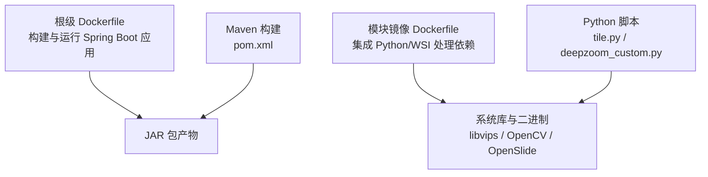
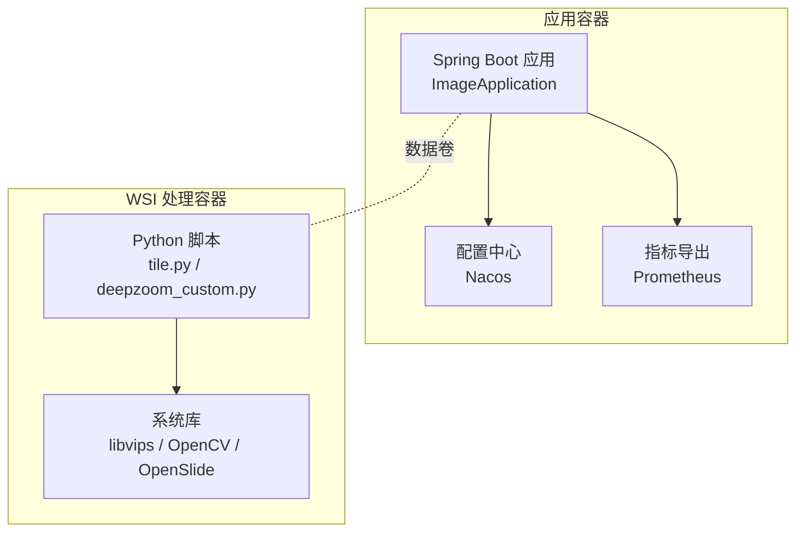
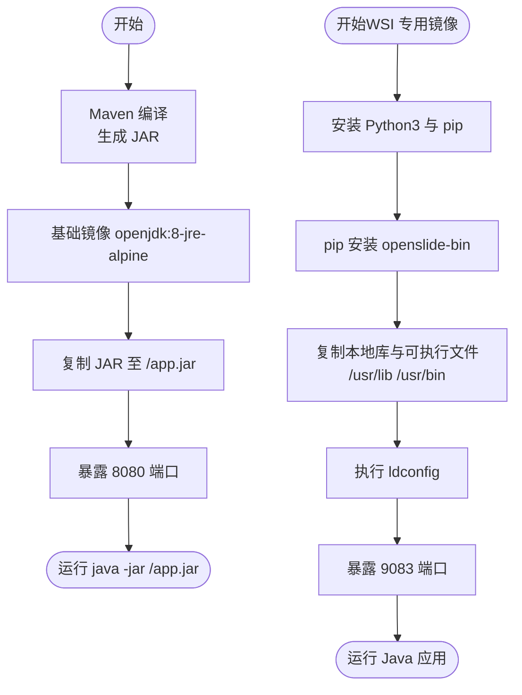
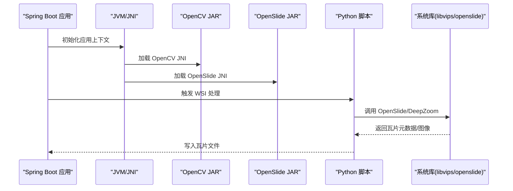
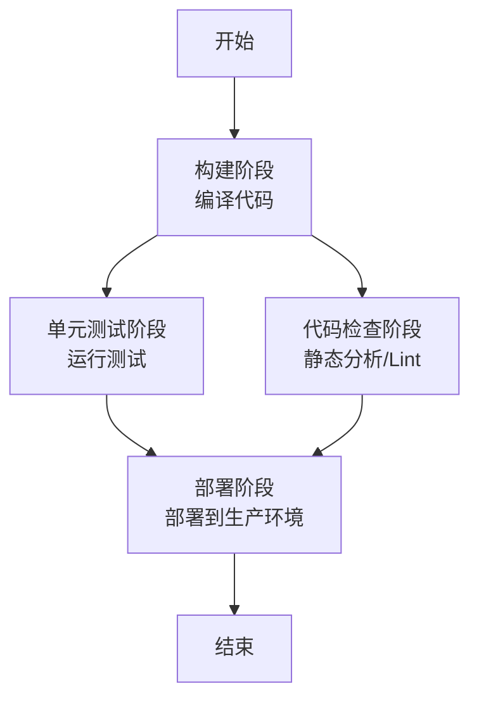
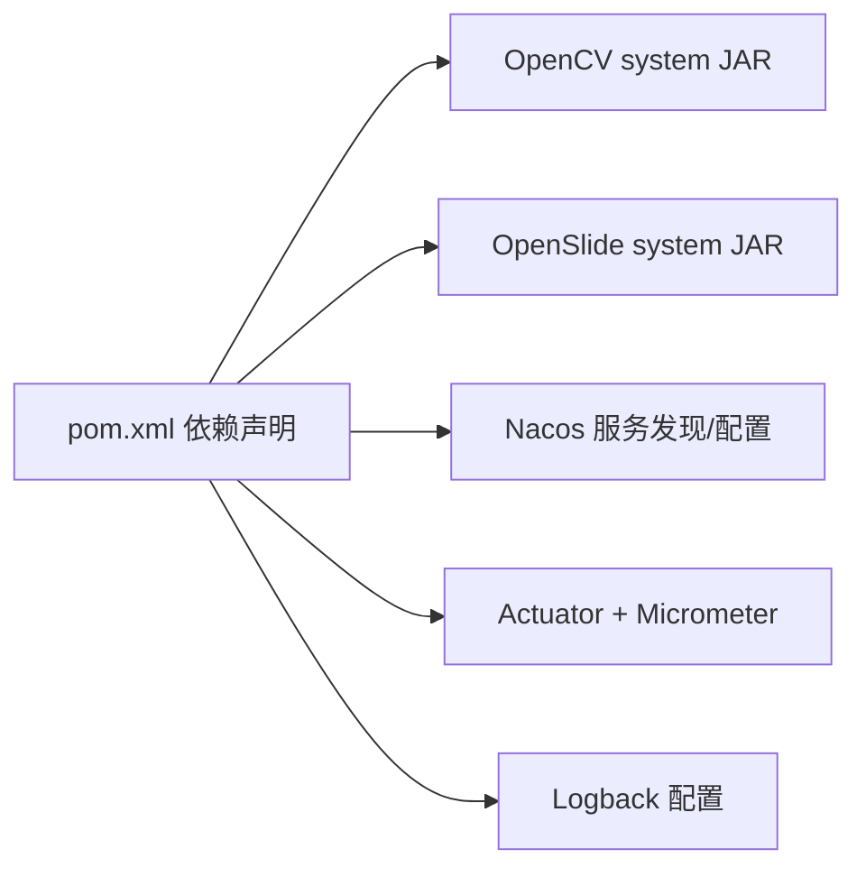

# 部署指南

<cite>
**本文引用的文件**
- [README.md](file://README.md)
- [Dockerfile](file://Dockerfile)
- [docker\staitech\modules\image\Dockerfile](file://docker/staitech/modules/image/Dockerfile)
- [.gitlab-ci.yml](file://.gitlab-ci.yml)
- [pom.xml](file://pom.xml)
- [src\main\resources\bootstrap.yml](file://src/main/resources/bootstrap.yml)
- [src\main\java\cn\staitech\ImageApplication.java](file://src/main/java/cn/staitech/ImageApplication.java)
- [docker\staitech\modules\image\script\deepzoom_custom.py](file://docker/staitech/modules/image/script/deepzoom_custom.py)
- [docker\staitech\modules\image\script\tile.py](file://docker/staitech/modules/image/script/tile.py)
- [src\main\resources\logback.xml](file://src/main/resources/logback.xml)
- [sql\update_v2.5.2.sql](file://sql/update_v2.5.2.sql)
</cite>

## 目录
1. [简介](#简介)
2. [项目结构](#项目结构)
3. [核心组件](#核心组件)
4. [架构总览](#架构总览)
5. [详细组件分析](#详细组件分析)
6. [依赖关系分析](#依赖关系分析)
7. [性能考虑](#性能考虑)
8. [故障排查指南](#故障排查指南)
9. [结论](#结论)
10. [附录](#附录)

## 简介
本指南面向运维与开发团队，提供 PACMVS 图像模块（Java Spring Boot）在生产环境中的完整部署方案，涵盖以下主题：
- 容器化部署：Docker 镜像构建与运行
- Kubernetes 部署：工作负载、存储与网络规划
- 本地库集成：libvips、OpenCV、OpenSlide 的系统级依赖与 JNI 绑定
- 生产最佳实践：服务器配置、网络与安全策略
- CI/CD 流水线：GitLab CI/CD 配置与自动化部署
- 监控与告警：指标暴露、日志采集与健康检查

## 项目结构
该仓库包含两套镜像构建与部署相关的关键资产：
- 根级 Dockerfile：用于标准 Spring Boot 应用打包与运行
- docker/staitech/modules/image/Dockerfile：集成 Python、OpenSlide、OpenCV、libvips 的专用镜像，用于 WSI 切片处理与瓦片生成

图表来源
- [Dockerfile:1-16](file://Dockerfile#L1-L16)
- [docker\staitech\modules\image\Dockerfile:1-46](file://docker/staitech/modules/image/Dockerfile#L1-L46)
- [pom.xml:229-346](file://pom.xml#L229-L346)

章节来源
- [Dockerfile:1-16](file://Dockerfile#L1-L16)
- [docker\staitech\modules\image\Dockerfile:1-46](file://docker/staitech/modules/image/Dockerfile#L1-L46)
- [pom.xml:229-346](file://pom.xml#L229-L346)

## 核心组件
- Spring Boot 应用入口与配置
  - 应用主类负责启用调度、Web Socket、服务发现、Feign 客户端、事务管理与指标标签
  - 配置文件通过 Maven Profile 注入 Nacos 地址与命名空间，支持多环境切换
- 本地库与 JNI 绑定
  - OpenCV 与 OpenSlide 以 system 依赖形式打包至最终 JAR 的 BOOT-INF/lib 中，并通过 Spring Boot 插件标记解压执行
  - libvips 与 Python 依赖在专用镜像中通过系统库与可执行文件注入
- 日志与监控
  - Logback 配置按级别滚动输出，支持控制台与文件输出
  - Actuator 与 Micrometer Prometheus 集成，暴露指标供 Prometheus 抓取

章节来源
- [src\main\java\cn\staitech\ImageApplication.java:1-53](file://src/main/java/cn/staitech/ImageApplication.java#L1-L53)
- [src\main\resources\bootstrap.yml:1-37](file://src/main/resources/bootstrap.yml#L1-L37)
- [pom.xml:164-190](file://pom.xml#L164-L190)
- [pom.xml:327-344](file://pom.xml#L327-L344)
- [src\main\resources\logback.xml:1-116](file://src/main/resources/logback.xml#L1-L116)

## 架构总览
下图展示容器化部署的整体架构：应用容器承载 Spring Boot 服务，WSI 处理容器承载 Python 脚本与系统库；两者通过共享卷或独立卷挂载实现数据流转。

图表来源
- [src\main\java\cn\staitech\ImageApplication.java:37-50](file://src/main/java/cn/staitech/ImageApplication.java#L37-L50)
- [src\main\resources\bootstrap.yml:17-34](file://src/main/resources/bootstrap.yml#L17-L34)
- [docker\staitech\modules\image\script\tile.py:1-99](file://docker/staitech/modules/image/script/tile.py#L1-L99)
- [docker\staitech\modules\image\script\deepzoom_custom.py:1-177](file://docker/staitech/modules/image/script/deepzoom_custom.py#L1-L177)

## 详细组件分析

### 容器镜像构建与运行
- 根级镜像
  - 使用 Maven 编译阶段构建 JAR，再以最小 JRE 镜像运行，暴露 8080 端口
  - 适合标准 Spring Boot 应用的快速部署
- 专用镜像（WSI 处理）
  - 基于 openjdk:8-jre，安装 Python3 与 pip，使用 pip 安装 openslide-bin
  - 通过 VOLUME 暴露附件、上传、切片与工作目录
  - 将本地库与可执行文件复制到 /usr/lib 与 /usr/bin，并执行 ldconfig
  - 暴露 9083 端口，入口为 Java -jar 启动应用

图表来源
- [Dockerfile:1-16](file://Dockerfile#L1-L16)
- [docker\staitech\modules\image\Dockerfile:1-46](file://docker/staitech/modules/image/Dockerfile#L1-L46)

章节来源
- [Dockerfile:1-16](file://Dockerfile#L1-L16)
- [docker\staitech\modules\image\Dockerfile:1-46](file://docker/staitech/modules/image/Dockerfile#L1-L46)

### 本地库集成（libvips、OpenCV、OpenSlide）
- OpenCV 与 OpenSlide（JAR）
  - 通过 Maven system 依赖方式引入本地 JAR，并打包进最终 JAR 的 BOOT-INF/lib
  - Spring Boot 插件配置要求解压执行，确保 JNI 可用
- Python 侧 OpenSlide 与瓦片生成
  - Python 脚本依赖 openslide，使用自定义 DeepZoom 生成器与线程池并发生成瓦片
  - 通过缓存与有界队列控制并发，避免内存峰值过高
- libvips 与可执行文件
  - 在专用镜像中将 libvips 动态库与二进制复制到系统路径，并执行 ldconfig 使动态链接生效

图表来源
- [pom.xml:164-190](file://pom.xml#L164-L190)
- [pom.xml:327-344](file://pom.xml#L327-L344)
- [docker\staitech\modules\image\script\tile.py:13-99](file://docker/staitech/modules/image/script/tile.py#L13-L99)
- [docker\staitech\modules\image\script\deepzoom_custom.py:8-177](file://docker/staitech/modules/image/script/deepzoom_custom.py#L8-L177)
- [docker\staitech\modules\image\Dockerfile:31-36](file://docker/staitech/modules/image/Dockerfile#L31-L36)

章节来源
- [pom.xml:164-190](file://pom.xml#L164-L190)
- [pom.xml:327-344](file://pom.xml#L327-L344)
- [docker\staitech\modules\image\script\tile.py:13-99](file://docker/staitech/modules/image/script/tile.py#L13-L99)
- [docker\staitech\modules\image\script\deepzoom_custom.py:8-177](file://docker/staitech/modules/image/script/deepzoom_custom.py#L8-L177)
- [docker\staitech\modules\image\Dockerfile:31-36](file://docker/staitech/modules/image/Dockerfile#L31-L36)

### 配置与环境变量
- 应用端口与多环境
  - 应用监听 9083 端口，通过 Maven Profile 注入 Nacos 地址、命名空间与分组
  - 支持 pacmvsdev/testpvcmvs/pathmedics 三套环境配置
- 日志配置
  - 控制台与多级别文件输出，按日期滚动，保留 60 天
- 数据库迁移
  - 提供表结构变更 SQL，包含新增处理状态字段与时间字段调整

章节来源
- [src\main\resources\bootstrap.yml:1-37](file://src/main/resources/bootstrap.yml#L1-L37)
- [src\main\resources\logback.xml:1-116](file://src/main/resources/logback.xml#L1-L116)
- [sql\update_v2.5.2.sql:1-10](file://sql/update_v2.5.2.sql#L1-L10)

### CI/CD 流水线
- GitLab CI/CD
  - 三阶段：build、test、deploy
  - 包含依赖扫描模板的集成
  - deploy 阶段指向 production 环境

图表来源
- [.gitlab-ci.yml:16-49](file://.gitlab-ci.yml#L16-L49)

章节来源
- [.gitlab-ci.yml:1-50](file://.gitlab-ci.yml#L1-L50)

## 依赖关系分析
- Maven 依赖与资源打包
  - OpenCV 与 OpenSlide 以 system 依赖方式打包进 JAR
  - 资源目录包含本地库与二进制文件，Spring Boot 插件配置要求解压执行
- 运行时依赖
  - Spring Cloud Alibaba Nacos（服务发现与配置中心）
  - Actuator 与 Micrometer Prometheus（指标导出）
  - 日志框架 Logback（多级别滚动输出）

图表来源
- [pom.xml:164-190](file://pom.xml#L164-L190)
- [pom.xml:327-344](file://pom.xml#L327-L344)
- [src\main\resources\bootstrap.yml:17-34](file://src/main/resources/bootstrap.yml#L17-L34)
- [src\main\resources\logback.xml:1-116](file://src/main/resources/logback.xml#L1-L116)

章节来源
- [pom.xml:164-190](file://pom.xml#L164-L190)
- [pom.xml:327-344](file://pom.xml#L327-L344)
- [src\main\resources\bootstrap.yml:17-34](file://src/main/resources/bootstrap.yml#L17-L34)
- [src\main\resources\logback.xml:1-116](file://src/main/resources/logback.xml#L1-L116)

## 性能考虑
- 并发与缓存
  - Python 脚本使用线程池与有界队列控制并发任务数量，避免内存峰值
  - OpenSlide 设置缓存容量（示例为 1GB），提升读取性能
- I/O 与存储
  - 通过 VOLUME 暴露附件与切片目录，建议使用高性能持久化卷（如 SSD）
- JVM 与指标
  - 应用启动时设置时区，避免时区相关的调度问题
  - 暴露 Prometheus 指标，结合外部监控系统进行容量与性能分析

章节来源
- [docker\staitech\modules\image\script\tile.py:30-80](file://docker/staitech/modules/image/script/tile.py#L30-L80)
- [docker\staitech\modules\image\script\tile.py:90-96](file://docker/staitech/modules/image/script/tile.py#L90-L96)
- [src\main\java\cn\staitech\ImageApplication.java:41-44](file://src/main/java/cn/staitech/ImageApplication.java#L41-L44)

## 故障排查指南
- 启动与端口
  - 根镜像默认 8080，专用镜像 9083；确认容器端口映射与防火墙放行
- 本地库加载失败
  - 确认 /usr/lib 与 /usr/bin 已正确复制，执行 ldconfig 更新缓存
  - 检查 OpenCV/OpenSlide JAR 是否被打包进 BOOT-INF/lib
- 日志定位
  - 查看 logs/staitech-image 下 info/warn/error/debug 文件，按日期滚动
- 配置中心连接
  - 检查 Nacos 地址、命名空间与分组是否与 Profile 一致
- 数据库迁移
  - 执行 update_v2.5.2.sql，确认新增字段与时间字段修改生效

章节来源
- [docker\staitech\modules\image\Dockerfile:31-36](file://docker/staitech/modules/image/Dockerfile#L31-L36)
- [pom.xml:292-301](file://pom.xml#L292-L301)
- [src\main\resources\logback.xml:16-103](file://src/main/resources/logback.xml#L16-L103)
- [src\main\resources\bootstrap.yml:17-34](file://src/main/resources/bootstrap.yml#L17-L34)
- [sql\update_v2.5.2.sql:1-10](file://sql/update_v2.5.2.sql#L1-L10)

## 结论
本指南提供了从镜像构建、容器运行、WSI 处理到 CI/CD 与监控告警的全链路部署参考。建议在生产环境中结合 Kubernetes 的工作负载、持久化存储与网络策略，配合 Nacos 与 Prometheus 的统一治理，确保高可用与可观测性。

## 附录
- 快速检查清单
  - 镜像构建：确认 Maven 编译与 JAR 复制成功
  - 本地库：确认 /usr/lib 与 /usr/bin 存在并执行 ldconfig
  - 端口与卷：确认 9083 暴露与数据卷挂载
  - 配置：确认 Nacos 地址与命名空间正确
  - 监控：确认 Actuator 指标可被 Prometheus 抓取
  - 日志：确认日志滚动与级别过滤按预期工作