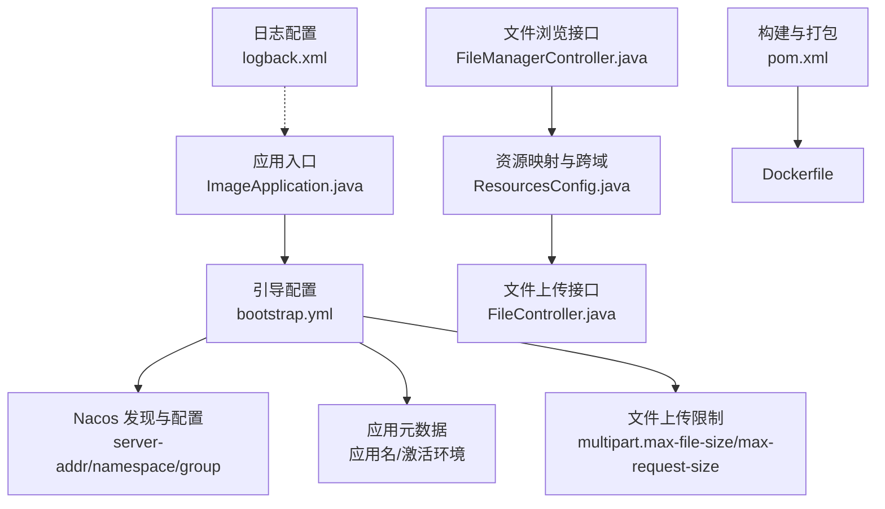
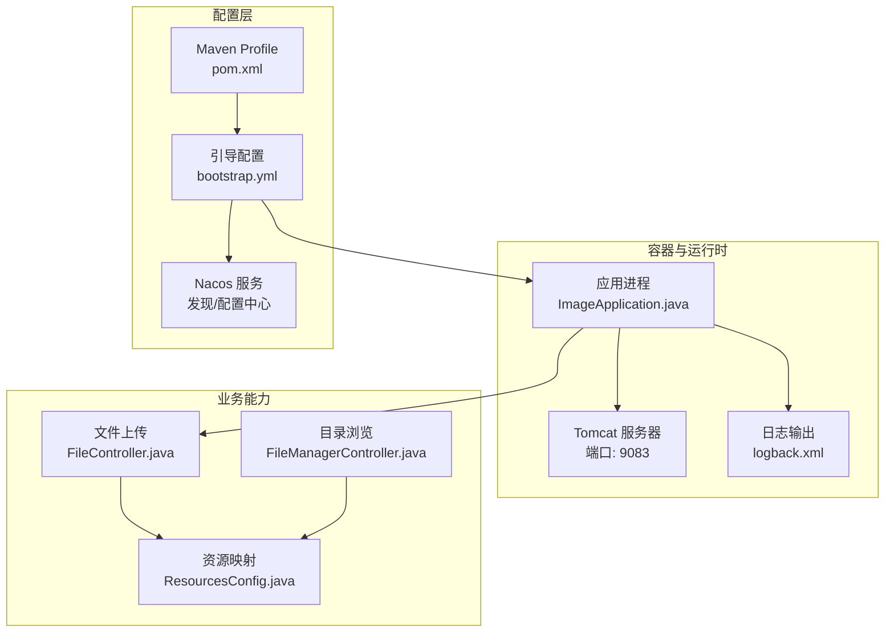
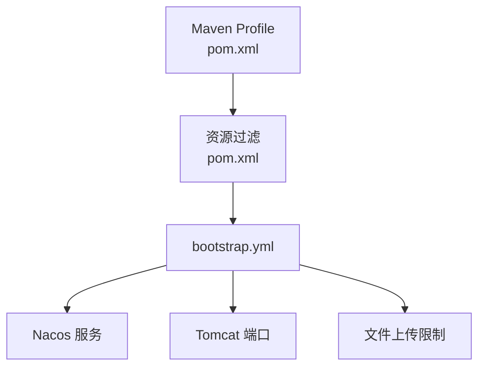
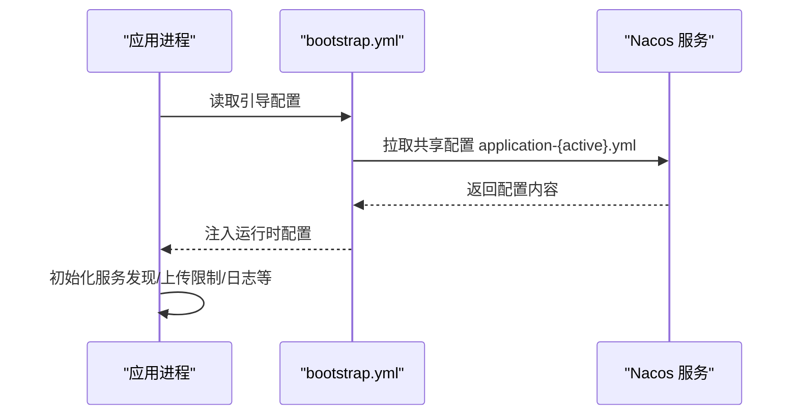

# 应用配置

<cite>
**本文引用的文件**
- [bootstrap.yml](file://src/main/resources/bootstrap.yml)
- [pom.xml](file://pom.xml)
- [Dockerfile](file://Dockerfile)
- [ResourcesConfig.java](file://src/main/java/cn/staitech/file/config/ResourcesConfig.java)
- [FileController.java](file://src/main/java/cn/staitech/file/controller/FileController.java)
- [FileManagerController.java](file://src/main/java/cn/staitech/file/controller/FileManagerController.java)
- [logback.xml](file://src/main/resources/logback.xml)
- [ImageApplication.java](file://src/main/java/cn/staitech/ImageApplication.java)
- [.gitlab-ci.yml](file://.gitlab-ci.yml)
</cite>

## 目录
1. [简介](#简介)
2. [项目结构](#项目结构)
3. [核心组件](#核心组件)
4. [架构总览](#架构总览)
5. [详细组件分析](#详细组件分析)
6. [依赖分析](#依赖分析)
7. [性能考虑](#性能考虑)
8. [故障排查指南](#故障排查指南)
9. [结论](#结论)
10. [附录](#附录)

## 简介
本文件面向运维与开发人员，系统化梳理应用的配置体系，重点覆盖以下方面：
- bootstrap.yml 中的 Tomcat 服务器端口、Spring 应用配置、文件上传限制、Nacos 服务发现与配置中心设置
- 环境变量占位符的含义与配置方式（@activatedProperties@、@serverAddr@、@nacosNamespace@、@nacosGroup@ 等）
- 不同环境（开发、测试、生产）的配置差异与最佳实践
- 配置模板与实际部署示例

## 项目结构
应用采用 Spring Boot + Spring Cloud Alibaba 的标准工程结构，配置集中在 resources 目录，Maven Profile 提供多环境差异化配置。

图表来源
- [bootstrap.yml:1-37](file://src/main/resources/bootstrap.yml#L1-L37)
- [pom.xml:348-385](file://pom.xml#L348-L385)
- [Dockerfile:1-16](file://Dockerfile#L1-L16)
- [ResourcesConfig.java:1-51](file://src/main/java/cn/staitech/file/config/ResourcesConfig.java#L1-L51)
- [FileController.java:1-130](file://src/main/java/cn/staitech/file/controller/FileController.java#L1-L130)
- [FileManagerController.java:1-119](file://src/main/java/cn/staitech/file/controller/FileManagerController.java#L1-L119)
- [logback.xml:1-116](file://src/main/resources/logback.xml#L1-L116)
- [ImageApplication.java:1-53](file://src/main/java/cn/staitech/ImageApplication.java#L1-L53)

章节来源
- [bootstrap.yml:1-37](file://src/main/resources/bootstrap.yml#L1-L37)
- [pom.xml:348-385](file://pom.xml#L348-L385)
- [Dockerfile:1-16](file://Dockerfile#L1-L16)
- [ResourcesConfig.java:1-51](file://src/main/java/cn/staitech/file/config/ResourcesConfig.java#L1-L51)
- [FileController.java:1-130](file://src/main/java/cn/staitech/file/controller/FileController.java#L1-L130)
- [FileManagerController.java:1-119](file://src/main/java/cn/staitech/file/controller/FileManagerController.java#L1-L119)
- [logback.xml:1-116](file://src/main/resources/logback.xml#L1-L116)
- [ImageApplication.java:1-53](file://src/main/java/cn/staitech/ImageApplication.java#L1-L53)

## 核心组件
- 引导配置（bootstrap.yml）
  - Tomcat 服务器端口：用于容器或主机暴露端口映射
  - Spring 应用元数据：应用名、激活环境
  - 文件上传限制：单文件与请求总大小上限
  - Nacos 服务发现与配置中心：服务地址、命名空间、分组、共享配置文件
- Maven Profile（pom.xml）
  - 定义开发、测试、生产三套环境的占位符属性
- 资源与上传（ResourcesConfig.java、FileController.java、FileManagerController.java）
  - 本地文件存储路径与前缀
  - 跨域与静态资源映射
  - 大文件切片上传与目录浏览
- 日志（logback.xml）
  - 控制台与滚动文件输出、按级别过滤
- 启动入口（ImageApplication.java）
  - 启用服务发现、Web 组件、指标标签等

章节来源
- [bootstrap.yml:1-37](file://src/main/resources/bootstrap.yml#L1-L37)
- [pom.xml:348-385](file://pom.xml#L348-L385)
- [ResourcesConfig.java:1-51](file://src/main/java/cn/staitech/file/config/ResourcesConfig.java#L1-L51)
- [FileController.java:1-130](file://src/main/java/cn/staitech/file/controller/FileController.java#L1-L130)
- [FileManagerController.java:1-119](file://src/main/java/cn/staitech/file/controller/FileManagerController.java#L1-L119)
- [logback.xml:1-116](file://src/main/resources/logback.xml#L1-L116)
- [ImageApplication.java:1-53](file://src/main/java/cn/staitech/ImageApplication.java#L1-L53)

## 架构总览
应用通过 bootstrap.yml 从 Nacos 拉取运行时配置，并结合 Maven Profile 注入环境占位符；Tomcat 在容器中以固定端口对外提供服务；文件上传能力由 Spring MVC 的 multipart 与自定义资源映射共同实现。

图表来源
- [bootstrap.yml:1-37](file://src/main/resources/bootstrap.yml#L1-L37)
- [pom.xml:348-385](file://pom.xml#L348-L385)
- [ImageApplication.java:1-53](file://src/main/java/cn/staitech/ImageApplication.java#L1-L53)
- [ResourcesConfig.java:1-51](file://src/main/java/cn/staitech/file/config/ResourcesConfig.java#L1-L51)
- [FileController.java:1-130](file://src/main/java/cn/staitech/file/controller/FileController.java#L1-L130)
- [FileManagerController.java:1-119](file://src/main/java/cn/staitech/file/controller/FileManagerController.java#L1-L119)
- [logback.xml:1-116](file://src/main/resources/logback.xml#L1-L116)

## 详细组件分析

### 引导配置（bootstrap.yml）详解
- Tomcat 服务器端口
  - 作用：容器或主机映射端口，建议与 Dockerfile EXPOSE 保持一致
  - 参考路径：[bootstrap.yml:2-3](file://src/main/resources/bootstrap.yml#L2-L3)
- Spring 应用配置
  - 应用名：用于服务注册与日志标签
  - 激活环境：通过占位符注入，来源于 Maven Profile
  - 参考路径：[bootstrap.yml:11-16](file://src/main/resources/bootstrap.yml#L11-L16)
- 文件上传限制
  - 单文件与请求总大小上限，避免内存溢出与拒绝服务
  - 参考路径：[bootstrap.yml:6-10](file://src/main/resources/bootstrap.yml#L6-L10)
- Nacos 服务发现与配置中心
  - 服务注册地址、命名空间、分组
  - 配置中心地址、文件格式、命名空间、分组
  - 共享配置：application-{spring.profiles.active}.yml
  - 参考路径：[bootstrap.yml:17-37](file://src/main/resources/bootstrap.yml#L17-L37)

章节来源
- [bootstrap.yml:1-37](file://src/main/resources/bootstrap.yml#L1-L37)

### 环境变量占位符与 Maven Profile
- 占位符说明
  - @activatedProperties@：激活的环境标识（开发/测试/生产）
  - @serverAddr@：Nacos 地址（含端口）
  - @nacosNamespace@：命名空间 ID
  - @nacosGroup@：分组名称
  - 参考路径：[bootstrap.yml:16,21,23,25,28,31,33:16-37](file://src/main/resources/bootstrap.yml#L16-L37)
- Maven Profile 差异
  - 开发环境（pacmvsdev）：命名空间、地址、分组
  - 测试环境（testpvcmvs）：命名空间、地址、分组
  - 生产环境（pathmedics）：命名空间、地址、分组
  - 参考路径：[pom.xml:349-382](file://pom.xml#L349-L382)
- 占位符注入机制
  - Maven 打包时通过资源过滤替换占位符
  - 参考路径：[pom.xml:241-274](file://pom.xml#L241-L274)

章节来源
- [bootstrap.yml:16,21,23,25,28,31,33:16-37](file://src/main/resources/bootstrap.yml#L16-L37)
- [pom.xml:241-274](file://pom.xml#L241-L274)
- [pom.xml:349-382](file://pom.xml#L349-L382)

### 文件上传与资源映射
- 上传接口与限制
  - 接口：/bigPicture/uploadSlice
  - 限制：单文件与请求总大小上限由 bootstrap.yml 控制
  - 参考路径：[bootstrap.yml:6-10](file://src/main/resources/bootstrap.yml#L6-L10)，[FileController.java:98-127](file://src/main/java/cn/staitech/file/controller/FileController.java#L98-L127)
- 本地存储与跨域
  - 存储根路径与前缀由配置注入
  - 资源映射与跨域策略
  - 参考路径：[ResourcesConfig.java:22,28-36:22-36](file://src/main/java/cn/staitech/file/config/ResourcesConfig.java#L22-L36)，[ResourcesConfig.java:43-50](file://src/main/java/cn/staitech/file/config/ResourcesConfig.java#L43-L50)
- 目录浏览
  - 接口：/filePath/list
  - 路径安全校验与过滤
  - 参考路径：[FileManagerController.java:46-89](file://src/main/java/cn/staitech/file/controller/FileManagerController.java#L46-L89)

章节来源
- [bootstrap.yml:6-10](file://src/main/resources/bootstrap.yml#L6-L10)
- [FileController.java:98-127](file://src/main/java/cn/staitech/file/controller/FileController.java#L98-L127)
- [ResourcesConfig.java:22,28-36:22-36](file://src/main/java/cn/staitech/file/config/ResourcesConfig.java#L22-L36)
- [ResourcesConfig.java:43-50](file://src/main/java/cn/staitech/file/config/ResourcesConfig.java#L43-L50)
- [FileManagerController.java:46-89](file://src/main/java/cn/staitech/file/controller/FileManagerController.java#L46-L89)

### 日志与可观测性
- 日志配置
  - 控制台与滚动文件输出
  - INFO/WARN/ERROR/DEBUG 分级别过滤
  - 参考路径：[logback.xml:8-115](file://src/main/resources/logback.xml#L8-L115)
- 指标标签
  - 应用标签统一为“staitech-image”
  - 参考路径：[ImageApplication.java:47-50](file://src/main/java/cn/staitech/ImageApplication.java#L47-L50)

章节来源
- [logback.xml:8-115](file://src/main/resources/logback.xml#L8-L115)
- [ImageApplication.java:47-50](file://src/main/java/cn/staitech/ImageApplication.java#L47-L50)

### 启动与容器化
- 启动入口
  - 启用服务发现、Web 组件、事务管理等
  - 参考路径：[ImageApplication.java:27-36](file://src/main/java/cn/staitech/ImageApplication.java#L27-L36)
- 容器镜像
  - 基于 openjdk:8-jre-alpine
  - EXPOSE 8080（注意：bootstrap.yml 中端口为 9083）
  - 参考路径：[Dockerfile:8-15](file://Dockerfile#L8-L15)，[bootstrap.yml:2-3](file://src/main/resources/bootstrap.yml#L2-L3)

章节来源
- [ImageApplication.java:27-36](file://src/main/java/cn/staitech/ImageApplication.java#L27-L36)
- [Dockerfile:8-15](file://Dockerfile#L8-L15)
- [bootstrap.yml:2-3](file://src/main/resources/bootstrap.yml#L2-L3)

## 依赖分析
- 配置来源链路
  - Maven Profile 注入占位符 → 资源过滤替换 → bootstrap.yml → Nacos 拉取运行时配置
- 关键耦合点
  - @serverAddr@、@nacosNamespace@、@nacosGroup@ 必须与 Nacos 实际配置一致
  - @activatedProperties@ 决定共享配置文件名后缀
- 潜在风险
  - 占位符未正确注入会导致 Nacos 连接失败
  - 文件上传大小限制与业务场景不匹配可能导致上传失败

图表来源
- [pom.xml:241-274](file://pom.xml#L241-L274)
- [bootstrap.yml:16,21,23,25,28,31,33:16-37](file://src/main/resources/bootstrap.yml#L16-L37)

章节来源
- [pom.xml:241-274](file://pom.xml#L241-L274)
- [bootstrap.yml:16,21,23,25,28,31,33:16-37](file://src/main/resources/bootstrap.yml#L16-L37)

## 性能考虑
- 文件上传
  - 合理设置单文件与请求总大小，避免 OOM
  - 使用分片上传与断点续传，降低网络波动影响
- Nacos
  - 选择就近机房地址，减少延迟
  - 合理设置命名空间与分组，避免配置冲突
- 日志
  - 生产环境建议降低 DEBUG 输出量，避免磁盘 IO 压力

## 故障排查指南
- Nacos 连接失败
  - 检查 @serverAddr@ 是否正确注入
  - 确认 @nacosNamespace@ 与 @nacosGroup@ 与 Nacos 侧一致
  - 参考路径：[bootstrap.yml:21,23,25,28,31,33:21-33](file://src/main/resources/bootstrap.yml#L21-L33)
- 端口冲突或映射错误
  - 容器 EXPOSE 与应用端口不一致，需统一
  - 参考路径：[Dockerfile:12](file://Dockerfile#L12)，[bootstrap.yml:3](file://src/main/resources/bootstrap.yml#L3)
- 上传失败
  - 检查文件大小是否超过限制
  - 参考路径：[bootstrap.yml:9-10](file://src/main/resources/bootstrap.yml#L9-L10)
- 日志问题
  - 查看 logback.xml 的输出位置与级别
  - 参考路径：[logback.xml:4,109-115](file://src/main/resources/logback.xml#L4,L109-L115)

章节来源
- [bootstrap.yml:21,23,25,28,31,33:21-33](file://src/main/resources/bootstrap.yml#L21-L33)
- [Dockerfile:12](file://Dockerfile#L12)
- [bootstrap.yml:9-10](file://src/main/resources/bootstrap.yml#L9-L10)
- [logback.xml:4,109-115](file://src/main/resources/logback.xml#L4,L109-L115)

## 结论
本应用通过 bootstrap.yml 与 Maven Profile 实现环境解耦与集中配置，结合 Nacos 的服务发现与配置中心，形成清晰的配置链路。建议在部署时严格核对占位符注入、端口映射与上传限制，确保稳定运行。

## 附录

### 不同环境配置模板（占位符）
- 开发环境（pacmvsdev）
  - @activatedProperties@ = pacmvsdev
  - @nacosNamespace@ = pacmvsdev
  - @serverAddr@ = 192.168.52.224:8848
  - @nacosGroup@ = DEFAULT_GROUP
  - 参考路径：[pom.xml:354-358](file://pom.xml#L354-L358)
- 测试环境（testpvcmvs）
  - @activatedProperties@ = testpvcmvs
  - @nacosNamespace@ = 301f5c59-5f9c-451c-a77b-88d64ddfd9f0
  - @serverAddr@ = 192.168.160.105:8848
  - @nacosGroup@ = DEFAULT_GROUP
  - 参考路径：[pom.xml:365-370](file://pom.xml#L365-L370)
- 生产环境（pathmedics）
  - @activatedProperties@ = pathmedics
  - @nacosNamespace@ = 40438ad6-00f6-4524-8043-4e79819cccf0
  - @serverAddr@ = 10.10.4.13:8848
  - @nacosGroup@ = DEFAULT_GROUP
  - 参考路径：[pom.xml:376-381](file://pom.xml#L376-L381)

### 部署示例（GitLab CI）
- 示例阶段：build → test → deploy
- 环境：production
- 参考路径：[.gitlab-ci.yml:16-49](file://.gitlab-ci.yml#L16-L49)

### 关键流程时序图（配置拉取）

图表来源
- [bootstrap.yml:16,36-37](file://src/main/resources/bootstrap.yml#L16,L36-L37)
- [pom.xml:349-382](file://pom.xml#L349-L382)