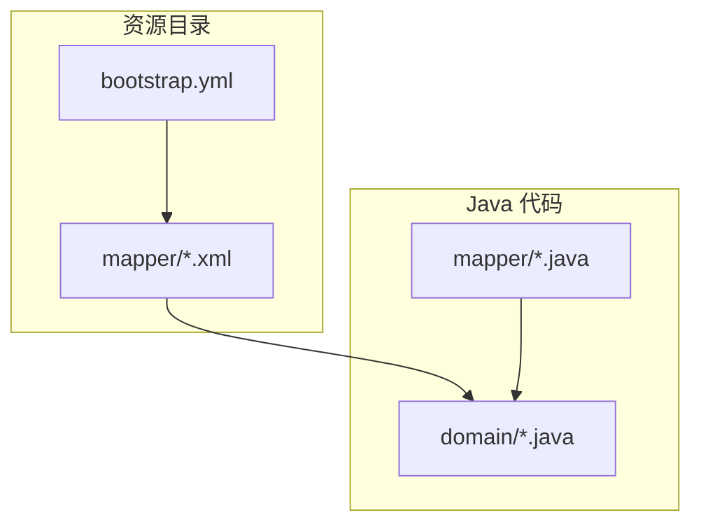
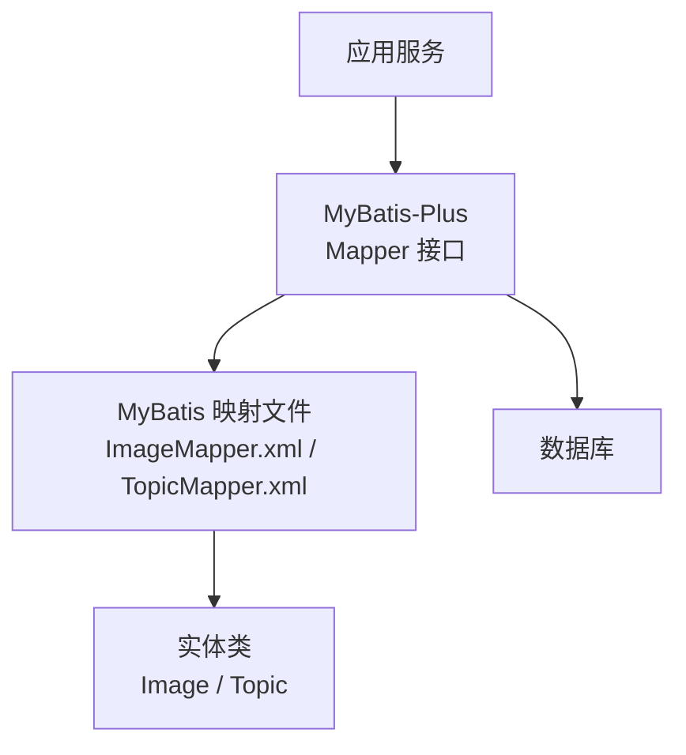
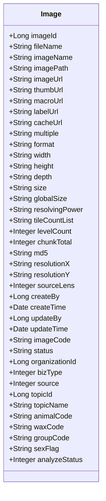
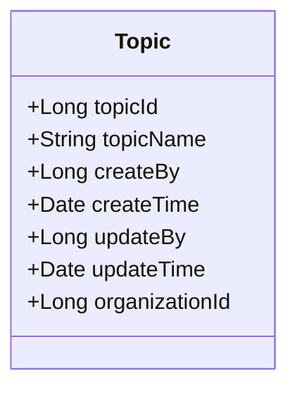
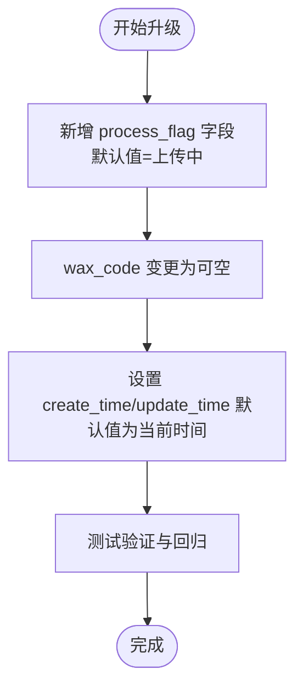
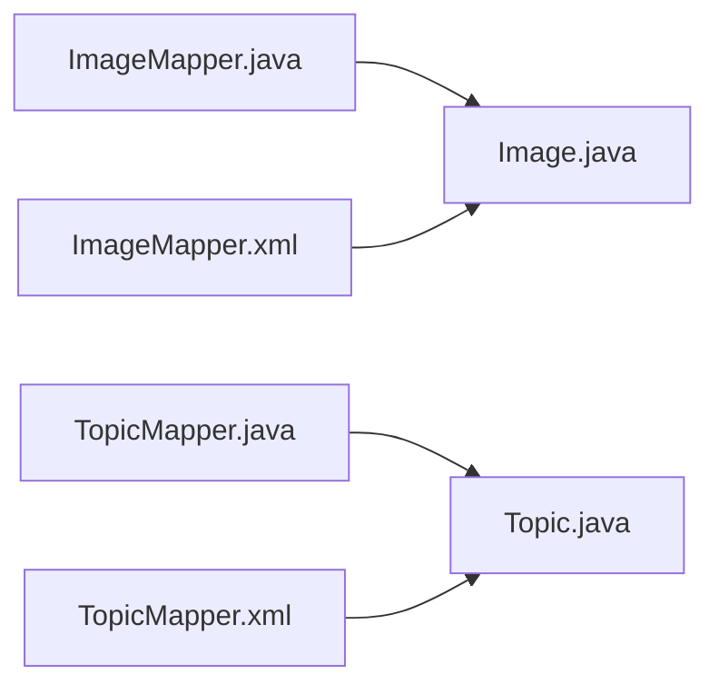

# 数据库配置

<cite>
**本文引用的文件**
- [update_v2.5.2.sql](file://sql/update_v2.5.2.sql)
- [ImageMapper.xml](file://src/main/resources/mapper/ImageMapper.xml)
- [TopicMapper.xml](file://src/main/resources/mapper/TopicMapper.xml)
- [Image.java](file://src/main/java/cn/staitech/file/domain/Image.java)
- [Topic.java](file://src/main/java/cn/staitech/file/domain/Topic.java)
- [ImageMapper.java](file://src/main/java/cn/staitech/file/mapper/ImageMapper.java)
- [TopicMapper.java](file://src/main/java/cn/staitech/file/mapper/TopicMapper.java)
- [bootstrap.yml](file://src/main/resources/bootstrap.yml)
</cite>

## 目录
1. [简介](#简介)
2. [项目结构](#项目结构)
3. [核心组件](#核心组件)
4. [架构总览](#架构总览)
5. [详细组件分析](#详细组件分析)
6. [依赖分析](#依赖分析)
7. [性能考虑](#性能考虑)
8. [故障排除指南](#故障排除指南)
9. [结论](#结论)
10. [附录](#附录)

## 简介
本文件面向数据库管理员与后端开发人员，系统性梳理本项目的数据库配置与使用方式，重点覆盖以下方面：
- MyBatis 映射文件的表结构映射与 SQL 实现要点
- ImageMapper.xml 与 TopicMapper.xml 的字段映射、查询优化与事务配置现状
- 数据库版本更新脚本 update_v2.5.2.sql 的内容与升级路径
- 连接池配置、性能优化参数与索引设计建议
- 数据库监控指标、备份恢复策略与故障排除方法
- 面向 DBA 的完整配置管理与维护指南

## 项目结构
本项目采用 Spring Boot + MyBatis-Plus 架构，数据库相关的核心位置如下：
- MyBatis 映射文件位于 resources/mapper 下，分别定义了 Image 与 Topic 的映射关系
- 实体类位于 domain 包下，通过注解声明表名与字段映射
- Mapper 接口位于 mapper 包下，继承 MyBatis-Plus 的 BaseMapper，提供通用 CRUD 能力
- 应用配置位于 resources/bootstrap.yml，包含 Nacos 配置中心等环境信息

**图表来源**
- [ImageMapper.xml:1-65](file://src/main/resources/mapper/ImageMapper.xml#L1-L65)
- [TopicMapper.xml:1-7](file://src/main/resources/mapper/TopicMapper.xml#L1-L7)
- [Image.java:26-216](file://src/main/java/cn/staitech/file/domain/Image.java#L26-L216)
- [Topic.java:23-61](file://src/main/java/cn/staitech/file/domain/Topic.java#L23-L61)
- [ImageMapper.java:1-16](file://src/main/java/cn/staitech/file/mapper/ImageMapper.java#L1-L16)
- [TopicMapper.java:1-10](file://src/main/java/cn/staitech/file/mapper/TopicMapper.java#L1-L10)
- [bootstrap.yml:1-37](file://src/main/resources/bootstrap.yml#L1-L37)

**章节来源**
- [bootstrap.yml:1-37](file://src/main/resources/bootstrap.yml#L1-L37)

## 核心组件
- 实体类与表映射
  - Image 实体通过注解绑定 tb_image 表，包含图像元数据、切片信息、分辨率、组织与专题关联等字段
  - Topic 实体通过注解绑定 tb_topic 表，包含专题名称与组织信息
- Mapper 接口与 MyBatis 映射
  - ImageMapper 继承 BaseMapper，提供通用 CRUD 与分页能力
  - TopicMapper 继承 BaseMapper，提供通用 CRUD 与分页能力
  - ImageMapper.xml 定义了完整的字段映射与列清单，TopicMapper.xml 当前为空，后续可按需扩展
- 配置与环境
  - bootstrap.yml 提供应用名、Nacos 配置中心地址与共享配置等信息，实际数据库连接配置通常由 Nacos 或本地配置提供

**章节来源**
- [Image.java:26-216](file://src/main/java/cn/staitech/file/domain/Image.java#L26-L216)
- [Topic.java:23-61](file://src/main/java/cn/staitech/file/domain/Topic.java#L23-L61)
- [ImageMapper.java:1-16](file://src/main/java/cn/staitech/file/mapper/ImageMapper.java#L1-L16)
- [TopicMapper.java:1-10](file://src/main/java/cn/staitech/file/mapper/TopicMapper.java#L1-L10)
- [ImageMapper.xml:1-65](file://src/main/resources/mapper/ImageMapper.xml#L1-L65)
- [TopicMapper.xml:1-7](file://src/main/resources/mapper/TopicMapper.xml#L1-L7)
- [bootstrap.yml:1-37](file://src/main/resources/bootstrap.yml#L1-L37)

## 架构总览
下图展示从应用到数据库的交互路径，以及 MyBatis-Plus 在其中的角色。

**图表来源**
- [ImageMapper.java:1-16](file://src/main/java/cn/staitech/file/mapper/ImageMapper.java#L1-L16)
- [TopicMapper.java:1-10](file://src/main/java/cn/staitech/file/mapper/TopicMapper.java#L1-L10)
- [ImageMapper.xml:1-65](file://src/main/resources/mapper/ImageMapper.xml#L1-L65)
- [TopicMapper.xml:1-7](file://src/main/resources/mapper/TopicMapper.xml#L1-L7)
- [Image.java:26-216](file://src/main/java/cn/staitech/file/domain/Image.java#L26-L216)
- [Topic.java:23-61](file://src/main/java/cn/staitech/file/domain/Topic.java#L23-L61)

## 详细组件分析

### ImageMapper.xml 与 Image 实体映射
- 字段映射
  - 通过 resultMap 将 tb_image 表的列与 Image 实体属性一一对应，涵盖基础元数据、切片与层级信息、分辨率、组织与专题关联、状态与处理标志等
  - 定义了 Base_Column_List 便于统一查询列清单，减少重复与遗漏
- 查询优化建议
  - 建议在高频查询条件（如 topic_id、image_code、status、组织标识、时间范围）上建立合适索引
  - 对于分页查询，确保排序字段与索引匹配，避免回表与排序开销
  - 使用 Base_Column_List 减少不必要的列加载，提升网络与解析效率
- 事务配置现状
  - 该映射文件未直接声明事务，事务控制由上层 Service 层管理；请确认 Service 方法上的事务注解与隔离级别满足业务需求

**图表来源**
- [Image.java:26-216](file://src/main/java/cn/staitech/file/domain/Image.java#L26-L216)

**章节来源**
- [ImageMapper.xml:1-65](file://src/main/resources/mapper/ImageMapper.xml#L1-L65)
- [Image.java:26-216](file://src/main/java/cn/staitech/file/domain/Image.java#L26-L216)

### TopicMapper.xml 与 Topic 实体映射
- 当前状态
  - TopicMapper.xml 为空文件，尚未定义任何 SQL 与映射；TopicMapper 继承 BaseMapper，可通过通用 CRUD 完成基本操作
- 后续建议
  - 如需复杂查询（如按专题名称模糊匹配、统计专题内图像数量），可在 TopicMapper.xml 中补充相应 SQL
  - 建议对 topic_name 建立唯一索引以保证数据一致性与查询效率

**图表来源**
- [Topic.java:23-61](file://src/main/java/cn/staitech/file/domain/Topic.java#L23-L61)

**章节来源**
- [TopicMapper.xml:1-7](file://src/main/resources/mapper/TopicMapper.xml#L1-L7)
- [Topic.java:23-61](file://src/main/java/cn/staitech/file/domain/Topic.java#L23-L61)

### 数据库版本更新脚本 update_v2.5.2.sql
- 升级内容概要
  - 为 tb_image 表新增 process_flag 字段，用于记录“处理状态”，默认值为“5”（上传中）
  - 修改 wax_code 字段为可空，原为非空，以适配部分蜡块号缺失场景
  - 将 create_time 与 update_time 的默认值设置为当前时间戳，确保自动填充
- 升级路径建议
  - 在生产环境执行前，先在测试环境验证字段变更与默认值行为
  - 建议在变更字段类型或默认值时，评估对现有业务逻辑的影响（如状态机、报表统计）

**图表来源**
- [update_v2.5.2.sql:1-10](file://sql/update_v2.5.2.sql#L1-L10)

**章节来源**
- [update_v2.5.2.sql:1-10](file://sql/update_v2.5.2.sql#L1-L10)

### 事务配置现状与建议
- 现状
  - 本仓库未提供显式的事务配置文件或注解示例；事务通常由上层 Service 层通过注解或编程式事务管理
- 建议
  - 对写密集型操作（如批量导入、状态更新）明确事务边界，设置合理的超时与隔离级别
  - 对只读查询（如列表、详情）可降低隔离级别以提升并发性能

**章节来源**
- [ImageMapper.java:1-16](file://src/main/java/cn/staitech/file/mapper/ImageMapper.java#L1-L16)
- [TopicMapper.java:1-10](file://src/main/java/cn/staitech/file/mapper/TopicMapper.java#L1-L10)

## 依赖分析
- 组件耦合
  - Mapper 接口与实体类通过注解与映射文件强关联，耦合度合理
  - MyBatis-Plus 提供通用 CRUD，减少手写 SQL 的同时保持灵活性
- 外部依赖
  - 应用通过 Nacos 获取配置，数据库连接配置可能由 Nacos 管理
- 潜在风险
  - TopicMapper.xml 为空，若后续引入复杂查询，需及时补充 SQL 与索引

**图表来源**
- [ImageMapper.java:1-16](file://src/main/java/cn/staitech/file/mapper/ImageMapper.java#L1-L16)
- [TopicMapper.java:1-10](file://src/main/java/cn/staitech/file/mapper/TopicMapper.java#L1-L10)
- [Image.java:26-216](file://src/main/java/cn/staitech/file/domain/Image.java#L26-L216)
- [Topic.java:23-61](file://src/main/java/cn/staitech/file/domain/Topic.java#L23-L61)
- [ImageMapper.xml:1-65](file://src/main/resources/mapper/ImageMapper.xml#L1-L65)
- [TopicMapper.xml:1-7](file://src/main/resources/mapper/TopicMapper.xml#L1-L7)

**章节来源**
- [ImageMapper.java:1-16](file://src/main/java/cn/staitech/file/mapper/ImageMapper.java#L1-L16)
- [TopicMapper.java:1-10](file://src/main/java/cn/staitech/file/mapper/TopicMapper.java#L1-L10)
- [Image.java:26-216](file://src/main/java/cn/staitech/file/domain/Image.java#L26-L216)
- [Topic.java:23-61](file://src/main/java/cn/staitech/file/domain/Topic.java#L23-L61)
- [ImageMapper.xml:1-65](file://src/main/resources/mapper/ImageMapper.xml#L1-L65)
- [TopicMapper.xml:1-7](file://src/main/resources/mapper/TopicMapper.xml#L1-L7)

## 性能考虑
- 连接池配置
  - 建议在 Nacos 或应用配置中设置连接池参数（如最小/最大连接数、空闲超时、连接生命周期、获取超时），并结合压测结果调优
- SQL 优化
  - 使用 ImageMapper.xml 中的 Base_Column_List，避免 SELECT *
  - 对高频查询字段建立合适索引（如 topic_id、image_code、status、组织标识、时间范围）
  - 分页查询确保排序字段与索引一致，避免大偏移量分页
- 缓存与热点
  - 对只读数据与热点查询引入缓存（如 Redis），减少数据库压力
- 监控与告警
  - 关注慢查询日志、锁等待、连接池饱和、QPS/P95 延迟等指标

[本节为通用性能指导，不直接分析具体文件，故不附加“章节来源”]

## 故障排除指南
- 常见问题定位
  - 字段映射异常：核对实体类注解与映射文件字段是否一致
  - 查询性能差：检查索引是否存在、SQL 是否回表、是否使用了函数或隐式转换
  - 事务冲突：检查长事务、锁升级、隔离级别与业务并发模式
- 版本升级相关
  - 执行 update_v2.5.2.sql 后，确认 process_flag 默认值与 wax_code 可空行为符合预期
  - 核查 create_time/update_time 的默认值是否生效，避免历史数据时间戳异常
- 日志与诊断
  - 开启数据库慢查询日志与连接池监控，定期巡检
  - 结合应用侧日志与数据库审计，快速定位问题根因

**章节来源**
- [update_v2.5.2.sql:1-10](file://sql/update_v2.5.2.sql#L1-L10)
- [ImageMapper.xml:1-65](file://src/main/resources/mapper/ImageMapper.xml#L1-L65)

## 结论
本项目基于 MyBatis-Plus 的数据库访问层简洁清晰，ImageMapper.xml 提供完善的字段映射，TopicMapper.xml 待后续扩展。通过合理的索引设计、连接池与事务配置，以及持续的监控与回归验证，可有效保障系统的稳定性与性能。建议尽快完善 TopicMapper.xml 并补充必要的查询 SQL，以支撑专题维度的数据管理需求。

[本节为总结性内容，不直接分析具体文件，故不附加“章节来源”]

## 附录

### 数据库监控指标建议
- 连接层：活跃连接数、空闲连接数、连接获取耗时、连接池等待队列长度
- 查询层：慢查询数量与阈值、QPS、P95/P99 延迟、错误率
- 索引层：索引命中率、回表率、索引选择性
- 事务层：事务提交/回滚速率、平均事务时长、死锁次数

[本节为通用监控建议，不直接分析具体文件，故不附加“章节来源”]

### 备份恢复策略
- 全量备份：定期执行全库导出，保留多版本以便回滚
- 增量备份：开启二进制日志，按需恢复到指定时间点
- 恢复演练：定期进行 RTO/RPO 测试，验证备份有效性
- 灾备：跨机房同步或异地容灾，确保业务连续性

[本节为通用策略建议，不直接分析具体文件，故不附加“章节来源”]

### 索引设计建议（基于现有实体）
- tb_image
  - 唯一索引：image_code（唯一标识）
  - 组合索引：topic_id + status + organization_id（专题+状态+组织筛选）
  - 时间索引：create_time / update_time（按时间范围查询）
  - 文本检索：wax_code（如需模糊匹配，考虑函数索引或分词）
- tb_topic
  - 唯一索引：topic_name（唯一约束）
  - 组合索引：organization_id + createTime（组织+创建时间）

**章节来源**
- [Image.java:26-216](file://src/main/java/cn/staitech/file/domain/Image.java#L26-L216)
- [Topic.java:23-61](file://src/main/java/cn/staitech/file/domain/Topic.java#L23-L61)