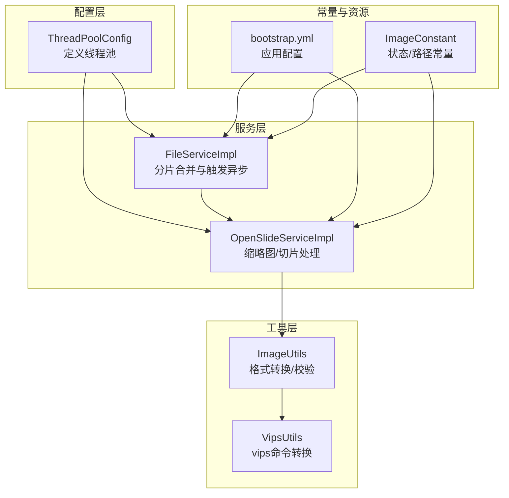
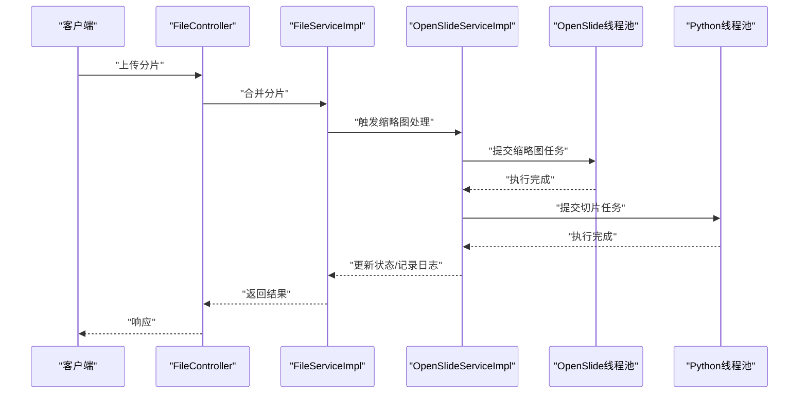
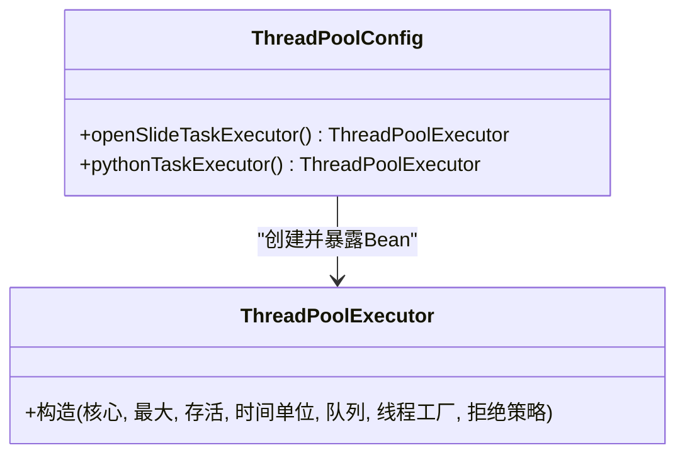
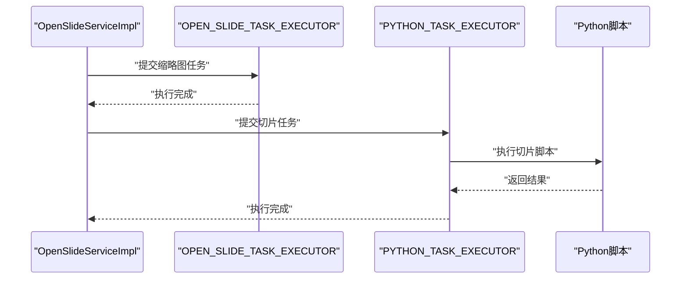
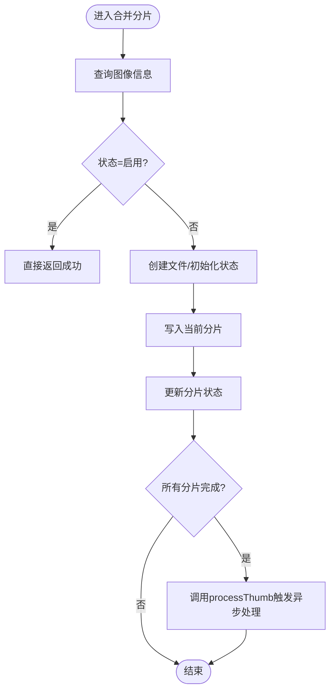
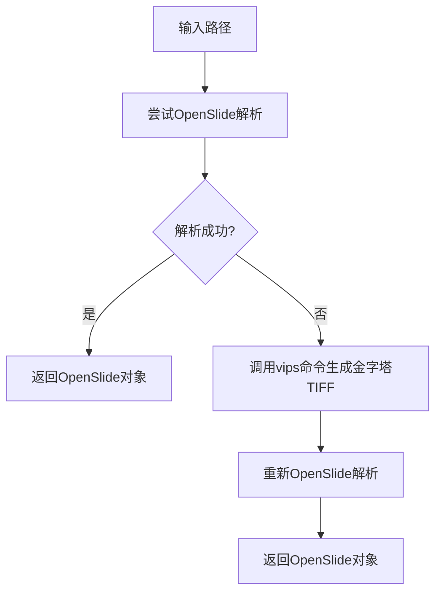
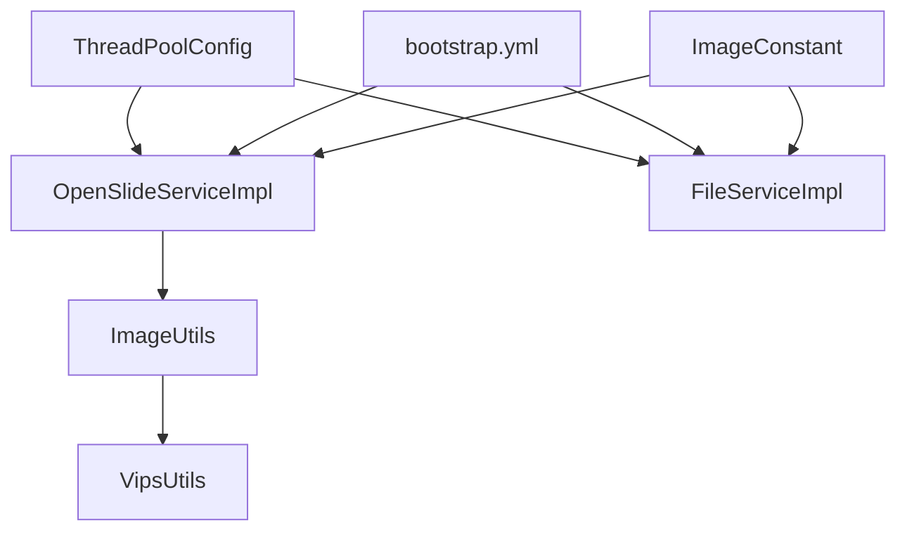

# 线程池配置

<cite>
**本文引用的文件**
- [ThreadPoolConfig.java](file://src/main/java/cn/staitech/file/config/ThreadPoolConfig.java)
- [OpenSlideServiceImpl.java](file://src/main/java/cn/staitech/file/service/impl/OpenSlideServiceImpl.java)
- [FileServiceImpl.java](file://src/main/java/cn/staitech/file/service/impl/FileServiceImpl.java)
- [ImageUtils.java](file://src/main/java/cn/staitech/file/util/ImageUtils.java)
- [VipsUtils.java](file://src/main/java/cn/staitech/file/util/VipsUtils.java)
- [ImageConstant.java](file://src/main/java/cn/staitech/file/constant/ImageConstant.java)
- [bootstrap.yml](file://src/main/resources/bootstrap.yml)
</cite>

## 目录
1. [简介](#简介)
2. [项目结构](#项目结构)
3. [核心组件](#核心组件)
4. [架构总览](#架构总览)
5. [详细组件分析](#详细组件分析)
6. [依赖分析](#依赖分析)
7. [性能考量](#性能考量)
8. [故障排查指南](#故障排查指南)
9. [结论](#结论)
10. [附录](#附录)

## 简介
本文件围绕线程池配置展开，重点解析 ThreadPoolConfig 中的线程池实现与使用方式，覆盖核心线程数、最大线程数、队列容量、空闲线程存活时间、拒绝策略等参数设计，并结合图像处理、文件上传、异步处理等业务场景给出配置策略与优化建议。同时提供监控指标、性能调优参数与故障处理方法，以及最佳实践与常见问题解决方案。

## 项目结构
本项目采用 Spring Boot 结构，线程池配置位于配置包下，业务侧通过服务实现类注入并使用线程池执行耗时任务（如 OpenSlide 缩略图生成、Python 切片脚本执行）。上传流程由控制器与服务协作完成，最终触发异步处理。

图表来源
- [ThreadPoolConfig.java:1-66](file://src/main/java/cn/staitech/file/config/ThreadPoolConfig.java#L1-L66)
- [OpenSlideServiceImpl.java:67-72](file://src/main/java/cn/staitech/file/service/impl/OpenSlideServiceImpl.java#L67-L72)
- [FileServiceImpl.java:134-144](file://src/main/java/cn/staitech/file/service/impl/FileServiceImpl.java#L134-L144)
- [ImageUtils.java:52-97](file://src/main/java/cn/staitech/file/util/ImageUtils.java#L52-L97)
- [VipsUtils.java:22-35](file://src/main/java/cn/staitech/file/util/VipsUtils.java#L22-L35)
- [ImageConstant.java:1-67](file://src/main/java/cn/staitech/file/constant/ImageConstant.java#L1-L67)
- [bootstrap.yml:1-37](file://src/main/resources/bootstrap.yml#L1-L37)

章节来源
- [ThreadPoolConfig.java:1-66](file://src/main/java/cn/staitech/file/config/ThreadPoolConfig.java#L1-L66)
- [OpenSlideServiceImpl.java:67-72](file://src/main/java/cn/staitech/file/service/impl/OpenSlideServiceImpl.java#L67-L72)
- [FileServiceImpl.java:134-144](file://src/main/java/cn/staitech/file/service/impl/FileServiceImpl.java#L134-L144)
- [ImageUtils.java:52-97](file://src/main/java/cn/staitech/file/util/ImageUtils.java#L52-L97)
- [VipsUtils.java:22-35](file://src/main/java/cn/staitech/file/util/VipsUtils.java#L22-L35)
- [ImageConstant.java:1-67](file://src/main/java/cn/staitech/file/constant/ImageConstant.java#L1-L67)
- [bootstrap.yml:1-37](file://src/main/resources/bootstrap.yml#L1-L37)

## 核心组件
- 线程池配置类：定义两个专用线程池 Bean，分别用于 OpenSlide 处理与 Python 脚本执行。
- 业务服务类：OpenSlideServiceImpl 注入并使用线程池执行缩略图生成与切片任务；FileServiceImpl 在分片合并完成后触发异步处理。
- 工具类：ImageUtils 负责格式转换与 OpenSlide 验证；VipsUtils 调用 vips 命令进行金字塔 TIFF 转换。
- 常量与配置：ImageConstant 提供状态与路径常量；bootstrap.yml 提供应用与 Nacos 配置中心等环境配置。

章节来源
- [ThreadPoolConfig.java:18-64](file://src/main/java/cn/staitech/file/config/ThreadPoolConfig.java#L18-L64)
- [OpenSlideServiceImpl.java:67-72](file://src/main/java/cn/staitech/file/service/impl/OpenSlideServiceImpl.java#L67-L72)
- [FileServiceImpl.java:134-144](file://src/main/java/cn/staitech/file/service/impl/FileServiceImpl.java#L134-L144)
- [ImageUtils.java:52-97](file://src/main/java/cn/staitech/file/util/ImageUtils.java#L52-L97)
- [VipsUtils.java:22-35](file://src/main/java/cn/staitech/file/util/VipsUtils.java#L22-L35)
- [ImageConstant.java:1-67](file://src/main/java/cn/staitech/file/constant/ImageConstant.java#L1-L67)
- [bootstrap.yml:1-37](file://src/main/resources/bootstrap.yml#L1-L37)

## 架构总览
线程池在系统中的作用是隔离不同类型的后台任务，避免相互影响。OpenSlide 线程池用于缩略图生成与元数据解析；Python 线程池用于调用外部脚本进行切片处理。两者均采用固定优先级的阻塞队列与自定义拒绝策略，保证高吞吐与稳定性。

图表来源
- [FileServiceImpl.java:134-144](file://src/main/java/cn/staitech/file/service/impl/FileServiceImpl.java#L134-L144)
- [OpenSlideServiceImpl.java:278-339](file://src/main/java/cn/staitech/file/service/impl/OpenSlideServiceImpl.java#L278-L339)
- [ThreadPoolConfig.java:18-64](file://src/main/java/cn/staitech/file/config/ThreadPoolConfig.java#L18-L64)

## 详细组件分析

### 线程池配置类（ThreadPoolConfig）
- OpenSlide 处理线程池
  - 核心线程数：CPU 核数 + 1
  - 最大线程数：CPU 核数 × 2
  - 空闲线程存活时间：30 秒
  - 阻塞队列：ArrayBlockingQueue，容量 100000
  - 线程工厂：NamedThreadFactory，线程名前缀“OpenSlide-Thread-Pool”
  - 拒绝策略：记录错误日志并使用调用者线程执行
- Python 脚本执行线程池
  - 核心线程数：max(1, CPU/16)
  - 最大线程数：max(2, CPU/16)
  - 空闲线程存活时间：30 秒
  - 阻塞队列：ArrayBlockingQueue，容量 100000
  - 线程工厂：NamedThreadFactory，线程名前缀“Python-Thread-Pool”
  - 拒绝策略：记录错误日志并使用调用者线程执行

图表来源
- [ThreadPoolConfig.java:18-64](file://src/main/java/cn/staitech/file/config/ThreadPoolConfig.java#L18-L64)

章节来源
- [ThreadPoolConfig.java:18-64](file://src/main/java/cn/staitech/file/config/ThreadPoolConfig.java#L18-L64)

### OpenSlide 服务实现（OpenSlideServiceImpl）
- 注入线程池：通过 @Resource(name="openSlideTaskExecutor") 和 @Resource(name="pythonTaskExecutor") 注入两个线程池。
- 缩略图处理：在 processThumb 中批量提交任务，使用 OPEN_SLIDE_TASK_EXECUTOR 执行缩略图生成与元数据解析。
- 切片任务：submitTileTask 中使用 PYTHON_TASK_EXECUTOR 调用 Python 脚本生成切片，完成后更新状态。
- 失败处理：当任务失败时，将文件移动到失败目录并记录审计日志。

图表来源
- [OpenSlideServiceImpl.java:67-72](file://src/main/java/cn/staitech/file/service/impl/OpenSlideServiceImpl.java#L67-L72)
- [OpenSlideServiceImpl.java:278-339](file://src/main/java/cn/staitech/file/service/impl/OpenSlideServiceImpl.java#L278-L339)

章节来源
- [OpenSlideServiceImpl.java:67-72](file://src/main/java/cn/staitech/file/service/impl/OpenSlideServiceImpl.java#L67-L72)
- [OpenSlideServiceImpl.java:278-339](file://src/main/java/cn/staitech/file/service/impl/OpenSlideServiceImpl.java#L278-L339)

### 文件分片合并（FileServiceImpl）
- 合并分片：在分片全部到达后，更新状态并调用 OpenSlideService.processThumb 触发异步处理。
- 并发控制：使用并发安全的结构与原子引用控制分片状态，避免重复处理。

图表来源
- [FileServiceImpl.java:53-146](file://src/main/java/cn/staitech/file/service/impl/FileServiceImpl.java#L53-L146)

章节来源
- [FileServiceImpl.java:53-146](file://src/main/java/cn/staitech/file/service/impl/FileServiceImpl.java#L53-L146)

### 图像工具与转换（ImageUtils、VipsUtils）
- OpenSlide 验证与转换：pictureConversion 方法尝试使用 OpenSlide 解析，若失败则通过 VipsUtils 调用 vips 命令生成金字塔 TIFF，再重新解析。
- vips 命令：使用 LZW 压缩、256×256 瓦片尺寸生成金字塔结构，提升后续切片效率。

图表来源
- [ImageUtils.java:52-97](file://src/main/java/cn/staitech/file/util/ImageUtils.java#L52-L97)
- [VipsUtils.java:22-35](file://src/main/java/cn/staitech/file/util/VipsUtils.java#L22-L35)

章节来源
- [ImageUtils.java:52-97](file://src/main/java/cn/staitech/file/util/ImageUtils.java#L52-L97)
- [VipsUtils.java:22-35](file://src/main/java/cn/staitech/file/util/VipsUtils.java#L22-L35)

## 依赖分析
- 线程池依赖：OpenSlideServiceImpl 显式注入两个线程池 Bean，分别用于缩略图与切片任务。
- 任务提交：通过 CompletableFuture.runAsync 指定线程池执行，实现任务解耦与并发控制。
- 工具链依赖：ImageUtils 依赖 OpenSlide 与 VipsUtils 的命令行工具，形成“验证-转换-解析”的闭环。
- 配置依赖：bootstrap.yml 提供应用端口、Nacos 配置中心等运行时配置。

图表来源
- [ThreadPoolConfig.java:18-64](file://src/main/java/cn/staitech/file/config/ThreadPoolConfig.java#L18-L64)
- [OpenSlideServiceImpl.java:67-72](file://src/main/java/cn/staitech/file/service/impl/OpenSlideServiceImpl.java#L67-L72)
- [FileServiceImpl.java:134-144](file://src/main/java/cn/staitech/file/service/impl/FileServiceImpl.java#L134-L144)
- [ImageUtils.java:52-97](file://src/main/java/cn/staitech/file/util/ImageUtils.java#L52-L97)
- [VipsUtils.java:22-35](file://src/main/java/cn/staitech/file/util/VipsUtils.java#L22-L35)
- [bootstrap.yml:1-37](file://src/main/resources/bootstrap.yml#L1-L37)
- [ImageConstant.java:1-67](file://src/main/java/cn/staitech/file/constant/ImageConstant.java#L1-L67)

章节来源
- [ThreadPoolConfig.java:18-64](file://src/main/java/cn/staitech/file/config/ThreadPoolConfig.java#L18-L64)
- [OpenSlideServiceImpl.java:67-72](file://src/main/java/cn/staitech/file/service/impl/OpenSlideServiceImpl.java#L67-L72)
- [FileServiceImpl.java:134-144](file://src/main/java/cn/staitech/file/service/impl/FileServiceImpl.java#L134-L144)
- [ImageUtils.java:52-97](file://src/main/java/cn/staitech/file/util/ImageUtils.java#L52-L97)
- [VipsUtils.java:22-35](file://src/main/java/cn/staitech/file/util/VipsUtils.java#L22-L35)
- [bootstrap.yml:1-37](file://src/main/resources/bootstrap.yml#L1-L37)
- [ImageConstant.java:1-67](file://src/main/java/cn/staitech/file/constant/ImageConstant.java#L1-L67)

## 性能考量
- 线程数设计
  - OpenSlide 线程池：核心线程数为 CPU+1，最大线程数为 CPU×2，适合 I/O 密集型任务（OpenSlide 解析与缩略图生成），兼顾吞吐与延迟。
  - Python 线程池：核心/最大线程数按 CPU/16 计算，确保在多任务并发时不会过度占用 CPU 资源，避免与主线程争抢。
- 队列容量
  - 两个线程池均使用容量为 100000 的 ArrayBlockingQueue，可缓冲大量短任务，降低拒绝率。
- 拒绝策略
  - 自定义拒绝策略记录错误并回退到调用者线程执行，避免任务丢失，但需注意调用线程的阻塞风险。
- I/O 与外部进程
  - Python 脚本执行与 vips 命令均为外部 I/O 密集型操作，建议配合合理的超时与重试策略，避免长时间阻塞线程池。
- 监控指标建议
  - 活跃线程数、已完成任务数、队列长度、拒绝次数、平均排队时延、平均执行时延。
  - 业务指标：缩略图生成成功率、切片任务完成率、失败重试次数。

[本节为通用性能讨论，无需列出章节来源]

## 故障排查指南
- OpenSlide 线程池拒绝任务
  - 现象：日志出现“OpenSlide任务被拒绝执行”。
  - 排查：检查队列是否持续积压、线程池是否过载；评估核心/最大线程数与队列容量是否合理。
  - 处理：临时增大线程池或扩大队列容量，定位慢任务并优化。
- Python 线程池拒绝任务
  - 现象：日志出现“Python任务被拒绝执行”。
  - 排查：确认外部 Python 脚本执行时间与资源消耗；检查磁盘空间与权限。
  - 处理：缩短脚本执行时间、优化脚本逻辑、增加线程池容量。
- 缩略图生成失败
  - 现象：图像状态变为解析失败。
  - 排查：检查 OpenSlide 是否能正确解析文件；必要时通过 VipsUtils 转换为金字塔 TIFF。
  - 处理：在 ImageUtils 中捕获异常并回退到转换流程，确保后续解析成功。
- 切片任务失败
  - 现象：图像状态变为切片处理失败。
  - 排查：查看 Python 脚本返回码与日志；确认输出目录可写。
  - 处理：将源文件移动到失败目录并记录审计日志，便于人工复核与重试。

章节来源
- [ThreadPoolConfig.java:28-37](file://src/main/java/cn/staitech/file/config/ThreadPoolConfig.java#L28-L37)
- [ThreadPoolConfig.java:54-63](file://src/main/java/cn/staitech/file/config/ThreadPoolConfig.java#L54-L63)
- [OpenSlideServiceImpl.java:188-201](file://src/main/java/cn/staitech/file/service/impl/OpenSlideServiceImpl.java#L188-L201)
- [OpenSlideServiceImpl.java:457-477](file://src/main/java/cn/staitech/file/service/impl/OpenSlideServiceImpl.java#L457-L477)
- [OpenSlideServiceImpl.java:399-454](file://src/main/java/cn/staitech/file/service/impl/OpenSlideServiceImpl.java#L399-L454)

## 结论
本项目的线程池配置针对图像处理的 I/O 密集特性进行了针对性设计：OpenSlide 线程池侧重高并发与快速响应，Python 线程池侧重资源占用控制。通过阻塞队列与自定义拒绝策略，系统在高负载下仍能保持稳定。建议结合监控指标持续优化线程池参数，并完善超时与重试机制以提升整体可靠性。

[本节为总结性内容，无需列出章节来源]

## 附录

### 不同业务场景下的线程池配置策略
- 图像处理任务（OpenSlide）
  - 特点：I/O 密集、OpenSlide 解析与缩略图生成为主。
  - 建议：核心线程数略高于 CPU 数，最大线程数为核心数的 2 倍；队列容量大；拒绝策略记录日志并回退调用线程。
- 文件上传任务（分片合并）
  - 特点：上传阶段 I/O 密集，合并后触发异步处理。
  - 建议：合并线程池容量适中，避免与图像处理线程池冲突；关注磁盘写入与目录权限。
- 异步处理任务（Python 切片）
  - 特点：外部进程调用，资源消耗较大。
  - 建议：线程池容量按 CPU/16 设计，避免过度占用；为脚本设置超时与重试；监控输出目录权限与磁盘空间。

[本节为通用策略建议，无需列出章节来源]

### 线程池监控指标与调优参数
- 指标
  - 活跃线程数、核心线程数、最大线程数、队列长度、拒绝次数、任务完成数、执行时延分布。
- 调优
  - 动态调整核心/最大线程数与队列容量；引入限流与熔断；对慢任务进行隔离与降级。

[本节为通用指导，无需列出章节来源]

### 常见问题与解决方案
- 队列积压导致拒绝
  - 方案：增大队列容量或线程池规模；优化任务粒度与执行时间。
- 外部进程卡死
  - 方案：设置超时与重试；监控进程退出码；记录详细日志。
- 磁盘空间不足
  - 方案：定期清理失败目录；监控磁盘配额；限制单任务输出大小。

[本节为通用指导，无需列出章节来源]