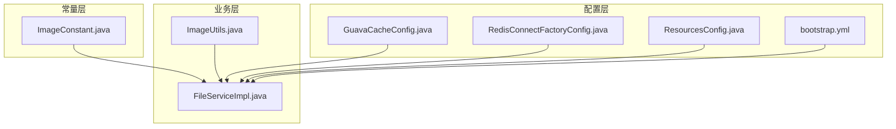
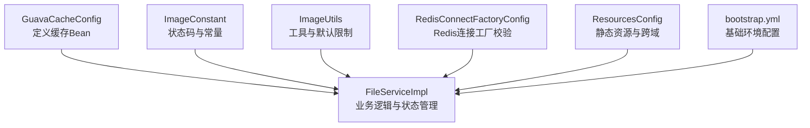
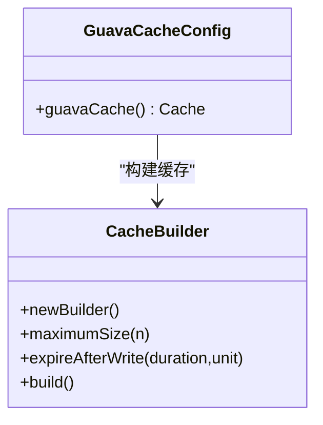
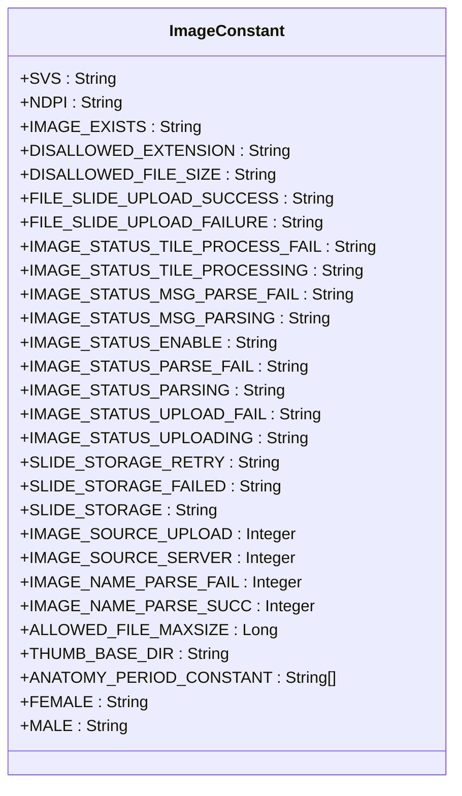
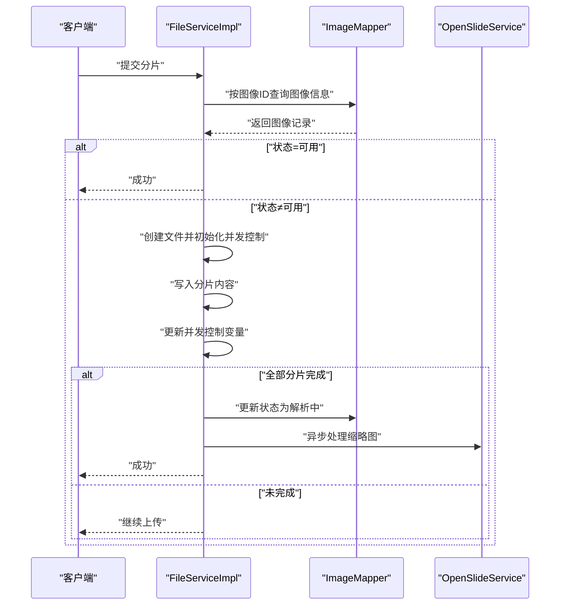
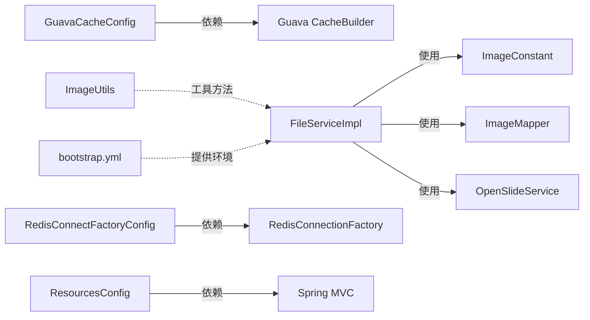

# 缓存配置

<cite>
**本文引用的文件**
- [GuavaCacheConfig.java](file://src/main/java/cn/staitech/file/config/GuavaCacheConfig.java)
- [ImageConstant.java](file://src/main/java/cn/staitech/file/constant/ImageConstant.java)
- [bootstrap.yml](file://src/main/resources/bootstrap.yml)
- [RedisConnectFactoryConfig.java](file://src/main/java/cn/staitech/file/config/RedisConnectFactoryConfig.java)
- [ResourcesConfig.java](file://src/main/java/cn/staitech/file/config/ResourcesConfig.java)
- [FileServiceImpl.java](file://src/main/java/cn/staitech/file/service/impl/FileServiceImpl.java)
- [ImageUtils.java](file://src/main/java/cn/staitech/file/util/ImageUtils.java)
</cite>

## 目录
1. [简介](#简介)
2. [项目结构](#项目结构)
3. [核心组件](#核心组件)
4. [架构总览](#架构总览)
5. [详细组件分析](#详细组件分析)
6. [依赖分析](#依赖分析)
7. [性能考虑](#性能考虑)
8. [故障排除指南](#故障排除指南)
9. [结论](#结论)
10. [附录](#附录)

## 简介
本文件聚焦于项目中的缓存配置与相关常量定义，围绕以下目标展开：
- 解析 GuavaCacheConfig 中的缓存配置实现，包括缓存大小限制、过期时间设置、缓存加载策略等。
- 解释 ImageConstant 中定义的缓存常量与状态码含义。
- 提供缓存性能调优参数建议，涵盖命中率优化、内存使用控制、缓存失效策略等。
- 给出缓存监控指标与故障排除方法，帮助开发者进行最佳实践与性能优化。

## 项目结构
与缓存配置直接相关的模块与文件如下：
- 配置层：GuavaCacheConfig（Guava 缓存 Bean 定义）、RedisConnectFactoryConfig（Redis 连接工厂配置）、ResourcesConfig（静态资源与跨域配置）、bootstrap.yml（应用基础配置）
- 常量层：ImageConstant（图像状态码、切片存储目录、来源类型等常量）
- 业务层：FileServiceImpl（文件分片合并与状态管理）、ImageUtils（图像工具与默认限制）

**图表来源**
- [GuavaCacheConfig.java:1-27](file://src/main/java/cn/staitech/file/config/GuavaCacheConfig.java#L1-L27)
- [ImageConstant.java:1-67](file://src/main/java/cn/staitech/file/constant/ImageConstant.java#L1-L67)
- [bootstrap.yml:1-37](file://src/main/resources/bootstrap.yml#L1-L37)
- [RedisConnectFactoryConfig.java:1-26](file://src/main/java/cn/staitech/file/config/RedisConnectFactoryConfig.java#L1-L26)
- [ResourcesConfig.java:1-51](file://src/main/java/cn/staitech/file/config/ResourcesConfig.java#L1-L51)
- [FileServiceImpl.java:1-178](file://src/main/java/cn/staitech/file/service/impl/FileServiceImpl.java#L1-L178)
- [ImageUtils.java:1-148](file://src/main/java/cn/staitech/file/util/ImageUtils.java#L1-L148)

**章节来源**
- [GuavaCacheConfig.java:1-27](file://src/main/java/cn/staitech/file/config/GuavaCacheConfig.java#L1-L27)
- [ImageConstant.java:1-67](file://src/main/java/cn/staitech/file/constant/ImageConstant.java#L1-L67)
- [bootstrap.yml:1-37](file://src/main/resources/bootstrap.yml#L1-L37)
- [RedisConnectFactoryConfig.java:1-26](file://src/main/java/cn/staitech/file/config/RedisConnectFactoryConfig.java#L1-L26)
- [ResourcesConfig.java:1-51](file://src/main/java/cn/staitech/file/config/ResourcesConfig.java#L1-L51)
- [FileServiceImpl.java:1-178](file://src/main/java/cn/staitech/file/service/impl/FileServiceImpl.java#L1-L178)
- [ImageUtils.java:1-148](file://src/main/java/cn/staitech/file/util/ImageUtils.java#L1-L148)

## 核心组件
- GuavaCacheConfig：定义了名为 cache 的 Guava Cache Bean，设置了最大缓存项数量与写入后的过期时间。
- ImageConstant：集中定义了图像状态码、切片存储目录、来源类型、文件大小上限等常量。
- FileServiceImpl：负责文件分片合并与状态流转，间接体现缓存与状态管理的交互。
- ImageUtils：提供默认文件大小限制、扩展名判断等工具能力，与上传流程相关。
- RedisConnectFactoryConfig：对 Redis 连接工厂进行连接有效性校验配置。
- ResourcesConfig：静态资源映射与跨域配置，影响前端访问与资源加载。
- bootstrap.yml：应用端口、多部分上传大小、Nacos 配置中心等基础环境配置。

**章节来源**
- [GuavaCacheConfig.java:19-25](file://src/main/java/cn/staitech/file/config/GuavaCacheConfig.java#L19-L25)
- [ImageConstant.java:20-53](file://src/main/java/cn/staitech/file/constant/ImageConstant.java#L20-L53)
- [FileServiceImpl.java:53-146](file://src/main/java/cn/staitech/file/service/impl/FileServiceImpl.java#L53-L146)
- [ImageUtils.java:25-30](file://src/main/java/cn/staitech/file/util/ImageUtils.java#L25-L30)
- [RedisConnectFactoryConfig.java:10-24](file://src/main/java/cn/staitech/file/config/RedisConnectFactoryConfig.java#L10-L24)
- [ResourcesConfig.java:17-50](file://src/main/java/cn/staitech/file/config/ResourcesConfig.java#L17-L50)
- [bootstrap.yml:1-37](file://src/main/resources/bootstrap.yml#L1-L37)

## 架构总览
下图展示了缓存配置在系统中的角色与与其他组件的关系：

**图表来源**
- [GuavaCacheConfig.java:1-27](file://src/main/java/cn/staitech/file/config/GuavaCacheConfig.java#L1-L27)
- [FileServiceImpl.java:1-178](file://src/main/java/cn/staitech/file/service/impl/FileServiceImpl.java#L1-L178)
- [ImageConstant.java:1-67](file://src/main/java/cn/staitech/file/constant/ImageConstant.java#L1-L67)
- [ImageUtils.java:1-148](file://src/main/java/cn/staitech/file/util/ImageUtils.java#L1-L148)
- [RedisConnectFactoryConfig.java:1-26](file://src/main/java/cn/staitech/file/config/RedisConnectFactoryConfig.java#L1-L26)
- [ResourcesConfig.java:1-51](file://src/main/java/cn/staitech/file/config/ResourcesConfig.java#L1-L51)
- [bootstrap.yml:1-37](file://src/main/resources/bootstrap.yml#L1-L37)

## 详细组件分析

### GuavaCacheConfig 组件分析
- 缓存 Bean 名称：cache
- 关键配置点：
  - 最大缓存数量：限制为固定值
  - 写入后过期：设置为 1 小时
- 加载策略：当前实现未配置加载器（如 CacheLoader），因此不会自动加载缺失键；访问缺失键会返回空值或触发外部逻辑处理。
- 适用场景：适用于短期、小规模的键值缓存需求，避免无限增长导致内存压力。

**图表来源**
- [GuavaCacheConfig.java:19-25](file://src/main/java/cn/staitech/file/config/GuavaCacheConfig.java#L19-L25)

**章节来源**
- [GuavaCacheConfig.java:19-25](file://src/main/java/cn/staitech/file/config/GuavaCacheConfig.java#L19-L25)

### ImageConstant 组件分析
- 图像状态码（字符串形式）：
  - 上传中、上传失败、解析中、解析失败、可用、信息解析中、信息解析失败、处理中、处理失败
- 切片存储目录：
  - Retry、Failed、Slides
- 图像来源：
  - 上传来源、服务器来源
- 图像名称解析状态：
  - 失败、成功
- 其他关键常量：
  - 允许的最大文件大小
  - 缩略图基础目录
  - 解剖期限常量数组
  - 性别标识常量

**图表来源**
- [ImageConstant.java:9-67](file://src/main/java/cn/staitech/file/constant/ImageConstant.java#L9-L67)

**章节来源**
- [ImageConstant.java:9-67](file://src/main/java/cn/staitech/file/constant/ImageConstant.java#L9-L67)

### FileServiceImpl 与缓存交互分析
- 文件分片合并流程：
  - 根据图像 ID 查询图像信息，若状态为“可用”，直接返回成功
  - 若文件不存在且未在并发控制表中，则创建文件并初始化状态集合
  - 将块内容写入目标文件，更新并发控制变量
  - 当所有分片上传完成后，更新图像状态为“解析中”，并异步处理缩略图
- 与缓存的关系：
  - 当前实现未显式使用 Guava Cache Bean；但可作为后续扩展点引入，用于缓存图像元数据、状态映射或临时中间结果，以减少数据库与 IO 访问
  - 可结合 ImageConstant 中的状态码与存储目录常量，统一管理缓存键空间与失效策略

**图表来源**
- [FileServiceImpl.java:53-146](file://src/main/java/cn/staitech/file/service/impl/FileServiceImpl.java#L53-L146)
- [ImageConstant.java:20-31](file://src/main/java/cn/staitech/file/constant/ImageConstant.java#L20-L31)

**章节来源**
- [FileServiceImpl.java:53-146](file://src/main/java/cn/staitech/file/service/impl/FileServiceImpl.java#L53-L146)
- [ImageConstant.java:20-31](file://src/main/java/cn/staitech/file/constant/ImageConstant.java#L20-L31)

### ImageUtils 与缓存关联分析
- 默认最大文件大小与允许的扩展名列表可用于上传前的快速校验，减少无效请求进入后续流程
- 在缓存设计中，可将这些常量作为缓存键的一部分，或用于构建缓存策略（例如基于扩展名的白名单缓存）

**章节来源**
- [ImageUtils.java:25-30](file://src/main/java/cn/staitech/file/util/ImageUtils.java#L25-L30)
- [ImageUtils.java:105-114](file://src/main/java/cn/staitech/file/util/ImageUtils.java#L105-L114)

### RedisConnectFactoryConfig 与缓存协同
- 对 LettuceConnectionFactory 启用连接有效性校验，确保 Redis 连接稳定
- 若未来引入 Redis 缓存或分布式缓存，该配置有助于提升整体缓存系统的可靠性

**章节来源**
- [RedisConnectFactoryConfig.java:10-24](file://src/main/java/cn/staitech/file/config/RedisConnectFactoryConfig.java#L10-L24)

### ResourcesConfig 与 bootstrap.yml 的支撑作用
- ResourcesConfig 提供静态资源映射与跨域配置，便于前端访问缩略图与静态资源，间接影响缓存命中与网络性能
- bootstrap.yml 提供应用端口、多部分上传大小与 Nacos 配置中心等基础环境参数，为缓存与业务运行提供上下文

**章节来源**
- [ResourcesConfig.java:17-50](file://src/main/java/cn/staitech/file/config/ResourcesConfig.java#L17-L50)
- [bootstrap.yml:1-37](file://src/main/resources/bootstrap.yml#L1-L37)

## 依赖分析
- GuavaCacheConfig 仅依赖 Guava CacheBuilder，无其他外部依赖
- FileServiceImpl 依赖 ImageConstant、ImageMapper、OpenSlideService 等，与缓存无直接耦合
- ImageConstant 为纯常量类，不依赖其他组件
- ImageUtils 为工具类，不依赖缓存
- RedisConnectFactoryConfig 依赖 Redis 连接工厂接口
- ResourcesConfig 依赖 Spring MVC 配置接口
- bootstrap.yml 为配置文件，不依赖代码

**图表来源**
- [GuavaCacheConfig.java:1-27](file://src/main/java/cn/staitech/file/config/GuavaCacheConfig.java#L1-L27)
- [FileServiceImpl.java:1-178](file://src/main/java/cn/staitech/file/service/impl/FileServiceImpl.java#L1-L178)
- [ImageConstant.java:1-67](file://src/main/java/cn/staitech/file/constant/ImageConstant.java#L1-L67)
- [ImageUtils.java:1-148](file://src/main/java/cn/staitech/file/util/ImageUtils.java#L1-L148)
- [RedisConnectFactoryConfig.java:1-26](file://src/main/java/cn/staitech/file/config/RedisConnectFactoryConfig.java#L1-L26)
- [ResourcesConfig.java:1-51](file://src/main/java/cn/staitech/file/config/ResourcesConfig.java#L1-L51)
- [bootstrap.yml:1-37](file://src/main/resources/bootstrap.yml#L1-L37)

**章节来源**
- [GuavaCacheConfig.java:1-27](file://src/main/java/cn/staitech/file/config/GuavaCacheConfig.java#L1-L27)
- [FileServiceImpl.java:1-178](file://src/main/java/cn/staitech/file/service/impl/FileServiceImpl.java#L1-L178)
- [ImageConstant.java:1-67](file://src/main/java/cn/staitech/file/constant/ImageConstant.java#L1-L67)
- [ImageUtils.java:1-148](file://src/main/java/cn/staitech/file/util/ImageUtils.java#L1-L148)
- [RedisConnectFactoryConfig.java:1-26](file://src/main/java/cn/staitech/file/config/RedisConnectFactoryConfig.java#L1-L26)
- [ResourcesConfig.java:1-51](file://src/main/java/cn/staitech/file/config/ResourcesConfig.java#L1-L51)
- [bootstrap.yml:1-37](file://src/main/resources/bootstrap.yml#L1-L37)

## 性能考虑
- 命中率优化
  - 明确缓存键命名规范，结合 ImageConstant 中的状态码与存储目录常量，形成稳定的键空间
  - 对热点数据（如图像元数据、状态映射）设置合理的过期时间，避免过早过期导致抖动
- 内存使用控制
  - 当前 Guava Cache 的最大容量为固定值，建议根据实际内存与 QPS 进行压测，动态调整 maximumSize
  - 结合 expireAfterWrite 或 expireAfterAccess，平衡内存占用与访问延迟
- 失效策略
  - 对于 FileServiceImpl 中的状态流转，可在状态变更时主动淘汰相关缓存键，保证一致性
  - 对于上传超时或失败的场景，结合定时任务清理无效缓存与临时文件
- 扩展建议
  - 若未来引入 Redis 缓存，可利用 Redis 的持久化与集群能力，进一步提升缓存可用性与扩展性
  - 在高并发场景下，可考虑使用带统计信息的 CacheBuilder，以便观测命中率与淘汰情况

[本节为通用性能指导，无需特定文件来源]

## 故障排除指南
- 缓存未生效
  - 检查 GuavaCacheConfig 是否正确注册为 Bean，确认 Bean 名称为 cache
  - 确认业务层是否注入并使用该缓存实例
- 命中率低
  - 观察热点键分布，检查键空间是否过于分散
  - 调整过期策略与最大容量，结合压测数据优化
- 内存占用过高
  - 评估 maximumSize 与单条缓存对象大小，必要时降低容量或缩短过期时间
  - 对大对象采用懒加载或分段缓存
- 状态不一致
  - 在状态变更（如从“上传中”到“解析中”）时，同步清理相关缓存键
  - 结合定时任务清理超时或失败的缓存与临时文件
- Redis 连接不稳定
  - 检查 RedisConnectFactoryConfig 的连接有效性校验是否启用
  - 关注网络与资源限制，适当增加连接池配置

**章节来源**
- [GuavaCacheConfig.java:19-25](file://src/main/java/cn/staitech/file/config/GuavaCacheConfig.java#L19-L25)
- [FileServiceImpl.java:152-176](file://src/main/java/cn/staitech/file/service/impl/FileServiceImpl.java#L152-L176)
- [RedisConnectFactoryConfig.java:10-24](file://src/main/java/cn/staitech/file/config/RedisConnectFactoryConfig.java#L10-L24)

## 结论
- GuavaCacheConfig 提供了简洁明确的本地缓存配置，适合短期与小规模场景
- ImageConstant 为状态码与目录等关键常量提供了统一入口，便于缓存键设计与一致性维护
- FileServiceImpl 的状态流转与定时任务为缓存失效与清理提供了天然时机
- 建议在现有基础上引入缓存统计与容量压测，持续优化命中率与内存占用，并在需要时扩展至分布式缓存方案

[本节为总结性内容，无需特定文件来源]

## 附录
- 最佳实践清单
  - 明确缓存键命名规范，避免键空间污染
  - 为热点数据设置合理过期策略，兼顾内存与延迟
  - 在状态变更时主动失效相关缓存键
  - 结合压测数据动态调整 maximumSize 与过期时间
  - 如需扩展，优先考虑 Redis 缓存以提升可用性与扩展性

[本节为通用建议，无需特定文件来源]