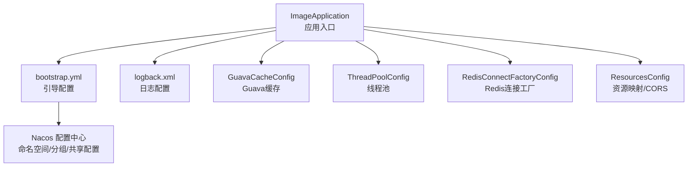
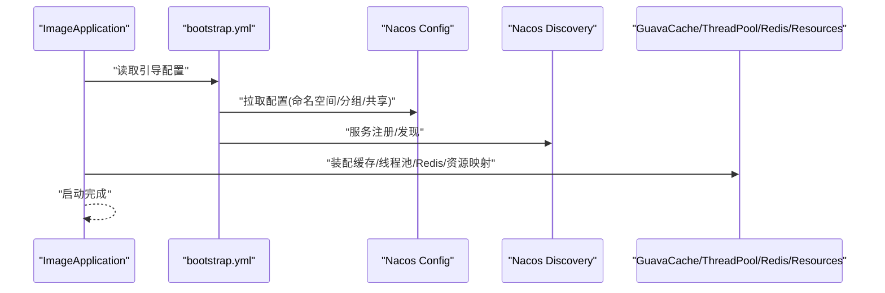
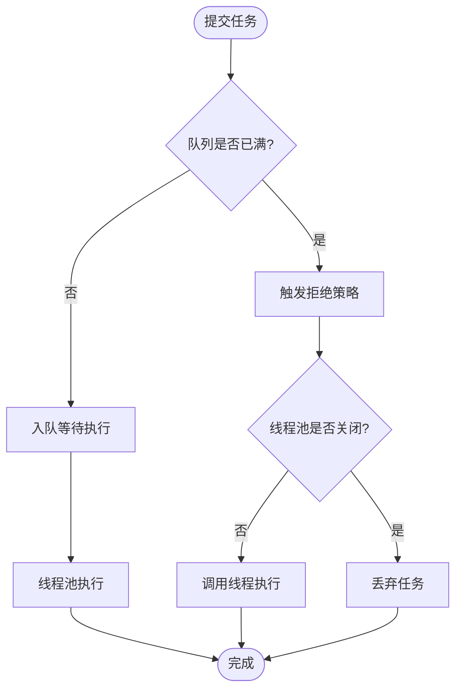
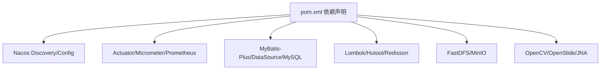

# 配置管理

<cite>
**本文引用的文件**
- [ImageApplication.java](file://src/main/java/cn/staitech/ImageApplication.java)
- [bootstrap.yml](file://src/main/resources/bootstrap.yml)
- [GuavaCacheConfig.java](file://src/main/java/cn/staitech/file/config/GuavaCacheConfig.java)
- [ThreadPoolConfig.java](file://src/main/java/cn/staitech/file/config/ThreadPoolConfig.java)
- [RedisConnectFactoryConfig.java](file://src/main/java/cn/staitech/file/config/RedisConnectFactoryConfig.java)
- [ResourcesConfig.java](file://src/main/java/cn/staitech/file/config/ResourcesConfig.java)
- [logback.xml](file://src/main/resources/logback.xml)
- [pom.xml](file://pom.xml)
</cite>

## 目录
1. [简介](#简介)
2. [项目结构](#项目结构)
3. [核心组件](#核心组件)
4. [架构总览](#架构总览)
5. [详细组件分析](#详细组件分析)
6. [依赖分析](#依赖分析)
7. [性能考虑](#性能考虑)
8. [故障排除指南](#故障排除指南)
9. [结论](#结论)
10. [附录](#附录)

## 简介
本文件面向运维与开发者，系统化梳理 PACMVS 图像模块的配置管理方案，覆盖应用配置、缓存配置、线程池配置、Nacos 配置中心集成、环境变量与共享配置、数据库连接与数据源、日志与监控指标等主题，并提供可复用的配置模板、调优建议与故障排除清单。

## 项目结构
该模块采用 Spring Boot 标准工程布局，关键配置集中在 resources 下的引导与日志配置，以及 Java 配置类中定义的缓存、线程池、资源映射与 Redis 连接工厂等。

图表来源
- [ImageApplication.java:37-52](file://src/main/java/cn/staitech/ImageApplication.java#L37-L52)
- [bootstrap.yml:14-37](file://src/main/resources/bootstrap.yml#L14-L37)
- [logback.xml:1-116](file://src/main/resources/logback.xml#L1-L116)
- [GuavaCacheConfig.java:17-26](file://src/main/java/cn/staitech/file/config/GuavaCacheConfig.java#L17-L26)
- [ThreadPoolConfig.java:10-66](file://src/main/java/cn/staitech/file/config/ThreadPoolConfig.java#L10-L66)
- [RedisConnectFactoryConfig.java:10-26](file://src/main/java/cn/staitech/file/config/RedisConnectFactoryConfig.java#L10-L26)
- [ResourcesConfig.java:16-51](file://src/main/java/cn/staitech/file/config/ResourcesConfig.java#L16-L51)

章节来源
- [ImageApplication.java:37-52](file://src/main/java/cn/staitech/ImageApplication.java#L37-L52)
- [bootstrap.yml:14-37](file://src/main/resources/bootstrap.yml#L14-L37)
- [logback.xml:1-116](file://src/main/resources/logback.xml#L1-L116)

## 核心组件
- 应用与引导配置：通过 bootstrap.yml 定义端口、应用名、环境激活、Nacos 服务发现与配置中心地址、命名空间、分组及共享配置。
- 缓存配置：基于 Guava Cache 的本地缓存，限制容量与过期策略。
- 线程池配置：异步执行与拒绝策略，分别针对 OpenSlide 与 Python 脚本任务。
- Redis 连接工厂：启用连接校验，提升稳定性。
- 资源映射与 CORS：本地文件访问路径映射与跨域策略。
- 日志与监控：Logback 多文件滚动输出；Actuator + Micrometer Prometheus 指标导出。

章节来源
- [bootstrap.yml:1-37](file://src/main/resources/bootstrap.yml#L1-L37)
- [GuavaCacheConfig.java:17-26](file://src/main/java/cn/staitech/file/config/GuavaCacheConfig.java#L17-L26)
- [ThreadPoolConfig.java:10-66](file://src/main/java/cn/staitech/file/config/ThreadPoolConfig.java#L10-L66)
- [RedisConnectFactoryConfig.java:10-26](file://src/main/java/cn/staitech/file/config/RedisConnectFactoryConfig.java#L10-L26)
- [ResourcesConfig.java:16-51](file://src/main/java/cn/staitech/file/config/ResourcesConfig.java#L16-L51)
- [logback.xml:1-116](file://src/main/resources/logback.xml#L1-L116)
- [pom.xml:48-51](file://pom.xml#L48-L51)
- [pom.xml:192-194](file://pom.xml#L192-L194)

## 架构总览
下图展示应用启动与配置加载的关键交互：应用入口初始化，加载 bootstrap.yml，接入 Nacos 配置中心与服务发现，随后按需装配缓存、线程池、Redis 连接工厂与资源映射。

图表来源
- [ImageApplication.java:37-52](file://src/main/java/cn/staitech/ImageApplication.java#L37-L52)
- [bootstrap.yml:14-37](file://src/main/resources/bootstrap.yml#L14-L37)
- [GuavaCacheConfig.java:17-26](file://src/main/java/cn/staitech/file/config/GuavaCacheConfig.java#L17-L26)
- [ThreadPoolConfig.java:10-66](file://src/main/java/cn/staitech/file/config/ThreadPoolConfig.java#L10-L66)
- [RedisConnectFactoryConfig.java:10-26](file://src/main/java/cn/staitech/file/config/RedisConnectFactoryConfig.java#L10-L26)
- [ResourcesConfig.java:16-51](file://src/main/java/cn/staitech/file/config/ResourcesConfig.java#L16-L51)

## 详细组件分析

### 应用与引导配置（bootstrap.yml）
- 关键点
  - 服务器端口、应用名、环境激活占位符。
  - Nacos 服务发现与配置中心地址、命名空间、分组。
  - 共享配置：按环境加载 application-{profile}.yml。
- 最佳实践
  - 使用 Maven Profile 注入占位符，避免硬编码。
  - 将敏感信息置于 Nacos 加密配置或外部密钥管理。
  - 生产环境建议开启配置监听与灰度发布策略。

章节来源
- [bootstrap.yml:1-37](file://src/main/resources/bootstrap.yml#L1-L37)
- [pom.xml:349-384](file://pom.xml#L349-L384)

### 缓存配置（GuavaCacheConfig）
- 关键点
  - Bean 名称：cache。
  - 最大容量与写入后过期时间。
- 性能建议
  - 结合业务热点数据规模调整容量与过期时间。
  - 对于高并发场景，可评估使用本地+分布式缓存组合。

章节来源
- [GuavaCacheConfig.java:17-26](file://src/main/java/cn/staitech/file/config/GuavaCacheConfig.java#L17-L26)

### 线程池配置（ThreadPoolConfig）
- 关键点
  - 异步执行开关与拒绝策略：记录日志并回退至调用线程执行。
  - OpenSlide 线程池：核心数+1 至 2×核心数，队列长度较大。
  - Python 线程池：按 CPU 核数比例缩放，保证最小线程数。
- 性能建议
  - 根据任务类型分离线程池，避免相互影响。
  - 监控队列长度与拒绝次数，动态调整容量与超时时间。

图表来源
- [ThreadPoolConfig.java:18-39](file://src/main/java/cn/staitech/file/config/ThreadPoolConfig.java#L18-L39)
- [ThreadPoolConfig.java:44-64](file://src/main/java/cn/staitech/file/config/ThreadPoolConfig.java#L44-L64)

章节来源
- [ThreadPoolConfig.java:10-66](file://src/main/java/cn/staitech/file/config/ThreadPoolConfig.java#L10-L66)

### Redis 连接工厂配置（RedisConnectFactoryConfig）
- 关键点
  - 在 LettuceConnectionFactory 上启用连接校验，增强稳定性。
- 最佳实践
  - 结合连接池参数（如超时、空闲检测）进一步优化。
  - 生产环境建议开启主从切换与哨兵/集群模式。

章节来源
- [RedisConnectFactoryConfig.java:10-26](file://src/main/java/cn/staitech/file/config/RedisConnectFactoryConfig.java#L10-L26)

### 资源映射与 CORS（ResourcesConfig）
- 关键点
  - 本地文件存储根路径与前缀由配置注入。
  - 资源处理器映射与跨域策略（允许 GET 方法、任意来源）。
- 安全建议
  - 生产环境限制允许来源与方法，增加鉴权与访问控制。
  - 对外暴露路径添加访问日志与限速。

章节来源
- [ResourcesConfig.java:16-51](file://src/main/java/cn/staitech/file/config/ResourcesConfig.java#L16-L51)

### 日志配置（logback.xml）
- 关键点
  - 控制台与多文件滚动输出（info/error/warn/debug），保留 60 天。
  - 打印 Nacos 客户端与 SQL 语句日志以便排查。
- 最佳实践
  - 生产环境降低 DEBUG 级别，聚焦 ERROR/WARN。
  - 结合集中式日志平台（如 ELK）统一采集。

章节来源
- [logback.xml:1-116](file://src/main/resources/logback.xml#L1-L116)

### 监控与指标（Actuator + Micrometer + Prometheus）
- 关键点
  - Actuator 与 Prometheus 注册器依赖已引入。
  - 应用标签已在入口处统一设置。
- 建议
  - 暴露健康检查、进程、JVM、业务指标端点。
  - 配置 Prometheus 抓取规则与告警阈值。

章节来源
- [pom.xml:48-51](file://pom.xml#L48-L51)
- [pom.xml:192-194](file://pom.xml#L192-L194)
- [ImageApplication.java:47-50](file://src/main/java/cn/staitech/ImageApplication.java#L47-L50)

## 依赖分析
- 启动与发现
  - Spring Boot、Spring Cloud Alibaba Nacos Discovery/Config、服务注册与配置中心。
- 监控与可观测性
  - Actuator + Micrometer + Prometheus。
- 数据库与数据源
  - MyBatis-Plus、Staitech Common DataSource、MySQL Connector。
- 工具与第三方
  - Lombok、Hutool、Redisson、FastDFS、MinIO、OpenCV、OpenSlide、JNA。

图表来源
- [pom.xml:23-205](file://pom.xml#L23-L205)

章节来源
- [pom.xml:23-205](file://pom.xml#L23-L205)

## 性能考虑
- 线程池
  - 依据 CPU 核心数与任务特征设置核心/最大线程数与队列长度。
  - 监控拒绝率与排队时延，必要时扩容或拆分线程池。
- 缓存
  - 基于热点数据规模与访问频率调整容量与过期策略。
  - 对于长尾数据，结合本地+分布式缓存降低延迟。
- IO 与网络
  - 文件上传大小与请求大小上限已在引导配置中设置，按需调整。
  - Redis 连接校验与池化参数优化连接稳定性。
- 监控
  - 启用 JVM/业务指标，结合 Prometheus/Grafana 建立性能看板。

章节来源
- [bootstrap.yml:6-10](file://src/main/resources/bootstrap.yml#L6-L10)
- [ThreadPoolConfig.java:18-64](file://src/main/java/cn/staitech/file/config/ThreadPoolConfig.java#L18-L64)
- [RedisConnectFactoryConfig.java:18-24](file://src/main/java/cn/staitech/file/config/RedisConnectFactoryConfig.java#L18-L24)
- [GuavaCacheConfig.java:19-25](file://src/main/java/cn/staitech/file/config/GuavaCacheConfig.java#L19-L25)

## 故障排除指南
- Nacos 配置未生效
  - 检查命名空间、分组与共享配置是否正确。
  - 确认环境 profile 与占位符替换是否生效。
- 线程池任务被拒绝
  - 查看拒绝日志与队列长度，评估扩容或降载策略。
- Redis 连接异常
  - 启用连接校验后仍失败，检查网络连通性与认证配置。
- 文件访问跨域问题
  - 生产环境收紧 CORS 策略，确保仅允许可信来源。
- 日志量过大或定位困难
  - 调整日志级别与输出策略，开启 Nacos/SQL 日志辅助排查。

章节来源
- [bootstrap.yml:14-37](file://src/main/resources/bootstrap.yml#L14-L37)
- [ThreadPoolConfig.java:28-38](file://src/main/java/cn/staitech/file/config/ThreadPoolConfig.java#L28-L38)
- [ThreadPoolConfig.java:54-63](file://src/main/java/cn/staitech/file/config/ThreadPoolConfig.java#L54-L63)
- [RedisConnectFactoryConfig.java:18-24](file://src/main/java/cn/staitech/file/config/RedisConnectFactoryConfig.java#L18-L24)
- [ResourcesConfig.java:42-50](file://src/main/java/cn/staitech/file/config/ResourcesConfig.java#L42-L50)
- [logback.xml:105-107](file://src/main/resources/logback.xml#L105-L107)

## 结论
本配置体系以 bootstrap.yml 为核心入口，结合 Nacos 实现环境化与集中化配置管理；通过 Guava Cache、自定义线程池与 Redis 连接工厂保障性能与稳定性；配合 Actuator/Micrometer/Prometheus 实现可观测性。建议在生产环境中强化安全策略、完善监控告警与容量规划，并持续迭代配置模板以适配不同环境。

## 附录

### 配置模板与示例要点
- 应用配置（bootstrap.yml）
  - 端口、应用名、环境激活、Nacos 地址/命名空间/分组、共享配置。
- 线程池配置（ThreadPoolConfig）
  - 分离 OpenSlide 与 Python 任务线程池，设置合理的拒绝策略。
- 缓存配置（GuavaCacheConfig）
  - 明确最大容量与过期策略，结合业务热点评估。
- Redis 连接工厂（RedisConnectFactoryConfig）
  - 启用连接校验，确保连接可用性。
- 资源映射与 CORS（ResourcesConfig）
  - 本地文件路径与前缀、CORS 允许来源与方法。
- 日志（logback.xml）
  - 多文件滚动输出与 Nacos/SQL 日志开关。
- 监控（Actuator + Micrometer + Prometheus）
  - 暴露指标端点，统一应用标签。

章节来源
- [bootstrap.yml:1-37](file://src/main/resources/bootstrap.yml#L1-L37)
- [ThreadPoolConfig.java:10-66](file://src/main/java/cn/staitech/file/config/ThreadPoolConfig.java#L10-L66)
- [GuavaCacheConfig.java:17-26](file://src/main/java/cn/staitech/file/config/GuavaCacheConfig.java#L17-L26)
- [RedisConnectFactoryConfig.java:10-26](file://src/main/java/cn/staitech/file/config/RedisConnectFactoryConfig.java#L10-L26)
- [ResourcesConfig.java:16-51](file://src/main/java/cn/staitech/file/config/ResourcesConfig.java#L16-L51)
- [logback.xml:1-116](file://src/main/resources/logback.xml#L1-L116)
- [pom.xml:48-51](file://pom.xml#L48-L51)
- [pom.xml:192-194](file://pom.xml#L192-L194)