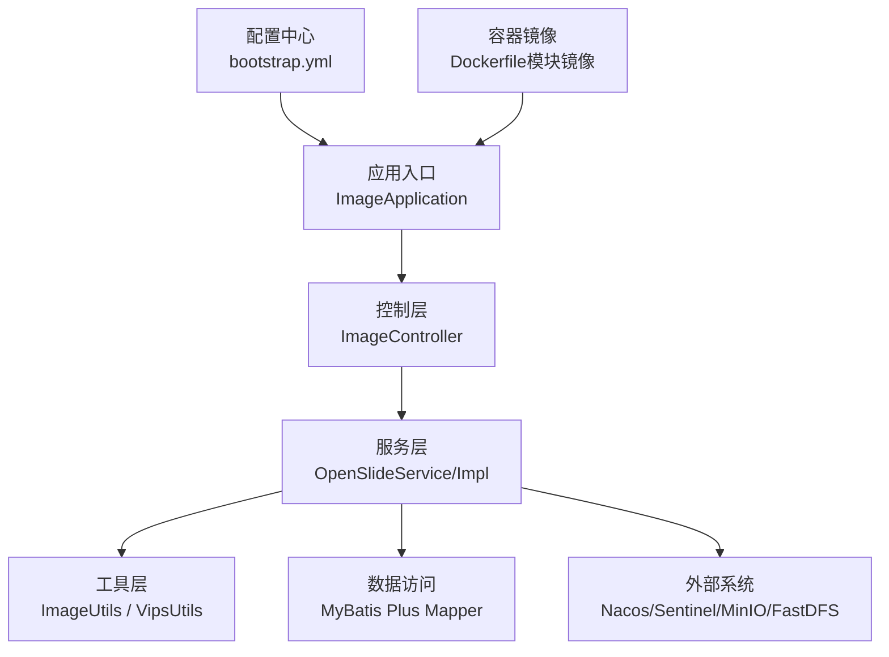
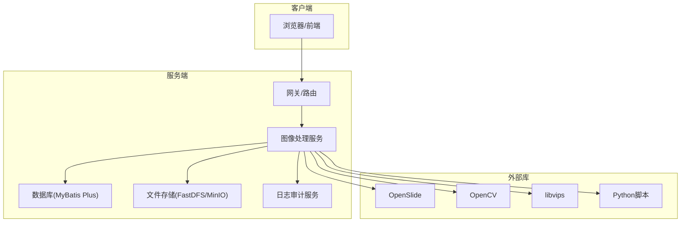
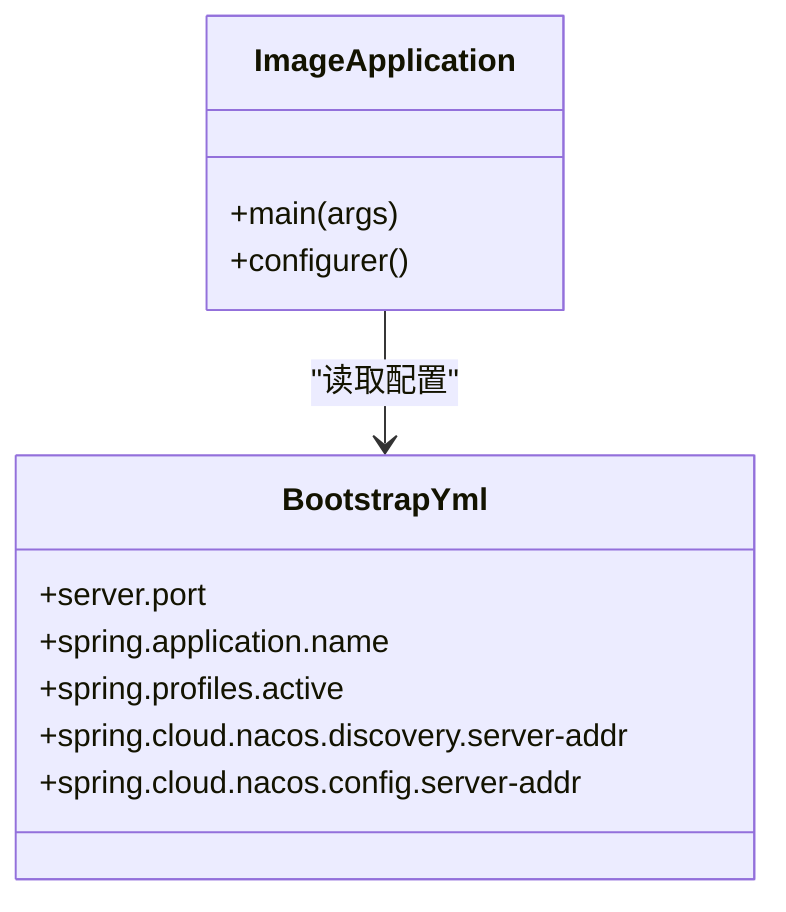
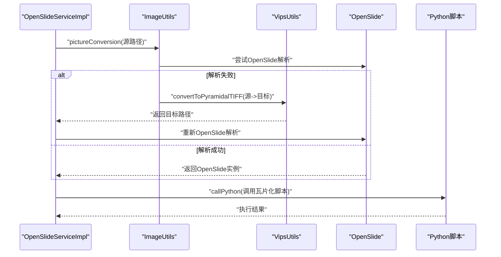
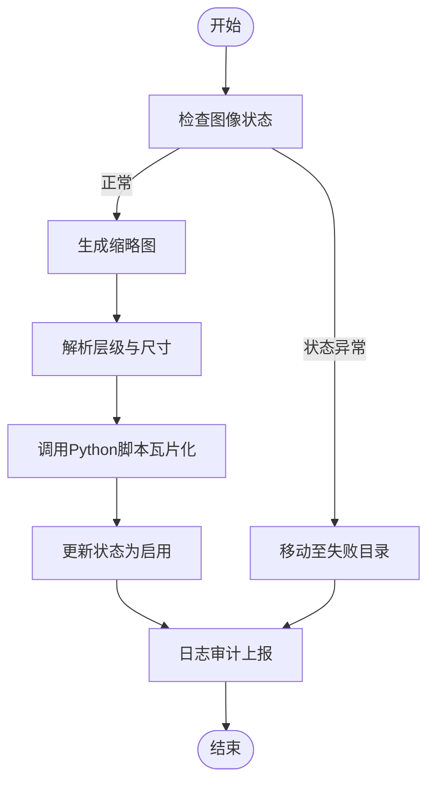
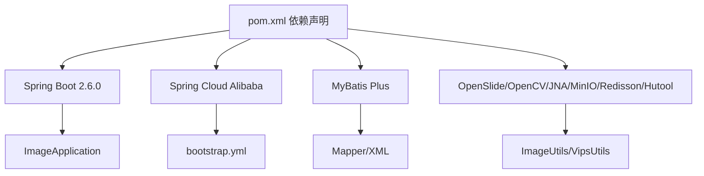

# 技术栈

<cite>
**本文引用的文件**
- [pom.xml](file://pom.xml)
- [ImageApplication.java](file://src/main/java/cn/staitech/ImageApplication.java)
- [bootstrap.yml](file://src/main/resources/bootstrap.yml)
- [Dockerfile（模块镜像）](file://docker/staitech/modules/image/Dockerfile)
- [README.md](file://README.md)
- [ImageUtils.java](file://src/main/java/cn/staitech/file/util/ImageUtils.java)
- [VipsUtils.java](file://src/main/java/cn/staitech/file/util/VipsUtils.java)
- [OpenSlideService.java](file://src/main/java/cn/staitech/file/service/OpenSlideService.java)
- [OpenSlideServiceImpl.java](file://src/main/java/cn/staitech/file/service/impl/OpenSlideServiceImpl.java)
- [ImageController.java](file://src/main/java/cn/staitech/file/controller/ImageController.java)
</cite>

## 目录
1. [简介](#简介)
2. [项目结构](#项目结构)
3. [核心组件](#核心组件)
4. [架构总览](#架构总览)
5. [组件详解](#组件详解)
6. [依赖关系分析](#依赖关系分析)
7. [性能考量](#性能考量)
8. [故障排查指南](#故障排查指南)
9. [结论](#结论)
10. [附录](#附录)

## 简介
本项目为 PACMVS 的图像处理子模块，聚焦于原始全切片数字病理影像（WSI）的解析、缩略图生成与金字塔瓦片化，结合微服务与容器化部署，支撑大规模医学影像浏览与分析场景。技术栈围绕 Spring Boot 2.6.0、Spring Cloud Alibaba（Nacos、Sentinel）、MyBatis Plus、OpenSlide、OpenCV、libvips、Python 脚本与 Docker 容器化展开。

## 项目结构
- 应用入口与配置
  - 应用启动类位于应用根包下，启用发现、网关、事务、定时、WebSocket、指标等能力。
  - 配置文件采用 bootstrap.yml，集中管理 Nacos 注册与配置中心、多环境 Profile。
- 业务模块
  - 控制层：对外提供“服务器选片”等接口。
  - 服务层：封装 OpenSlide 解析、缩略图生成、瓦片化任务调度、日志审计等。
  - 工具层：图像格式转换（OpenSlide + libvips）、文件路径与扩展名校验。
  - 数据访问：基于 MyBatis Plus 的 Mapper 与实体。
- 外部依赖与运行环境
  - 通过 Maven 管理依赖，包含 Spring Cloud Alibaba、MyBatis Plus、Redisson、MinIO、FastDFS、OpenSlide、OpenCV、JNA、Micrometer-Prometheus 等。
  - Dockerfile 构建镜像内含 Python、openslide-bin、libvips、OpenSlide、OpenCV 运行库，并挂载外部卷以持久化切片与中间产物。

图表来源
- [ImageApplication.java:1-53](file://src/main/java/cn/staitech/ImageApplication.java#L1-L53)
- [ImageController.java:1-72](file://src/main/java/cn/staitech/file/controller/ImageController.java#L1-L72)
- [OpenSlideServiceImpl.java:1-563](file://src/main/java/cn/staitech/file/service/impl/OpenSlideServiceImpl.java#L1-L563)
- [bootstrap.yml:1-37](file://src/main/resources/bootstrap.yml#L1-L37)
- [Dockerfile（模块镜像）:1-46](file://docker/staitech/modules/image/Dockerfile#L1-L46)

章节来源
- [ImageApplication.java:1-53](file://src/main/java/cn/staitech/ImageApplication.java#L1-L53)
- [bootstrap.yml:1-37](file://src/main/resources/bootstrap.yml#L1-L37)
- [Dockerfile（模块镜像）:1-46](file://docker/staitech/modules/image/Dockerfile#L1-L46)

## 核心组件
- Spring Boot 2.6.0
  - 版本与特性：基于父工程版本 2.6.0，启用 Actuator、WebSocket、定时任务、事务管理、Elasticsearch Repositories 等。
  - 作用与优势：统一依赖管理、自动装配、快速启动与可观测性，便于微服务治理与运维。
- Spring Cloud Alibaba
  - Nacos：服务注册与配置中心，按环境 Profile 注入 Nacos 地址、命名空间与分组。
  - Sentinel：流量与熔断限流，保障服务稳定性。
- MyBatis Plus
  - ORM 能力与代码生成，简化数据库 CRUD；配合 Join Starter 支持复杂联表。
- OpenSlide
  - 解析多厂商 WSI 格式（SVS、NDPI、Aperio、Hamamatsu 等），提取分辨率、物镜倍数、层级信息，生成缩略图。
- OpenCV
  - 作为系统级 JNI 依赖引入，用于图像处理与增强（在本模块中通过 libvips 间接参与金字塔瓦片化）。
- libvips
  - 通过命令行工具将 JPEG/PNG 转换为金字塔 TIFF（BigTiff + Tile + Pyramid），供 OpenSlide 后续解析。
- Python 脚本
  - 负责瓦片化（Deep Zoom）与输出组织，由服务层通过 ProcessBuilder 调用。
- 容器化与持久化
  - Dockerfile 内置 Python、openslide-bin、libvips、OpenSlide、OpenCV 运行库；挂载卷用于附件、上传、切片与工作目录。

章节来源
- [pom.xml:1-385](file://pom.xml#L1-L385)
- [ImageApplication.java:1-53](file://src/main/java/cn/staitech/ImageApplication.java#L1-L53)
- [bootstrap.yml:1-37](file://src/main/resources/bootstrap.yml#L1-L37)
- [OpenSlideServiceImpl.java:1-563](file://src/main/java/cn/staitech/file/service/impl/OpenSlideServiceImpl.java#L1-L563)
- [VipsUtils.java:1-37](file://src/main/java/cn/staitech/file/util/VipsUtils.java#L1-L37)
- [Dockerfile（模块镜像）:1-46](file://docker/staitech/modules/image/Dockerfile#L1-L46)

## 架构总览
- 微服务选择原因
  - 可观测性：Actuator + Micrometer-Prometheus，统一指标采集与告警。
  - 服务治理：Nacos 注册与配置中心，Sentinel 流控与熔断。
  - 可扩展性：模块化拆分，图像处理服务独立部署，便于弹性扩缩容。
  - 生态协同：与日志审计、文件存储（MinIO/FastDFS）等周边系统解耦。
- 技术决策
  - OpenSlide 作为 WSI 解析基石，兼容性强；对非标准格式先经 libvips 转换为金字塔 TIFF。
  - 通过 Python 脚本完成瓦片化，保证与前端 Deep Zoom 体系一致。
  - 使用线程池与异步任务（CompletableFuture）提升吞吐，失败重试与失败目录隔离。

图表来源
- [ImageApplication.java:1-53](file://src/main/java/cn/staitech/ImageApplication.java#L1-L53)
- [OpenSlideServiceImpl.java:1-563](file://src/main/java/cn/staitech/file/service/impl/OpenSlideServiceImpl.java#L1-L563)
- [VipsUtils.java:1-37](file://src/main/java/cn/staitech/file/util/VipsUtils.java#L1-L37)
- [pom.xml:1-385](file://pom.xml#L1-L385)

## 组件详解

### Spring Boot 与 Spring Cloud Alibaba
- 启用能力
  - 发现客户端、Feign 客户端、定时任务、WebSocket、事务管理、Elasticsearch Repositories。
  - Actuator + Prometheus 指标暴露，统一标签。
- 配置要点
  - bootstrap.yml 中配置 Nacos 注册地址、命名空间、分组、共享配置。
  - Maven Profiles 提供 dev/test/prod 三套环境变量注入。

图表来源
- [ImageApplication.java:1-53](file://src/main/java/cn/staitech/ImageApplication.java#L1-L53)
- [bootstrap.yml:1-37](file://src/main/resources/bootstrap.yml#L1-L37)

章节来源
- [ImageApplication.java:1-53](file://src/main/java/cn/staitech/ImageApplication.java#L1-L53)
- [bootstrap.yml:1-37](file://src/main/resources/bootstrap.yml#L1-L37)
- [pom.xml:349-385](file://pom.xml#L349-L385)

### MyBatis Plus
- 作用与优势
  - 简化 SQL 与实体映射，提供条件构造器、分页插件、乐观锁、自动填充等。
  - Join Starter 支持复杂联表查询，降低手写 SQL 成本。
- 在本模块中的体现
  - Mapper XML 与实体定义位于 resources/mapper 与 domain 包，配合 Service 层进行数据访问。

章节来源
- [pom.xml:132-143](file://pom.xml#L132-L143)

### OpenSlide、OpenCV、libvips 集成
- OpenSlide
  - 用于解析 WSI 元数据（分辨率、物镜倍数、层级数），生成缩略图。
  - 对部分特殊格式（如特定 TIFF 描述）做兼容处理。
- libvips
  - 将非金字塔格式（JPEG/PNG）转换为金字塔 TIFF（BigTiff + Tile + Pyramid），确保后续解析稳定。
- OpenCV
  - 以系统级依赖形式引入，配合 libvips 与 OpenSlide 形成完整的图像管线。

图表来源
- [OpenSlideServiceImpl.java:140-202](file://src/main/java/cn/staitech/file/service/impl/OpenSlideServiceImpl.java#L140-L202)
- [ImageUtils.java:52-97](file://src/main/java/cn/staitech/file/util/ImageUtils.java#L52-L97)
- [VipsUtils.java:22-35](file://src/main/java/cn/staitech/file/util/VipsUtils.java#L22-L35)

章节来源
- [OpenSlideServiceImpl.java:1-563](file://src/main/java/cn/staitech/file/service/impl/OpenSlideServiceImpl.java#L1-L563)
- [ImageUtils.java:1-148](file://src/main/java/cn/staitech/file/util/ImageUtils.java#L1-L148)
- [VipsUtils.java:1-37](file://src/main/java/cn/staitech/file/util/VipsUtils.java#L1-L37)

### Python 脚本与瓦片化流程
- 调用方式
  - 通过 ProcessBuilder 执行 Python 脚本，传入输入路径与输出目录，捕获标准输出与退出码。
- 输出组织
  - 按机构号与图像 ID 组织目录结构，生成 Deep Zoom 瓦片金字塔，供前端按需加载。

图表来源
- [OpenSlideServiceImpl.java:277-378](file://src/main/java/cn/staitech/file/service/impl/OpenSlideServiceImpl.java#L277-L378)
- [OpenSlideServiceImpl.java:457-477](file://src/main/java/cn/staitech/file/service/impl/OpenSlideServiceImpl.java#L457-L477)

章节来源
- [OpenSlideServiceImpl.java:1-563](file://src/main/java/cn/staitech/file/service/impl/OpenSlideServiceImpl.java#L1-L563)

### 控制层与接口
- 接口职责
  - “服务器选片”批量导入并触发缩略图与瓦片化流程。
  - 重新解析失败切片、检查失败状态、查询单张切片信息。
- 安全与鉴权
  - 通过安全工具类获取当前机构 ID，限制查询范围。

章节来源
- [ImageController.java:1-72](file://src/main/java/cn/staitech/file/controller/ImageController.java#L1-L72)

### 容器化与运行环境
- 镜像构建要点
  - 基于 openjdk:8-jre，安装 Python3 与 pip，pip 安装 openslide-bin。
  - 复制 libvips、OpenSlide、OpenCV 运行库至 /usr/lib 与 /usr/bin，赋予执行权限。
  - 挂载卷：附件、上传、切片、工作目录，便于持久化与调试。
- 启动命令
  - 以 Java -jar 方式启动打包好的 jar，暴露 9083 端口。

章节来源
- [Dockerfile（模块镜像）:1-46](file://docker/staitech/modules/image/Dockerfile#L1-L46)

## 依赖关系分析
- 模块依赖概览
  - Spring Boot 2.6.0（父工程版本）
  - Spring Cloud Alibaba（Nacos Discovery/Config、Sentinel）
  - MyBatis Plus 与 Join Starter
  - Redisson、MinIO、FastDFS、MySQL Connector、Swagger UI、Micrometer-Prometheus
  - OpenSlide、OpenCV（系统级依赖）、JNA、Hutool
- 运行期依赖
  - OpenSlide 与 libvips 通过系统路径注入，避免打包体积膨胀。
  - Python 脚本与系统命令行工具（vips）在容器内可用。

图表来源
- [pom.xml:1-385](file://pom.xml#L1-L385)
- [ImageApplication.java:1-53](file://src/main/java/cn/staitech/ImageApplication.java#L1-L53)
- [bootstrap.yml:1-37](file://src/main/resources/bootstrap.yml#L1-L37)

章节来源
- [pom.xml:1-385](file://pom.xml#L1-L385)
- [bootstrap.yml:1-37](file://src/main/resources/bootstrap.yml#L1-L37)

## 性能考量
- 并发与异步
  - 使用线程池与 CompletableFuture 并行处理多张切片的缩略图与瓦片化任务，显著提升吞吐。
- I/O 与存储
  - 通过挂载卷与本地路径组织文件结构，减少跨盘拷贝；失败文件移动至失败目录，避免阻塞主流程。
- 指标与监控
  - 暴露 Prometheus 指标，结合 Nacos/Sentinel 实现服务治理与容量规划。
- 图像处理优化
  - 先将非标准格式转换为金字塔 TIFF，再由 OpenSlide 解析，减少后续计算与 IO 压力。

章节来源
- [OpenSlideServiceImpl.java:277-312](file://src/main/java/cn/staitech/file/service/impl/OpenSlideServiceImpl.java#L277-L312)
- [OpenSlideServiceImpl.java:347-378](file://src/main/java/cn/staitech/file/service/impl/OpenSlideServiceImpl.java#L347-L378)
- [pom.xml:192-194](file://pom.xml#L192-L194)

## 故障排查指南
- OpenSlide 解析失败
  - 现象：层级数过少或无法生成缩略图。
  - 处理：自动触发 libvips 转换为金字塔 TIFF 后重试；若仍失败，移动至失败目录并记录日志。
- Python 脚本执行失败
  - 现象：退出码非零。
  - 处理：捕获错误输出，记录异常并回滚状态；检查脚本路径与可执行权限。
- 文件移动失败
  - 现象：原子移动不支持或权限不足。
  - 处理：降级为复制后删除策略，确保数据一致性与可恢复性。
- 日志审计
  - 通过 RestTemplate 调用日志审计服务，记录关键字段与操作对象，便于追踪与合规。

章节来源
- [OpenSlideServiceImpl.java:188-200](file://src/main/java/cn/staitech/file/service/impl/OpenSlideServiceImpl.java#L188-L200)
- [OpenSlideServiceImpl.java:457-477](file://src/main/java/cn/staitech/file/service/impl/OpenSlideServiceImpl.java#L457-L477)
- [OpenSlideServiceImpl.java:399-454](file://src/main/java/cn/staitech/file/service/impl/OpenSlideServiceImpl.java#L399-L454)
- [OpenSlideServiceImpl.java:487-535](file://src/main/java/cn/staitech/file/service/impl/OpenSlideServiceImpl.java#L487-L535)

## 结论
本模块以 Spring Boot 2.6.0 为核心，结合 Spring Cloud Alibaba 实现服务治理与配置中心，借助 OpenSlide、OpenCV、libvips 构建稳定的 WSI 解析与瓦片化流水线，并通过 Python 脚本与容器化部署实现高扩展性与可维护性。整体技术选型兼顾性能、兼容性与可观测性，适合在医学影像领域的大规模应用。

## 附录
- 学习路径建议
  - Spring Boot：入门与 Actuator、WebSocket、定时任务实践。
  - Spring Cloud Alibaba：Nacos 注册与配置、Sentinel 流控与限流。
  - MyBatis Plus：实体映射、条件构造器、Join 查询。
  - 图像处理：OpenSlide 多格式解析、libvips 命令行工具、OpenCV 基础 API。
  - 容器化：Dockerfile 最小化构建、卷挂载与进程管理。
- 版本与配置清单
  - Spring Boot：2.6.0（父工程）
  - Spring Cloud Alibaba：Nacos Discovery/Config、Sentinel
  - MyBatis Plus：3.3.0（starter）
  - OpenSlide：3.4.1（系统依赖）
  - OpenCV：4.2（系统依赖）
  - JNA：5.12.1
  - Micrometer-Prometheus：指标暴露
  - Dockerfile：基于 openjdk:8-jre，内置 Python3、openslide-bin、libvips、OpenSlide、OpenCV

章节来源
- [pom.xml:1-385](file://pom.xml#L1-L385)
- [Dockerfile（模块镜像）:1-46](file://docker/staitech/modules/image/Dockerfile#L1-L46)
- [README.md:1-11](file://README.md#L1-L11)