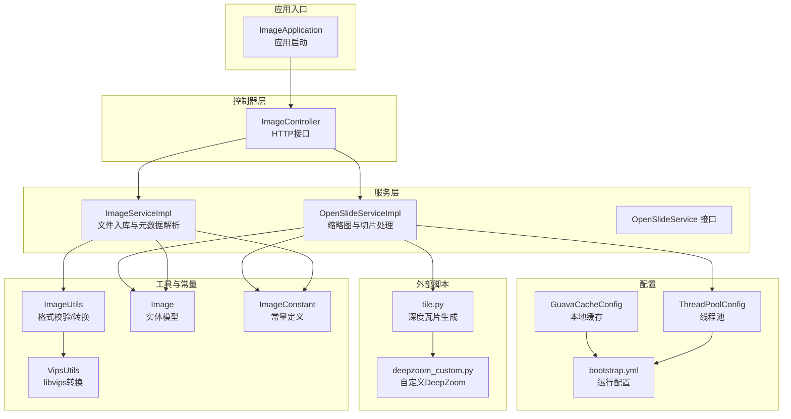
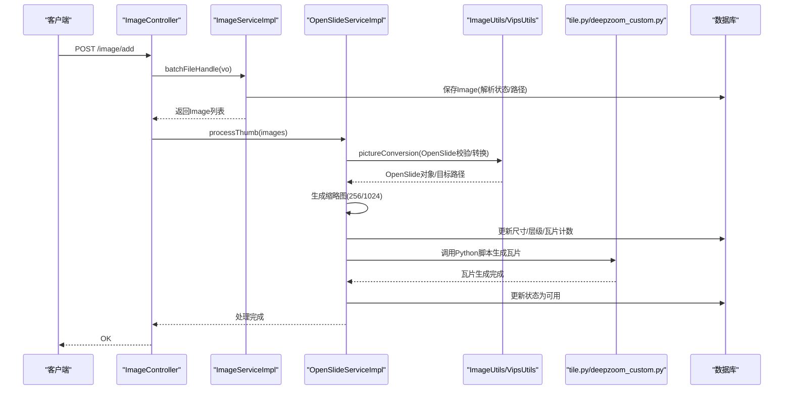
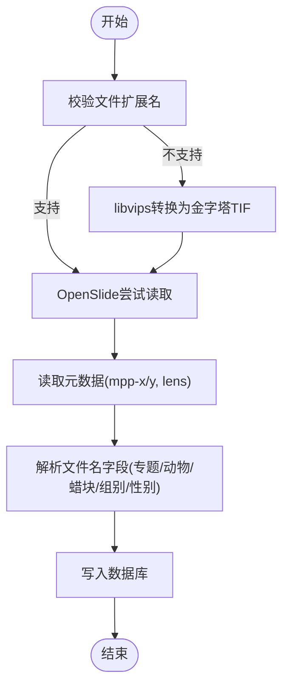
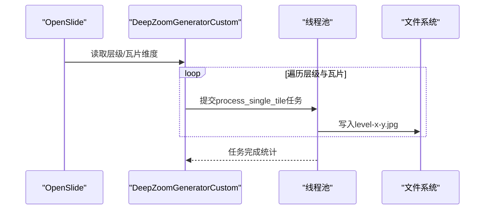
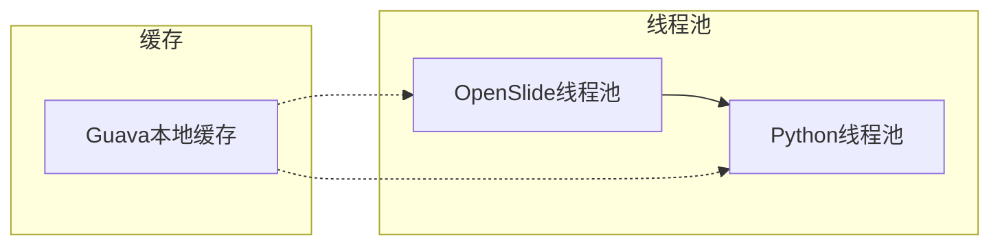
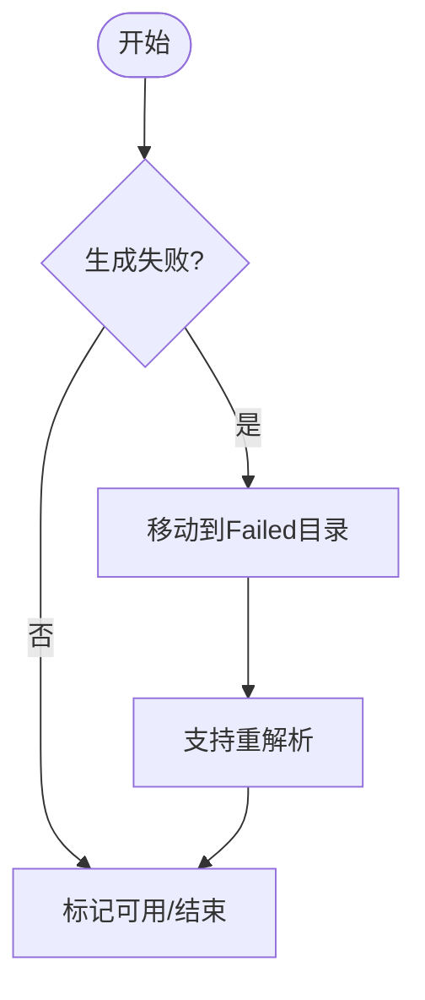
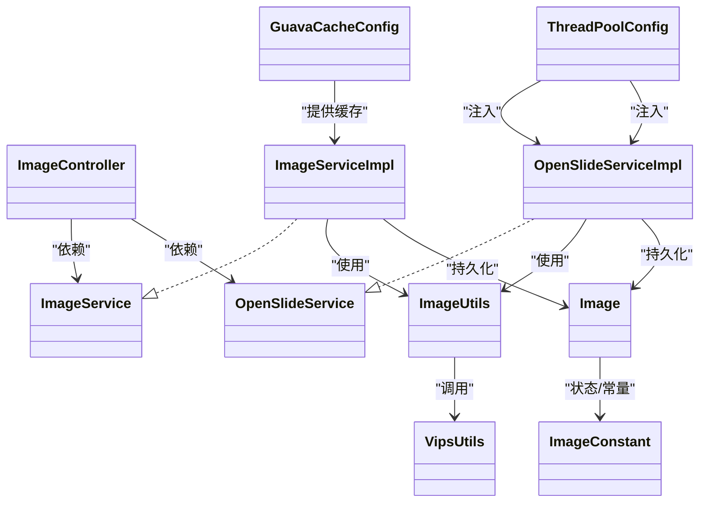

# 核心功能特性

<cite>
**本文引用的文件**
- [ImageApplication.java](file://src/main/java/cn/staitech/ImageApplication.java)
- [ImageController.java](file://src/main/java/cn/staitech/file/controller/ImageController.java)
- [ImageService.java](file://src/main/java/cn/staitech/file/service/ImageService.java)
- [ImageServiceImpl.java](file://src/main/java/cn/staitech/file/service/impl/ImageServiceImpl.java)
- [OpenSlideService.java](file://src/main/java/cn/staitech/file/service/OpenSlideService.java)
- [OpenSlideServiceImpl.java](file://src/main/java/cn/staitech/file/service/impl/OpenSlideServiceImpl.java)
- [ImageUtils.java](file://src/main/java/cn/staitech/file/util/ImageUtils.java)
- [VipsUtils.java](file://src/main/java/cn/staitech/file/util/VipsUtils.java)
- [Image.java](file://src/main/java/cn/staitech/file/domain/Image.java)
- [ImageConstant.java](file://src/main/java/cn/staitech/file/constant/ImageConstant.java)
- [ThreadPoolConfig.java](file://src/main/java/cn/staitech/file/config/ThreadPoolConfig.java)
- [GuavaCacheConfig.java](file://src/main/java/cn/staitech/file/config/GuavaCacheConfig.java)
- [bootstrap.yml](file://src/main/resources/bootstrap.yml)
- [tile.py](file://docker/staitech/modules/image/script/tile.py)
- [deepzoom_custom.py](file://docker/staitech/modules/image/script/deepzoom_custom.py)
</cite>

## 目录
1. [简介](#简介)
2. [项目结构](#项目结构)
3. [核心组件](#核心组件)
4. [架构总览](#架构总览)
5. [详细组件分析](#详细组件分析)
6. [依赖关系分析](#依赖关系分析)
7. [性能考量](#性能考量)
8. [故障排查指南](#故障排查指南)
9. [结论](#结论)
10. [附录](#附录)

## 简介
本文件聚焦 PACMVS 医学数字切片处理服务的核心能力，围绕多格式支持（SVS、NDPI 等）、自动元数据解析、图像金字塔与缩略图生成、异步处理与分布式缓存策略进行系统化说明。文档同时给出技术实现原理、业务价值、使用场景与实践建议，帮助用户快速理解与开发者深入实现细节。

## 项目结构
项目采用 Spring Boot 微服务架构，核心模块集中在 cn.staitech.file 包下，包含控制器、服务、工具与配置等层次化设计。资源文件集中于 resources，包含 Nacos 配置、日志与 MyBatis Mapper XML。Docker 模块内嵌 Python 切片脚本与 libvips/openslide 依赖，支撑深度瓦片生成。

**图表来源**
- [ImageApplication.java:37-52](file://src/main/java/cn/staitech/ImageApplication.java#L37-L52)
- [ImageController.java:30-71](file://src/main/java/cn/staitech/file/controller/ImageController.java#L30-L71)
- [ImageServiceImpl.java:42-140](file://src/main/java/cn/staitech/file/service/impl/ImageServiceImpl.java#L42-L140)
- [OpenSlideServiceImpl.java:47-339](file://src/main/java/cn/staitech/file/service/impl/OpenSlideServiceImpl.java#L47-L339)
- [ImageUtils.java:20-97](file://src/main/java/cn/staitech/file/util/ImageUtils.java#L20-L97)
- [VipsUtils.java:11-36](file://src/main/java/cn/staitech/file/util/VipsUtils.java#L11-L36)
- [Image.java:27-216](file://src/main/java/cn/staitech/file/domain/Image.java#L27-L216)
- [ImageConstant.java:9-67](file://src/main/java/cn/staitech/file/constant/ImageConstant.java#L9-L67)
- [ThreadPoolConfig.java:13-65](file://src/main/java/cn/staitech/file/config/ThreadPoolConfig.java#L13-L65)
- [GuavaCacheConfig.java:16-26](file://src/main/java/cn/staitech/file/config/GuavaCacheConfig.java#L16-L26)
- [bootstrap.yml:1-37](file://src/main/resources/bootstrap.yml#L1-L37)
- [tile.py:1-99](file://docker/staitech/modules/image/script/tile.py#L1-L99)
- [deepzoom_custom.py:1-177](file://docker/staitech/modules/image/script/deepzoom_custom.py#L1-L177)

**章节来源**
- [ImageApplication.java:37-52](file://src/main/java/cn/staitech/ImageApplication.java#L37-L52)
- [bootstrap.yml:1-37](file://src/main/resources/bootstrap.yml#L1-L37)

## 核心组件
- 文件入库与元数据解析：负责接收文件插入请求，校验路径有效性，去重，构造 Image 实体，解析文件名中的专题、动物、蜡块、组别与性别等字段，生成缩略图与缓存路径，写入数据库。
- OpenSlide 缩略图与切片处理：基于 OpenSlide 读取 WSI 元数据，生成 256×256 与 1024×1024 缩略图，记录层级数与瓦片计数，随后调用 Python 脚本生成深度瓦片金字塔。
- 工具与转换：ImageUtils 负责格式校验与 OpenSlide 验证，若不兼容则通过 VipsUtils 调用 libvips 将非金字塔 TIF 转换为金字塔 TIF；tile.py/dz_custom.py 实现多级瓦片生成与颜色管理。
- 异步与缓存：通过线程池异步执行缩略图与切片任务，Guava Cache 提供轻量本地缓存，bootstrap.yml 配置运行参数与 Nacos 注册。

**章节来源**
- [ImageService.java:17-23](file://src/main/java/cn/staitech/file/service/ImageService.java#L17-L23)
- [ImageServiceImpl.java:63-140](file://src/main/java/cn/staitech/file/service/impl/ImageServiceImpl.java#L63-L140)
- [OpenSlideService.java:14-39](file://src/main/java/cn/staitech/file/service/OpenSlideService.java#L14-L39)
- [OpenSlideServiceImpl.java:149-339](file://src/main/java/cn/staitech/file/service/impl/OpenSlideServiceImpl.java#L149-L339)
- [ImageUtils.java:20-97](file://src/main/java/cn/staitech/file/util/ImageUtils.java#L20-L97)
- [VipsUtils.java:11-36](file://src/main/java/cn/staitech/file/util/VipsUtils.java#L11-L36)
- [ThreadPoolConfig.java:13-65](file://src/main/java/cn/staitech/file/config/ThreadPoolConfig.java#L13-L65)
- [GuavaCacheConfig.java:16-26](file://src/main/java/cn/staitech/file/config/GuavaCacheConfig.java#L16-L26)

## 架构总览
系统以 HTTP 接口为入口，经由 ImageController 调用 ImageService 完成入库与元数据解析，再由 OpenSlideService 生成缩略图并触发 Python 切片任务。OpenSlide 读取 WSI 元数据，结合自定义 DeepZoom 生成器与瓦片脚本，输出多层级金字塔瓦片，最终状态回写数据库并记录审计日志。

**图表来源**
- [ImageController.java:42-48](file://src/main/java/cn/staitech/file/controller/ImageController.java#L42-L48)
- [ImageServiceImpl.java:63-140](file://src/main/java/cn/staitech/file/service/impl/ImageServiceImpl.java#L63-L140)
- [OpenSlideServiceImpl.java:149-339](file://src/main/java/cn/staitech/file/service/impl/OpenSlideServiceImpl.java#L149-L339)
- [ImageUtils.java:52-97](file://src/main/java/cn/staitech/file/util/ImageUtils.java#L52-L97)
- [tile.py:15-99](file://docker/staitech/modules/image/script/tile.py#L15-L99)
- [deepzoom_custom.py:129-177](file://docker/staitech/modules/image/script/deepzoom_custom.py#L129-L177)

## 详细组件分析

### 多格式支持与自动元数据解析
- 支持格式：通过 ImageUtils 的扩展名校验，覆盖 SVS、NDPI、TIF、ZVI、SCN、以及常见光栅格式（JPG/JPEG/PNG/BMP/GIF），并针对不可直接解析的格式进行 libvips 转换。
- 元数据解析：OpenSlide 读取 mpp-x/mpp-y 与 Objective Power/SourceLens 等属性；对特殊导出（含 tiff.ImageDescription JSON）做兼容处理；同时解析文件名中的专题、动物、蜡块、组别与性别等字段，写入 Image 实体。
- 业务价值：统一多厂商 WSI 数据接入，标准化分辨率与放大倍数，保障后续缩略图与切片质量。

**图表来源**
- [ImageUtils.java:20-97](file://src/main/java/cn/staitech/file/util/ImageUtils.java#L20-L97)
- [OpenSlideServiceImpl.java:87-130](file://src/main/java/cn/staitech/file/service/impl/OpenSlideServiceImpl.java#L87-L130)
- [ImageServiceImpl.java:421-484](file://src/main/java/cn/staitech/file/service/impl/ImageServiceImpl.java#L421-L484)

**章节来源**
- [ImageUtils.java:20-114](file://src/main/java/cn/staitech/file/util/ImageUtils.java#L20-L114)
- [OpenSlideServiceImpl.java:87-130](file://src/main/java/cn/staitech/file/service/impl/OpenSlideServiceImpl.java#L87-L130)
- [ImageServiceImpl.java:421-484](file://src/main/java/cn/staitech/file/service/impl/ImageServiceImpl.java#L421-L484)

### 图像金字塔与缩略图生成
- 缩略图：生成 256×256 与 1024×1024 两种尺寸，分别对应交互与缓存场景；路径按组织号与 ImageId 规划，便于前端按需加载。
- 金字塔：通过 Python 脚本调用 OpenSlide DeepZoom 生成多层级瓦片，自定义生成器适配前端需求；使用线程池并发处理，限制队列长度避免内存峰值。
- 颜色管理：在瓦片生成阶段应用 ICC 颜色配置转换，保证跨设备一致性。

**图表来源**
- [OpenSlideServiceImpl.java:319-339](file://src/main/java/cn/staitech/file/service/impl/OpenSlideServiceImpl.java#L319-L339)
- [tile.py:15-99](file://docker/staitech/modules/image/script/tile.py#L15-L99)
- [deepzoom_custom.py:129-177](file://docker/staitech/modules/image/script/deepzoom_custom.py#L129-L177)

**章节来源**
- [OpenSlideServiceImpl.java:242-256](file://src/main/java/cn/staitech/file/service/impl/OpenSlideServiceImpl.java#L242-L256)
- [OpenSlideServiceImpl.java:319-339](file://src/main/java/cn/staitech/file/service/impl/OpenSlideServiceImpl.java#L319-L339)
- [tile.py:15-99](file://docker/staitech/modules/image/script/tile.py#L15-L99)
- [deepzoom_custom.py:129-177](file://docker/staitech/modules/image/script/deepzoom_custom.py#L129-L177)

### 异步处理机制与分布式缓存策略
- 异步处理：缩略图与切片分别由 OpenSlide 与 Python 任务线程池异步执行，使用 CompletableFuture 并发调度，提升吞吐。
- 线程池：OpenSlide 线程池适配 CPU 核心数，Python 线程池规模更小，避免 I/O 密集型阻塞；均配置有界队列与拒绝策略。
- 本地缓存：Guava Cache 提供短时高频访问的键值缓存，降低重复计算与 IO 压力。
- 分布式缓存：当前实现未见 Redis/本地缓存以外的分布式缓存使用证据，建议在多实例部署时引入 Redis 以共享会话与热点数据。

**图表来源**
- [ThreadPoolConfig.java:18-64](file://src/main/java/cn/staitech/file/config/ThreadPoolConfig.java#L18-L64)
- [GuavaCacheConfig.java:19-25](file://src/main/java/cn/staitech/file/config/GuavaCacheConfig.java#L19-L25)

**章节来源**
- [ThreadPoolConfig.java:18-64](file://src/main/java/cn/staitech/file/config/ThreadPoolConfig.java#L18-L64)
- [GuavaCacheConfig.java:19-25](file://src/main/java/cn/staitech/file/config/GuavaCacheConfig.java#L19-L25)

### 错误处理与重试机制
- 失败迁移：当缩略图或切片生成失败时，将源文件移动至 Failed 目录，避免污染正常数据。
- 重解析：提供按 ID 重解析接口，筛选失败状态的任务重新执行。
- 日志审计：调用日志审计服务记录关键字段，便于追踪与溯源。

**图表来源**
- [OpenSlideServiceImpl.java:399-454](file://src/main/java/cn/staitech/file/service/impl/OpenSlideServiceImpl.java#L399-L454)
- [OpenSlideServiceImpl.java:259-268](file://src/main/java/cn/staitech/file/service/impl/OpenSlideServiceImpl.java#L259-L268)

**章节来源**
- [OpenSlideServiceImpl.java:399-454](file://src/main/java/cn/staitech/file/service/impl/OpenSlideServiceImpl.java#L399-L454)
- [OpenSlideServiceImpl.java:259-268](file://src/main/java/cn/staitech/file/service/impl/OpenSlideServiceImpl.java#L259-L268)

## 依赖关系分析
- 控制器依赖服务接口，服务实现依赖工具与常量，OpenSlide 依赖 Python 脚本与自定义 DeepZoom。
- 线程池与缓存配置独立于业务逻辑，便于横向扩展与运维调优。
- 数据模型 Image 统一承载元数据、路径与状态，贯穿解析、缩略图与切片全流程。

**图表来源**
- [ImageController.java:30-71](file://src/main/java/cn/staitech/file/controller/ImageController.java#L30-L71)
- [ImageService.java:17-23](file://src/main/java/cn/staitech/file/service/ImageService.java#L17-L23)
- [ImageServiceImpl.java:42-140](file://src/main/java/cn/staitech/file/service/impl/ImageServiceImpl.java#L42-L140)
- [OpenSlideService.java:14-39](file://src/main/java/cn/staitech/file/service/OpenSlideService.java#L14-L39)
- [OpenSlideServiceImpl.java:47-339](file://src/main/java/cn/staitech/file/service/impl/OpenSlideServiceImpl.java#L47-L339)
- [ImageUtils.java:20-97](file://src/main/java/cn/staitech/file/util/ImageUtils.java#L20-L97)
- [VipsUtils.java:11-36](file://src/main/java/cn/staitech/file/util/VipsUtils.java#L11-L36)
- [Image.java:27-216](file://src/main/java/cn/staitech/file/domain/Image.java#L27-L216)
- [ImageConstant.java:9-67](file://src/main/java/cn/staitech/file/constant/ImageConstant.java#L9-L67)
- [ThreadPoolConfig.java:18-64](file://src/main/java/cn/staitech/file/config/ThreadPoolConfig.java#L18-L64)
- [GuavaCacheConfig.java:19-25](file://src/main/java/cn/staitech/file/config/GuavaCacheConfig.java#L19-L25)

**章节来源**
- [ImageController.java:30-71](file://src/main/java/cn/staitech/file/controller/ImageController.java#L30-L71)
- [ImageServiceImpl.java:42-140](file://src/main/java/cn/staitech/file/service/impl/ImageServiceImpl.java#L42-L140)
- [OpenSlideServiceImpl.java:47-339](file://src/main/java/cn/staitech/file/service/impl/OpenSlideServiceImpl.java#L47-L339)

## 性能考量
- I/O 与内存：Python 切片脚本使用有界队列与线程池，限制并发任务数量，避免内存峰值；OpenSlideCache 设置 1GB 缓存容量，减少重复读取。
- 瓦片尺寸与压缩：瓦片默认 512×512，LZW 压缩，兼顾体积与质量；缩略图 256×256 与 1024×1024 满足不同场景。
- 线程池规模：OpenSlide 线程池随 CPU 动态调整，Python 线程池较小，避免 I/O 阻塞影响整体吞吐。
- 建议：在高并发场景引入 Redis 缓存热点元数据与切片索引；对超大 WSI 增加 OpenSlideCache 容量或分块预热。

**章节来源**
- [tile.py:30-81](file://docker/staitech/modules/image/script/tile.py#L30-L81)
- [OpenSlideServiceImpl.java:91-130](file://src/main/java/cn/staitech/file/service/impl/OpenSlideServiceImpl.java#L91-L130)
- [ThreadPoolConfig.java:18-64](file://src/main/java/cn/staitech/file/config/ThreadPoolConfig.java#L18-L64)

## 故障排查指南
- 缩略图生成失败：检查 OpenSlide 是否能读取 WSI，确认元数据层级数是否小于阈值；查看失败目录迁移日志。
- 切片生成失败：核对 Python 脚本路径与可执行权限，确认输出目录可写；关注线程池拒绝日志。
- 文件名解析失败：确认文件命名规范（专题号~动物号~蜡块号~组别性别~其他），检查专题是否存在。
- 元数据缺失：针对特殊导出（含 ImageDescription JSON）进行兼容解析；必要时手动补全。

**章节来源**
- [OpenSlideServiceImpl.java:188-200](file://src/main/java/cn/staitech/file/service/impl/OpenSlideServiceImpl.java#L188-L200)
- [OpenSlideServiceImpl.java:320-339](file://src/main/java/cn/staitech/file/service/impl/OpenSlideServiceImpl.java#L320-L339)
- [ImageServiceImpl.java:421-484](file://src/main/java/cn/staitech/file/service/impl/ImageServiceImpl.java#L421-L484)

## 结论
本系统通过 OpenSlide 与 Python 深度瓦片生成链路，实现了对多格式 WSI 的标准化接入与高质量金字塔输出；结合异步线程池与本地缓存，满足高吞吐与低延迟需求。建议在生产环境中进一步引入分布式缓存与监控告警，持续优化大体量 WSI 的处理性能与稳定性。

## 附录
- 使用场景与案例
  - 数字病理远程诊断：上传 SVS/NDPI 切片，自动生成缩略图与金字塔，前端按需加载，提升浏览体验。
  - 科研标注与检索：利用 1024×1024 缩略图进行标注与标注结果缓存，提高标注效率。
  - 跨平台展示：通过标准瓦片协议适配不同 Viewer，保障颜色一致性与跨设备显示稳定。
- 最佳实践
  - 统一文件命名规范，确保元数据解析成功率。
  - 合理设置线程池与缓存容量，结合监控指标动态调优。
  - 对失败任务建立重解析与人工干预流程，保障数据可用性。