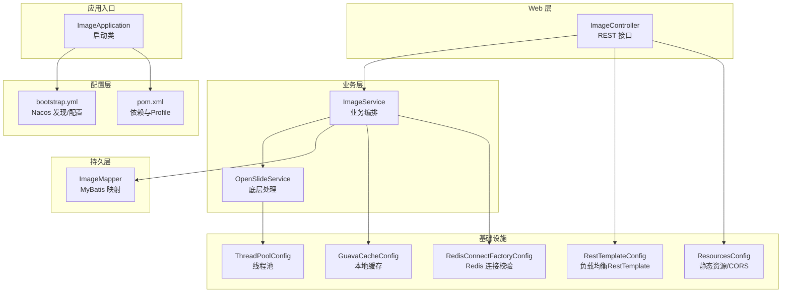
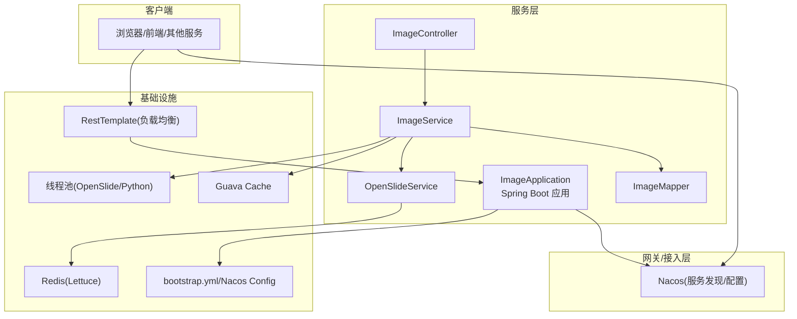
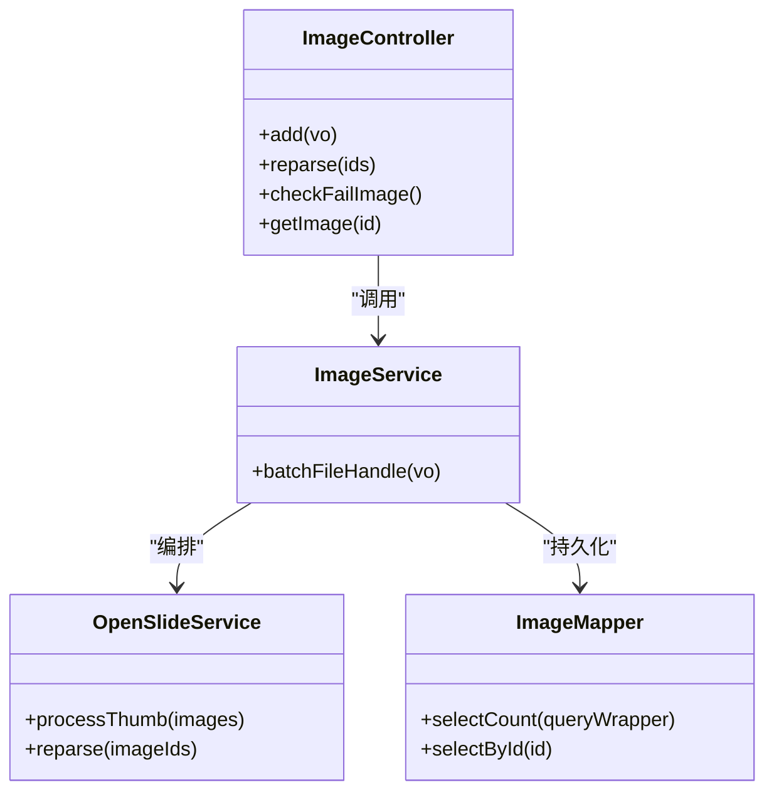
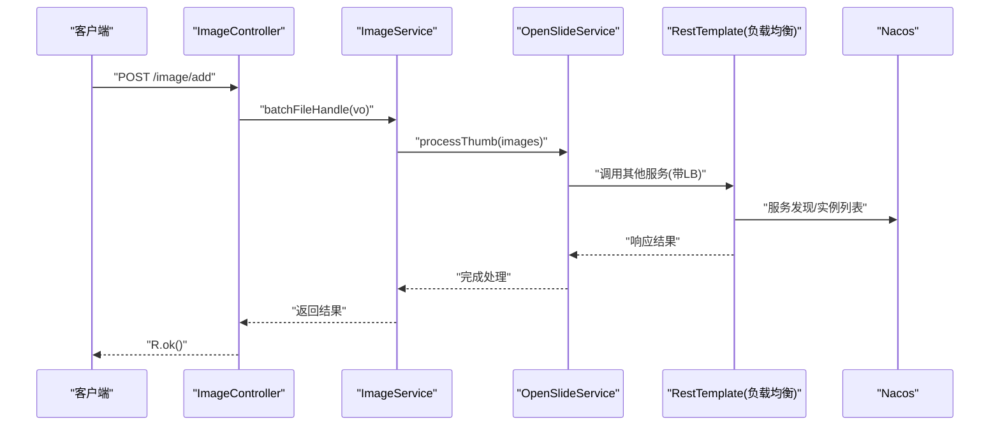
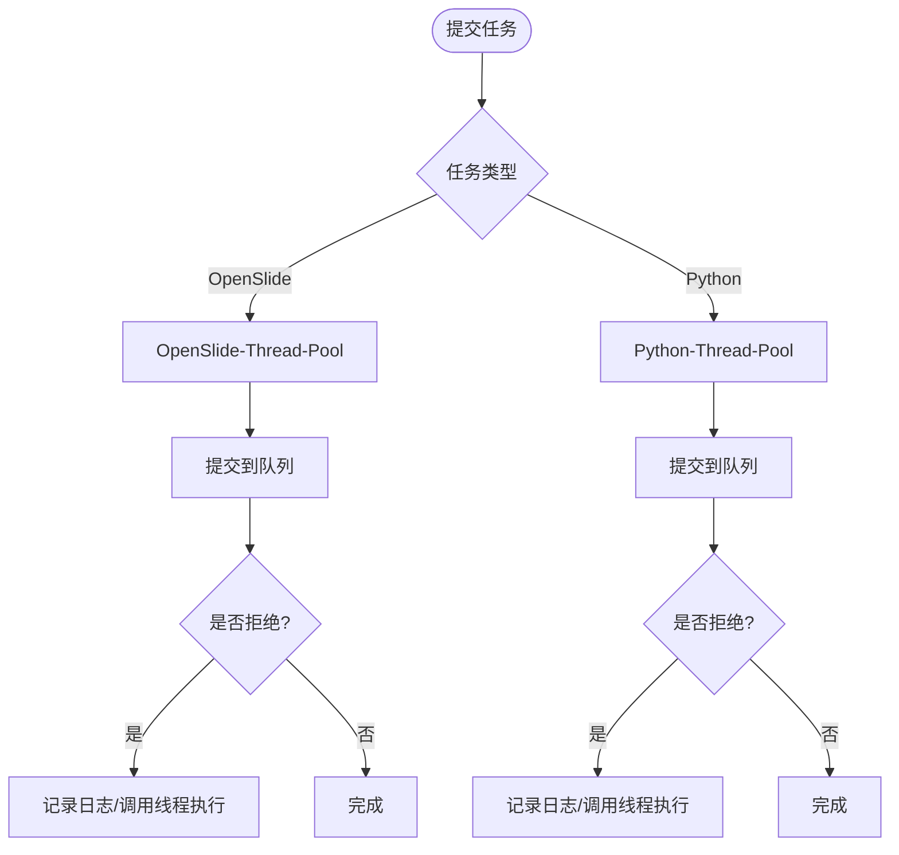
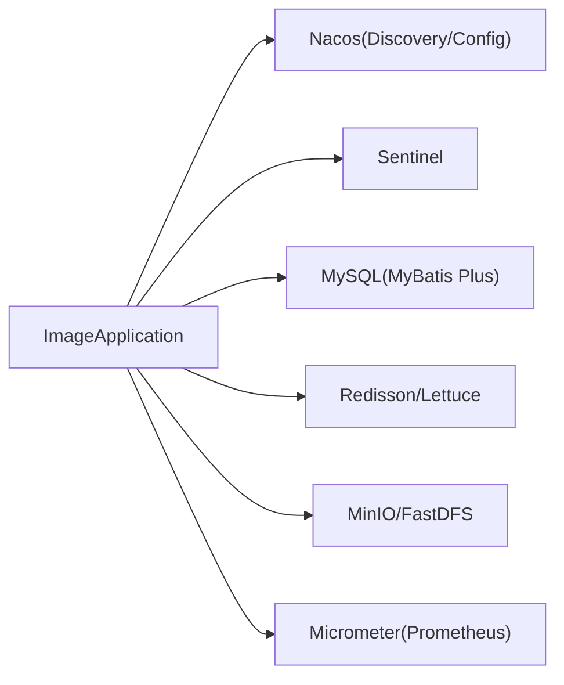

# 系统架构

<cite>
**本文引用的文件**
- [ImageApplication.java](file://src/main/java/cn/staitech/ImageApplication.java)
- [bootstrap.yml](file://src/main/resources/bootstrap.yml)
- [pom.xml](file://pom.xml)
- [ThreadPoolConfig.java](file://src/main/java/cn/staitech/file/config/ThreadPoolConfig.java)
- [GuavaCacheConfig.java](file://src/main/java/cn/staitech/file/config/GuavaCacheConfig.java)
- [RedisConnectFactoryConfig.java](file://src/main/java/cn/staitech/file/config/RedisConnectFactoryConfig.java)
- [RestTemplateConfig.java](file://src/main/java/cn/staitech/file/config/RestTemplateConfig.java)
- [ResourcesConfig.java](file://src/main/java/cn/staitech/file/config/ResourcesConfig.java)
- [ImageController.java](file://src/main/java/cn/staitech/file/controller/ImageController.java)
</cite>

## 目录
1. [引言](#引言)
2. [项目结构](#项目结构)
3. [核心组件](#核心组件)
4. [架构总览](#架构总览)
5. [详细组件分析](#详细组件分析)
6. [依赖分析](#依赖分析)
7. [性能考虑](#性能考虑)
8. [故障排查指南](#故障排查指南)
9. [结论](#结论)
10. [附录](#附录)

## 引言
本项目为 PACMVS 的图像模块，面向数字病理切片的原始数据解析与缩略图生成，采用基于 Spring Cloud Alibaba 的微服务架构，结合 Nacos 服务发现与配置中心、Sentinel 流量治理、Redis 缓存、线程池异步化以及定时扫描等能力，实现高可用、可扩展的图像处理服务。本文档从系统边界、组件交互与数据流出发，系统阐述分层架构（Controller-Service-Mapper）、服务拆分策略、服务间通信与负载均衡、基础设施配置与性能优化策略，并给出面向架构师与高级开发者的实践建议。

## 项目结构
项目采用标准 Spring Boot 工程结构，核心模块集中在 cn.staitech.file 包下，按职责划分为 controller、service、mapper、domain、vo、util、config 等层次；同时通过 Maven Profile 切换不同环境的 Nacos 地址与命名空间，统一由 bootstrap.yml 注入。

图表来源
- [ImageApplication.java:37-52](file://src/main/java/cn/staitech/ImageApplication.java#L37-L52)
- [bootstrap.yml:17-37](file://src/main/resources/bootstrap.yml#L17-L37)
- [pom.xml:32-45](file://pom.xml#L32-L45)
- [ImageController.java:30-71](file://src/main/java/cn/staitech/file/controller/ImageController.java#L30-L71)
- [ThreadPoolConfig.java:13-65](file://src/main/java/cn/staitech/file/config/ThreadPoolConfig.java#L13-L65)
- [GuavaCacheConfig.java:16-26](file://src/main/java/cn/staitech/file/config/GuavaCacheConfig.java#L16-L26)
- [RedisConnectFactoryConfig.java:10-25](file://src/main/java/cn/staitech/file/config/RedisConnectFactoryConfig.java#L10-L25)
- [RestTemplateConfig.java:22-49](file://src/main/java/cn/staitech/file/config/RestTemplateConfig.java#L22-L49)
- [ResourcesConfig.java:16-51](file://src/main/java/cn/staitech/file/config/ResourcesConfig.java#L16-L51)

章节来源
- [ImageApplication.java:37-52](file://src/main/java/cn/staitech/ImageApplication.java#L37-L52)
- [bootstrap.yml:17-37](file://src/main/resources/bootstrap.yml#L17-L37)
- [pom.xml:32-45](file://pom.xml#L32-L45)

## 核心组件
- 启动类与装配
  - 启用服务发现、Feign 客户端、定时任务、WebSocket、事务管理、Elasticsearch 仓库、Micrometer 指标等，排除 Seata 自动配置，避免与当前架构冲突。
- 配置中心与服务发现
  - 通过 bootstrap.yml 绑定 Nacos Discovery 与 Config，支持多环境 Profile 切换命名空间与分组。
- 控制器层
  - 提供图像批量导入、重解析失败数据、检查失败切片、查询原始切片等接口，统一返回 R<T> 结构。
- 业务层
  - ImageService 负责文件批次处理与状态编排；OpenSlideService 负责缩略图生成与失败重解析。
- 持久层
  - MyBatis Plus Mapper 负责与数据库交互，配合 Wrapper 查询条件。
- 基础设施
  - 线程池：OpenSlide 与 Python 脚本分别独立线程池，避免 IO 密集与 CPU 密集相互干扰。
  - 本地缓存：Guava Cache 用于轻量热点数据。
  - Redis：Lettuce 连接工厂开启连接校验，保障稳定性。
  - RestTemplate：启用负载均衡，统一超时与 JSON 转换器。
  - 静态资源与跨域：本地文件映射与 GET 跨域放行。

章节来源
- [ImageApplication.java:27-36](file://src/main/java/cn/staitech/ImageApplication.java#L27-L36)
- [bootstrap.yml:17-37](file://src/main/resources/bootstrap.yml#L17-L37)
- [ImageController.java:30-71](file://src/main/java/cn/staitech/file/controller/ImageController.java#L30-L71)
- [ThreadPoolConfig.java:13-65](file://src/main/java/cn/staitech/file/config/ThreadPoolConfig.java#L13-L65)
- [GuavaCacheConfig.java:16-26](file://src/main/java/cn/staitech/file/config/GuavaCacheConfig.java#L16-L26)
- [RedisConnectFactoryConfig.java:10-25](file://src/main/java/cn/staitech/file/config/RedisConnectFactoryConfig.java#L10-L25)
- [RestTemplateConfig.java:22-49](file://src/main/java/cn/staitech/file/config/RestTemplateConfig.java#L22-L49)
- [ResourcesConfig.java:16-51](file://src/main/java/cn/staitech/file/config/ResourcesConfig.java#L16-L51)

## 架构总览
系统采用“单体微服务”形态，内部遵循分层架构（Controller-Service-Mapper），通过 Nacos 实现服务注册与配置下发，使用 Sentinel 进行流量治理，Redis 与本地缓存提升访问性能，线程池异步化处理耗时任务，定时扫描保证数据一致性。

图表来源
- [ImageApplication.java:37-52](file://src/main/java/cn/staitech/ImageApplication.java#L37-L52)
- [bootstrap.yml:17-37](file://src/main/resources/bootstrap.yml#L17-L37)
- [ImageController.java:30-71](file://src/main/java/cn/staitech/file/controller/ImageController.java#L30-L71)
- [ThreadPoolConfig.java:13-65](file://src/main/java/cn/staitech/file/config/ThreadPoolConfig.java#L13-L65)
- [GuavaCacheConfig.java:16-26](file://src/main/java/cn/staitech/file/config/GuavaCacheConfig.java#L16-L26)
- [RedisConnectFactoryConfig.java:10-25](file://src/main/java/cn/staitech/file/config/RedisConnectFactoryConfig.java#L10-L25)
- [RestTemplateConfig.java:22-49](file://src/main/java/cn/staitech/file/config/RestTemplateConfig.java#L22-L49)

## 详细组件分析

### 分层架构与职责
- Controller 层
  - 职责：接收请求、参数校验、调用业务层、封装返回值。
  - 示例：图像添加、重解析、失败检查、查询原始切片。
- Service 层
  - 职责：业务编排、事务控制、异常处理、与外部系统交互。
  - 示例：批量文件处理、缩略图生成与失败重解析。
- Mapper 层
  - 职责：数据库访问、SQL 映射、条件构造。
  - 示例：基于 Wrapper 的查询与计数。

图表来源
- [ImageController.java:30-71](file://src/main/java/cn/staitech/file/controller/ImageController.java#L30-L71)
- [ImageService.java](file://src/main/java/cn/staitech/file/service/ImageService.java)
- [OpenSlideService.java](file://src/main/java/cn/staitech/file/service/OpenSlideService.java)
- [ImageMapper.java](file://src/main/java/cn/staitech/file/mapper/ImageMapper.java)

章节来源
- [ImageController.java:30-71](file://src/main/java/cn/staitech/file/controller/ImageController.java#L30-L71)

### 服务拆分策略
- 单模块多职责：图像模块内聚处理“原始切片解析+缩略图生成”，减少跨模块调用。
- 外部系统解耦：通过线程池与 Redis 缓存隔离第三方库（OpenSlide/Python）与对象存储（MinIO/FastDFS）带来的性能波动。
- 配置集中化：Nacos Config 将环境差异化参数（如存储路径、命名空间）集中管理，避免硬编码。

章节来源
- [bootstrap.yml:17-37](file://src/main/resources/bootstrap.yml#L17-L37)
- [pom.xml:32-45](file://pom.xml#L32-L45)

### 服务间通信机制与负载均衡
- RestTemplate 负载均衡：通过 @LoadBalanced 注解启用 Ribbon 或 Spring Cloud 负载均衡策略，自动轮询或基于权重的服务实例。
- Feign 客户端：启动类启用 Feign 客户端，便于声明式调用其他服务。
- 服务发现：Nacos Discovery 注册与订阅服务，实现动态上下线感知。

图表来源
- [ImageController.java:44-47](file://src/main/java/cn/staitech/file/controller/ImageController.java#L44-L47)
- [RestTemplateConfig.java:24-48](file://src/main/java/cn/staitech/file/config/RestTemplateConfig.java#L24-L48)
- [bootstrap.yml:17-25](file://src/main/resources/bootstrap.yml#L17-L25)

章节来源
- [RestTemplateConfig.java:22-49](file://src/main/java/cn/staitech/file/config/RestTemplateConfig.java#L22-L49)
- [ImageApplication.java:31-35](file://src/main/java/cn/staitech/ImageApplication.java#L31-L35)

### 负载均衡配置
- 连接与读写超时：连接超时、请求超时、读取超时统一配置，降低慢请求拖垮整体吞吐。
- JSON 转换器：显式注册 Jackson 转换器，确保跨服务序列化一致。
- 负载均衡注解：@LoadBalanced 使 RestTemplate 在服务名维度进行实例选择。

章节来源
- [RestTemplateConfig.java:24-48](file://src/main/java/cn/staitech/file/config/RestTemplateConfig.java#L24-L48)

### Nacos 服务发现与配置
- 服务发现：应用启动后向 Nacos 注册，提供健康检查与实例变更通知。
- 配置中心：从 Nacos 拉取 application-{env}.yml，支持共享配置与多环境命名空间隔离。
- 环境切换：通过 Maven Profile 注入 serverAddr、namespace、group，实现一键切换。

章节来源
- [bootstrap.yml:17-37](file://src/main/resources/bootstrap.yml#L17-L37)
- [pom.xml:349-384](file://pom.xml#L349-L384)

### Redis 缓存与连接校验
- 连接工厂：LettuceConnectionFactory 开启 validateConnection，降低连接失效导致的异常。
- 使用场景：缓存热点元信息、临时状态，减少数据库压力。

章节来源
- [RedisConnectFactoryConfig.java:10-25](file://src/main/java/cn/staitech/file/config/RedisConnectFactoryConfig.java#L10-L25)

### 线程池配置与异步化
- OpenSlide 线程池：CPU 密集型任务，核心线程数与队列容量适配 IO 设备并发。
- Python 脚本线程池：IO 密集型任务，较小核心线程数，避免过多上下文切换。
- 拒绝策略：记录日志并回退到调用线程执行，保证任务不丢失。

图表来源
- [ThreadPoolConfig.java:18-39](file://src/main/java/cn/staitech/file/config/ThreadPoolConfig.java#L18-L39)
- [ThreadPoolConfig.java:44-64](file://src/main/java/cn/staitech/file/config/ThreadPoolConfig.java#L44-L64)

章节来源
- [ThreadPoolConfig.java:13-65](file://src/main/java/cn/staitech/file/config/ThreadPoolConfig.java#L13-L65)

### 静态资源与跨域
- 本地文件映射：将本地磁盘路径映射为可访问的 URL 前缀，便于前端直接访问。
- 跨域放行：针对静态资源前缀开放 GET 方法跨域，简化前端调试与部署。

章节来源
- [ResourcesConfig.java:16-51](file://src/main/java/cn/staitech/file/config/ResourcesConfig.java#L16-L51)

## 依赖分析
- 外部依赖
  - Spring Cloud Alibaba：Nacos Discovery/Config、Sentinel。
  - MyBatis Plus：ORM 与 SQL 构造。
  - Redisson：分布式能力（如需要）。
  - MinIO/FastDFS：对象存储客户端。
  - Micrometer + Prometheus：指标采集。
- 内部模块
  - common-*：通用数据源、权限、日志、Swagger 等。

图表来源
- [pom.xml:24-204](file://pom.xml#L24-L204)
- [ImageApplication.java:31-35](file://src/main/java/cn/staitech/ImageApplication.java#L31-L35)

章节来源
- [pom.xml:24-204](file://pom.xml#L24-L204)

## 性能考虑
- 线程池分离：将 CPU 密集与 IO 密集任务隔离，避免互相抢占资源。
- 负载均衡：对下游服务启用 LB，结合超时与熔断，提升整体可用性。
- 缓存策略：本地缓存与 Redis 双通道，热点数据就近缓存，降低数据库压力。
- 文件上传：multipart 限制与静态资源映射，避免内存溢出与路径暴露。
- 指标监控：Micrometer + Prometheus，建立关键链路的延迟与错误率监控。

## 故障排查指南
- 服务无法注册/发现
  - 检查 Nacos 地址、命名空间、分组是否与 Profile 一致。
  - 确认应用名与端口未冲突。
- 负载均衡无效
  - 确认 RestTemplate Bean 上存在 @LoadBalanced 注解。
  - 检查服务名是否与注册名一致。
- 线程池拒绝任务
  - 查看拒绝日志，评估队列长度与核心线程数是否合理。
  - 必要时扩容或引入限流。
- Redis 连接异常
  - 检查连接工厂 validateConnection 是否生效。
  - 核对 Redis 地址与认证配置。
- 文件访问 404
  - 核对本地文件路径与前缀映射，确认 CORS 放行范围。

章节来源
- [bootstrap.yml:17-37](file://src/main/resources/bootstrap.yml#L17-L37)
- [RestTemplateConfig.java:24-48](file://src/main/java/cn/staitech/file/config/RestTemplateConfig.java#L24-L48)
- [ThreadPoolConfig.java:28-38](file://src/main/java/cn/staitech/file/config/ThreadPoolConfig.java#L28-L38)
- [RedisConnectFactoryConfig.java:18-24](file://src/main/java/cn/staitech/file/config/RedisConnectFactoryConfig.java#L18-L24)
- [ResourcesConfig.java:32-50](file://src/main/java/cn/staitech/file/config/ResourcesConfig.java#L32-L50)

## 结论
该图像模块以分层架构为核心，结合 Nacos 服务治理、Sentinel 流控、Redis 缓存与线程池异步化，形成稳定高效的图像处理流水线。通过集中化配置与多环境 Profile，实现快速部署与运维；通过负载均衡与指标监控，保障线上稳定性与可观测性。建议后续在对象存储与第三方库调用上进一步细化熔断降级策略，并完善灰度发布与限流规则。

## 附录
- 环境变量与 Profile
  - pacmvsdev/testpvcmvs/pathmedics：分别对应开发/测试/生产环境的 Nacos 地址与命名空间。
- 关键配置项
  - Nacos discovery/config：server-addr、namespace、group、shared-configs。
  - RestTemplate：连接/读取/请求超时、JSON 转换器。
  - 线程池：OpenSlide 与 Python 独立线程池，阻塞队列与拒绝策略。

章节来源
- [pom.xml:349-384](file://pom.xml#L349-L384)
- [bootstrap.yml:17-37](file://src/main/resources/bootstrap.yml#L17-L37)
- [RestTemplateConfig.java:24-48](file://src/main/java/cn/staitech/file/config/RestTemplateConfig.java#L24-L48)
- [ThreadPoolConfig.java:18-64](file://src/main/java/cn/staitech/file/config/ThreadPoolConfig.java#L18-L64)