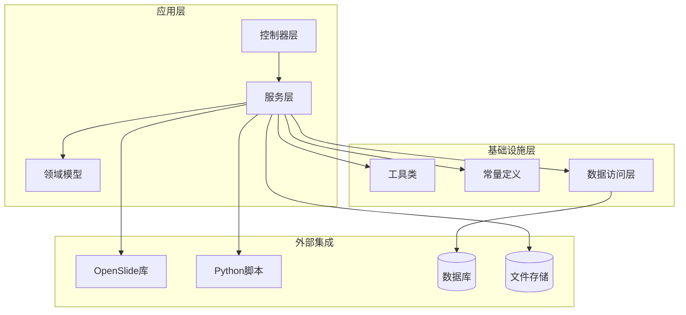
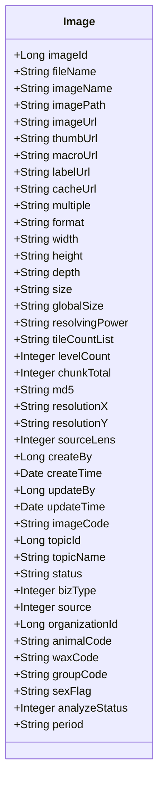
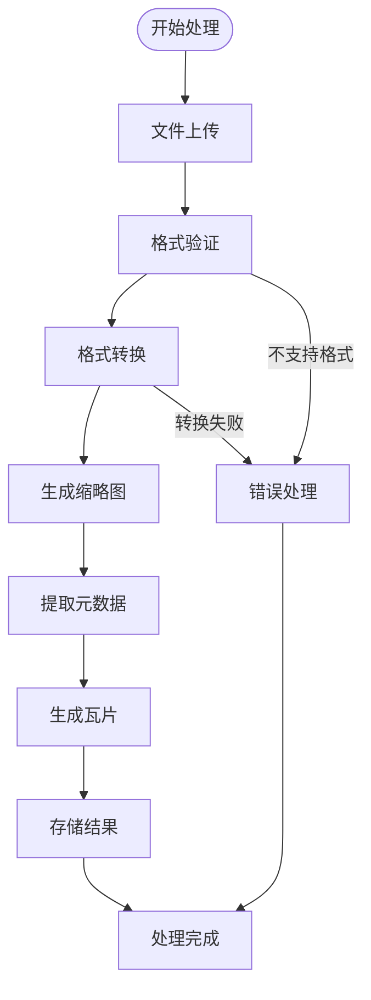
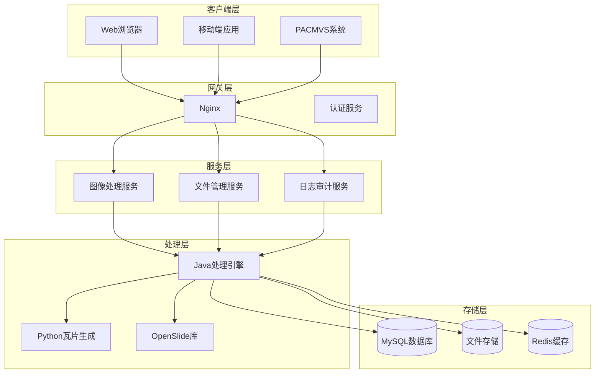
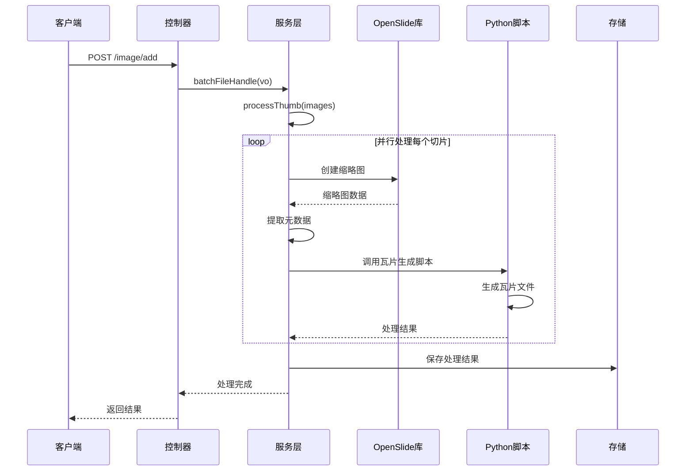
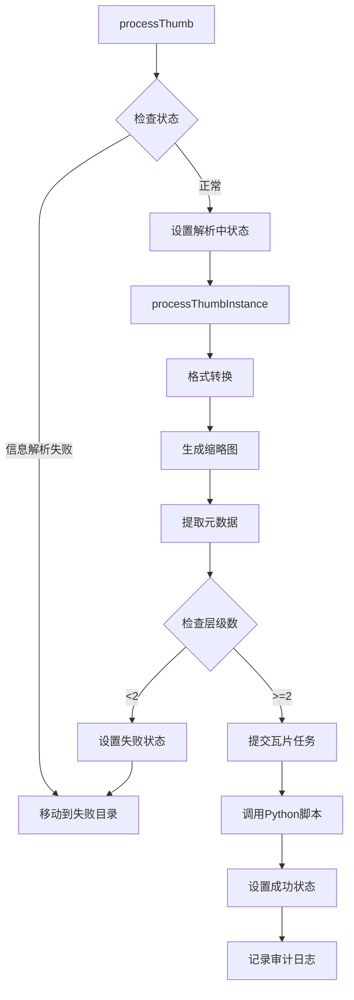
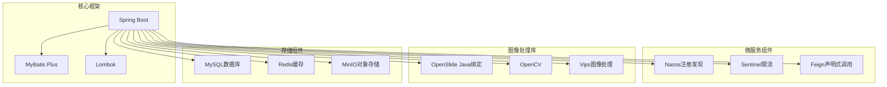

# 项目介绍

<cite>
**本文档引用的文件**
- [README.md](file://README.md)
- [ImageApplication.java](file://src/main/java/cn/staitech/ImageApplication.java)
- [Image.java](file://src/main/java/cn/staitech/file/domain/Image.java)
- [OpenSlideService.java](file://src/main/java/cn/staitech/file/service/OpenSlideService.java)
- [OpenSlideServiceImpl.java](file://src/main/java/cn/staitech/file/service/impl/OpenSlideServiceImpl.java)
- [ImageUtils.java](file://src/main/java/cn/staitech/file/util/ImageUtils.java)
- [ImageConstant.java](file://src/main/java/cn/staitech/file/constant/ImageConstant.java)
- [ImageController.java](file://src/main/java/cn/staitech/file/controller/ImageController.java)
- [tile.py](file://docker/staitech/modules/image/script/tile.py)
- [pom.xml](file://pom.xml)
- [bootstrap.yml](file://src/main/resources/bootstrap.yml)
- [ImageMapper.xml](file://src/main/resources/mapper/ImageMapper.xml)
- [update_v2.5.2.sql](file://sql/update_v2.5.2.sql)
</cite>

## 目录
1. [简介](#简介)
2. [项目结构](#项目结构)
3. [核心组件](#核心组件)
4. [架构概览](#架构概览)
5. [详细组件分析](#详细组件分析)
6. [依赖关系分析](#依赖关系分析)
7. [性能考虑](#性能考虑)
8. [故障排查指南](#故障排查指南)
9. [结论](#结论)

## 简介

PACMVS医学数字切片图像处理微服务项目是一个专门针对病理学数字切片（WSI，Whole Slide Image）处理的微服务系统。该项目致力于解决传统医学影像处理中的痛点问题，包括手动处理效率低、格式兼容性差、批量化处理困难等挑战。

### 核心目标

该项目的核心目标是为医学影像处理提供一个完整的解决方案，特别专注于以下方面：
- **多格式支持**：支持SVS、NDPI等多种主流病理切片格式
- **自动化处理**：实现从文件上传到最终可用的全流程自动化
- **高性能处理**：通过并行处理和缓存机制提升处理效率
- **标准化输出**：统一输出格式，便于后续应用集成

### 医学影像处理的重要性

在现代病理诊断中，数字切片技术已经成为标准实践。传统的玻璃载玻片需要人工扫描和数字化，而数字切片技术能够：
- 提高诊断效率和准确性
- 支持远程会诊和教学
- 实现AI辅助诊断
- 便于建立数字化档案

## 项目结构

该项目采用标准的Spring Boot微服务架构，主要包含以下模块：

**图表来源**
- [ImageApplication.java:37-52](file://src/main/java/cn/staitech/ImageApplication.java#L37-L52)
- [pom.xml:23-205](file://pom.xml#L23-L205)

**章节来源**
- [pom.xml:17-205](file://pom.xml#L17-L205)
- [ImageApplication.java:27-36](file://src/main/java/cn/staitech/ImageApplication.java#L27-L36)

## 核心组件

### 数据模型设计

项目的核心数据模型围绕Image实体展开，该实体包含了数字切片处理过程中的所有关键信息：

**图表来源**
- [Image.java:27-216](file://src/main/java/cn/staitech/file/domain/Image.java#L27-L216)

### 处理流程设计

项目实现了完整的数字切片处理流水线，从文件接收到底层瓦片生成：

**图表来源**
- [OpenSlideServiceImpl.java:140-202](file://src/main/java/cn/staitech/file/service/impl/OpenSlideServiceImpl.java#L140-L202)
- [OpenSlideServiceImpl.java:277-312](file://src/main/java/cn/staitech/file/service/impl/OpenSlideServiceImpl.java#L277-L312)

**章节来源**
- [Image.java:16-216](file://src/main/java/cn/staitech/file/domain/Image.java#L16-L216)
- [OpenSlideServiceImpl.java:47-563](file://src/main/java/cn/staitech/file/service/impl/OpenSlideServiceImpl.java#L47-L563)

## 架构概览

### 整体架构设计

该项目采用了微服务架构，结合了Java后端处理和Python脚本处理的优势：

**图表来源**
- [ImageApplication.java:37-52](file://src/main/java/cn/staitech/ImageApplication.java#L37-L52)
- [pom.xml:164-180](file://pom.xml#L164-L180)

### 处理流程序列图

**图表来源**
- [ImageController.java:44-48](file://src/main/java/cn/staitech/file/controller/ImageController.java#L44-L48)
- [OpenSlideServiceImpl.java:277-312](file://src/main/java/cn/staitech/file/service/impl/OpenSlideServiceImpl.java#L277-L312)

**章节来源**
- [ImageController.java:30-72](file://src/main/java/cn/staitech/file/controller/ImageController.java#L30-L72)
- [OpenSlideServiceImpl.java:277-378](file://src/main/java/cn/staitech/file/service/impl/OpenSlideServiceImpl.java#L277-L378)

## 详细组件分析

### OpenSlide服务实现

OpenSlideServiceImpl是项目的核心处理组件，负责具体的数字切片处理逻辑：

#### 核心功能特性

1. **多格式支持**：支持SVS、NDPI、TIFF等多种格式
2. **并行处理**：使用CompletableFuture实现异步并行处理
3. **错误恢复**：具备完善的错误处理和重试机制
4. **状态管理**：完整的处理状态跟踪

#### 处理流程详解

**图表来源**
- [OpenSlideServiceImpl.java:277-312](file://src/main/java/cn/staitech/file/service/impl/OpenSlideServiceImpl.java#L277-L312)
- [OpenSlideServiceImpl.java:457-477](file://src/main/java/cn/staitech/file/service/impl/OpenSlideServiceImpl.java#L457-L477)

**章节来源**
- [OpenSlideService.java:14-40](file://src/main/java/cn/staitech/file/service/OpenSlideService.java#L14-L40)
- [OpenSlideServiceImpl.java:47-563](file://src/main/java/cn/staitech/file/service/impl/OpenSlideServiceImpl.java#L47-L563)

### 工具类设计

ImageUtils提供了处理过程中常用的工具方法：

#### 核心工具方法

1. **格式验证**：支持20种常见图像格式
2. **文件转换**：自动将不支持格式转换为TIFF
3. **目录管理**：自动创建必要的目录结构
4. **路径处理**：提供组织ID格式化等功能

**章节来源**
- [ImageUtils.java:20-148](file://src/main/java/cn/staitech/file/util/ImageUtils.java#L20-L148)

### 常量定义

ImageConstant集中管理了项目中使用的各种常量：

#### 状态常量

| 常量 | 值 | 含义 |
|------|----|-----|
| IMAGE_STATUS_UPLOADING | "0" | 上传中 |
| IMAGE_STATUS_UPLOAD_FAIL | "1" | 上传失败 |
| IMAGE_STATUS_PARSING | "2" | 解析中 |
| IMAGE_STATUS_PARSE_FAIL | "3" | 解析失败 |
| IMAGE_STATUS_ENABLE | "4" | 可用 |
| IMAGE_STATUS_MSG_PARSING | "5" | 信息解析中 |
| IMAGE_STATUS_MSG_PARSE_FAIL | "6" | 信息解析失败 |
| IMAGE_STATUS_TILE_PROCESSING | "7" | 处理中 |
| IMAGE_STATUS_TILE_PROCESS_FAIL | "8" | 处理失败 |

**章节来源**
- [ImageConstant.java:9-67](file://src/main/java/cn/staitech/file/constant/ImageConstant.java#L9-L67)

### Python瓦片生成脚本

tile.py实现了高效的瓦片生成算法：

#### 核心特性

1. **深度瓦片生成**：基于OpenSlide的DeepZoomGenerator
2. **并发处理**：使用ThreadPoolExecutor实现多线程处理
3. **内存优化**：通过有界队列控制内存使用
4. **进度监控**：实时显示处理进度和时间统计

**章节来源**
- [tile.py:1-99](file://docker/staitech/modules/image/script/tile.py#L1-L99)

## 依赖关系分析

### 技术栈依赖

项目采用了现代化的技术栈组合：

**图表来源**
- [pom.xml:23-205](file://pom.xml#L23-L205)

### 外部依赖关系

项目对外部系统的依赖主要包括：

1. **OpenSlide库**：用于读取和处理WSI文件
2. **Python运行环境**：用于瓦片生成
3. **数据库系统**：存储图像元数据
4. **文件存储系统**：存储处理后的图像文件

**章节来源**
- [pom.xml:164-180](file://pom.xml#L164-L180)
- [bootstrap.yml:1-37](file://src/main/resources/bootstrap.yml#L1-L37)

## 性能考虑

### 并行处理策略

项目通过多种方式实现高性能处理：

1. **异步处理**：使用CompletableFuture实现并行处理
2. **线程池管理**：为不同类型的处理任务分配专用线程池
3. **缓存机制**：利用OpenSlide缓存减少重复读取
4. **内存控制**：通过有界队列控制内存使用

### 存储优化

1. **目录结构优化**：按组织ID和图像ID组织文件结构
2. **分层存储**：区分缩略图、缓存图和完整图
3. **失败重试**：自动重试失败的处理任务

## 故障排查指南

### 常见问题及解决方案

#### 格式兼容性问题

**问题现象**：某些切片文件无法正常解析
**解决方案**：
1. 检查文件格式是否在支持列表中
2. 查看格式转换日志
3. 验证OpenSlide库版本兼容性

#### 处理性能问题

**问题现象**：处理速度慢或内存占用过高
**解决方案**：
1. 检查线程池配置
2. 监控内存使用情况
3. 调整并发参数

#### 存储空间问题

**问题现象**：磁盘空间不足导致处理失败
**解决方案**：
1. 清理临时文件
2. 调整存储路径配置
3. 监控磁盘使用情况

**章节来源**
- [OpenSlideServiceImpl.java:399-454](file://src/main/java/cn/staitech/file/service/impl/OpenSlideServiceImpl.java#L399-L454)

## 结论

PACMVS医学数字切片图像处理微服务项目为医学影像处理提供了一个完整、高效、可靠的解决方案。通过采用现代化的技术架构和优化的处理流程，该项目有效解决了传统医学影像处理中的多个痛点问题。

### 主要优势

1. **格式兼容性强**：支持多种主流病理切片格式
2. **处理效率高**：通过并行处理和缓存机制提升性能
3. **可扩展性好**：微服务架构便于功能扩展和维护
4. **可靠性高**：完善的错误处理和重试机制

### 应用价值

该项目在医学影像处理领域具有重要的应用价值：
- **提高诊断效率**：自动化处理减少人工干预
- **降低运营成本**：批量处理能力减少人力成本
- **改善用户体验**：稳定的性能和良好的响应速度
- **支持AI应用**：标准化的数据格式便于机器学习应用

通过持续的优化和完善，该项目有望成为医学数字切片处理领域的标杆解决方案。