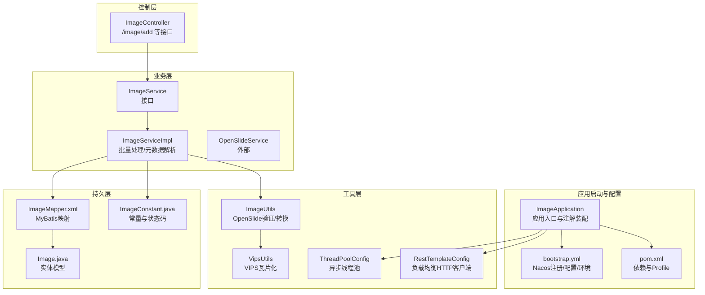
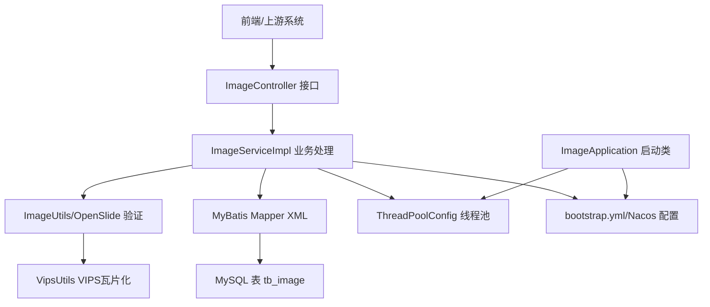
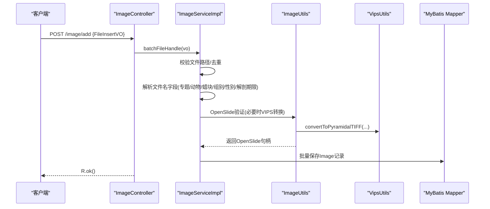
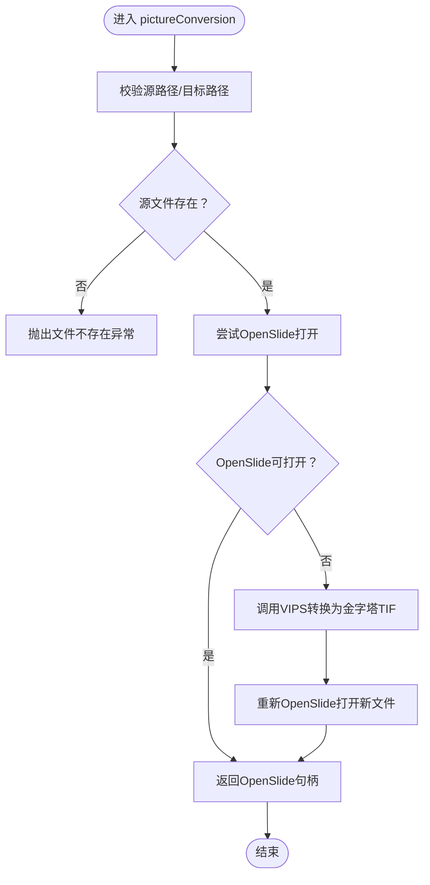
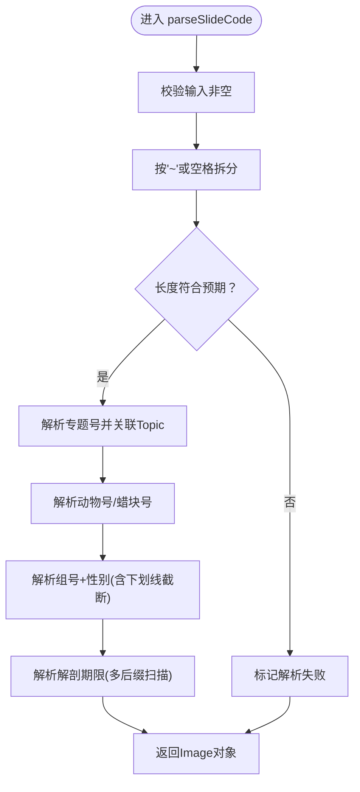
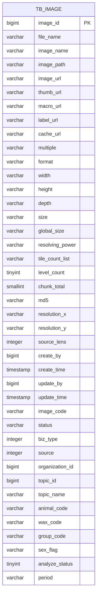
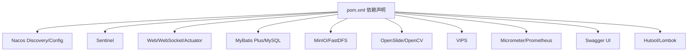

# 项目概述

<cite>
**本文档引用的文件**
- [README.md](file://README.md)
- [pom.xml](file://pom.xml)
- [bootstrap.yml](file://src/main/resources/bootstrap.yml)
- [ImageApplication.java](file://src/main/java/cn/staitech/ImageApplication.java)
- [ImageController.java](file://src/main/java/cn/staitech/file/controller/ImageController.java)
- [ImageService.java](file://src/main/java/cn/staitech/file/service/ImageService.java)
- [ImageServiceImpl.java](file://src/main/java/cn/staitech/file/service/impl/ImageServiceImpl.java)
- [ImageUtils.java](file://src/main/java/cn/staitech/file/util/ImageUtils.java)
- [VipsUtils.java](file://src/main/java/cn/staitech/file/util/VipsUtils.java)
- [ThreadPoolConfig.java](file://src/main/java/cn/staitech/file/config/ThreadPoolConfig.java)
- [RestTemplateConfig.java](file://src/main/java/cn/staitech/file/config/RestTemplateConfig.java)
- [ImageConstant.java](file://src/main/java/cn/staitech/file/constant/ImageConstant.java)
- [Image.java](file://src/main/java/cn/staitech/file/domain/Image.java)
- [ImageMapper.xml](file://src/main/resources/mapper/ImageMapper.xml)
</cite>

## 目录
1. [引言](#引言)
2. [项目结构](#项目结构)
3. [核心组件](#核心组件)
4. [架构总览](#架构总览)
5. [详细组件分析](#详细组件分析)
6. [依赖关系分析](#依赖关系分析)
7. [性能考量](#性能考量)
8. [故障排查指南](#故障排查指南)
9. [结论](#结论)
10. [附录](#附录)

## 引言
本项目是 PACMVS 医学数字切片图像处理微服务，面向病理学数字切片的采集、解析、元数据提取与多分辨率金字塔瓦片化处理。项目采用 Spring Boot 与 Spring Cloud Alibaba 技术栈，结合 Nacos 服务注册与配置、Sentinel 流控、OpenSlide 原始切片解析、VIPS 转换与瓦片化、MyBatis Plus 数据持久化等能力，构建高可用、可扩展的医学影像处理流水线。

项目在医学影像处理领域的应用价值体现在：
- 将多厂商格式（SVS、NDPI、TIF、SCN 等）统一解析为标准瓦片金字塔，支撑远程阅片与 AI 分析。
- 通过文件名规则解析专题号、动物号、蜡块号、组别与性别等元数据，建立结构化索引。
- 提供缩略图、宏图、标签图与缓存缩略图的多层级路径管理，满足前端交互与标注需求。
- 通过异步线程池与任务重试机制，保障大规模切片批处理的稳定性与吞吐。

## 项目结构
项目采用基于模块的分层组织方式，核心层次如下：
- 启动与配置：应用入口、引导配置、环境与注册中心接入
- 控制层：REST 接口定义与请求编排
- 业务层：文件信息入库、批量导入、元数据解析与状态管理
- 工具层：OpenSlide 验证与转换、VIPS 瓦片化、路径与文件工具
- 配置层：线程池、HTTP 客户端、定时调度等基础设施
- 持久层：MyBatis Mapper XML 映射与实体模型

图表来源
- [ImageApplication.java:1-53](file://src/main/java/cn/staitech/ImageApplication.java#L1-L53)
- [bootstrap.yml:1-37](file://src/main/resources/bootstrap.yml#L1-L37)
- [pom.xml:1-385](file://pom.xml#L1-L385)
- [ImageController.java:1-72](file://src/main/java/cn/staitech/file/controller/ImageController.java#L1-L72)
- [ImageService.java:1-24](file://src/main/java/cn/staitech/file/service/ImageService.java#L1-L24)
- [ImageServiceImpl.java:1-548](file://src/main/java/cn/staitech/file/service/impl/ImageServiceImpl.java#L1-L548)
- [ImageUtils.java:1-148](file://src/main/java/cn/staitech/file/util/ImageUtils.java#L1-L148)
- [VipsUtils.java:1-37](file://src/main/java/cn/staitech/file/util/VipsUtils.java#L1-L37)
- [ThreadPoolConfig.java:1-66](file://src/main/java/cn/staitech/file/config/ThreadPoolConfig.java#L1-L66)
- [RestTemplateConfig.java:1-51](file://src/main/java/cn/staitech/file/config/RestTemplateConfig.java#L1-L51)
- [ImageMapper.xml:1-65](file://src/main/resources/mapper/ImageMapper.xml#L1-L65)
- [Image.java:1-216](file://src/main/java/cn/staitech/file/domain/Image.java#L1-L216)
- [ImageConstant.java:1-67](file://src/main/java/cn/staitech/file/constant/ImageConstant.java#L1-L67)

章节来源
- [README.md:1-11](file://README.md#L1-L11)
- [pom.xml:1-385](file://pom.xml#L1-L385)
- [bootstrap.yml:1-37](file://src/main/resources/bootstrap.yml#L1-L37)

## 核心组件
- 应用入口与装配
  - 通过注解启用服务发现、Feign 客户端、定时任务、WebSocket、事务管理、Elasticsearch 仓库与 Micrometer 指标等能力。
  - 排除 Seata 自动配置，适配当前架构。
- 控制器
  - 提供“服务器选片”、“重新解析失败切片”、“检查失败切片”、“查询原始切片”等接口，统一编排业务流程。
- 服务层
  - ImageService 定义批量处理与文件信息上传能力；ImageServiceImpl 实现文件校验、去重、元数据解析、路径生成与入库。
- 工具层
  - ImageUtils：OpenSlide 验证与必要时的 VIPS 转换；VipsUtils：调用 vips 可执行程序生成金字塔 TIF。
- 配置层
  - ThreadPoolConfig：为 OpenSlide 与 Python 脚本处理分别提供线程池，含拒绝策略。
  - RestTemplateConfig：启用负载均衡的 HTTP 客户端，统一 JSON 转换。
- 持久层
  - MyBatis Mapper XML 映射 tb_image 表；实体 Image 定义完整字段集；ImageConstant 统一状态码与常量。

章节来源
- [ImageApplication.java:27-36](file://src/main/java/cn/staitech/ImageApplication.java#L27-L36)
- [ImageController.java:30-71](file://src/main/java/cn/staitech/file/controller/ImageController.java#L30-L71)
- [ImageService.java:17-23](file://src/main/java/cn/staitech/file/service/ImageService.java#L17-L23)
- [ImageServiceImpl.java:63-140](file://src/main/java/cn/staitech/file/service/impl/ImageServiceImpl.java#L63-L140)
- [ImageUtils.java:52-97](file://src/main/java/cn/staitech/file/util/ImageUtils.java#L52-L97)
- [VipsUtils.java:22-35](file://src/main/java/cn/staitech/file/util/VipsUtils.java#L22-L35)
- [ThreadPoolConfig.java:18-39](file://src/main/java/cn/staitech/file/config/ThreadPoolConfig.java#L18-L39)
- [RestTemplateConfig.java:24-48](file://src/main/java/cn/staitech/file/config/RestTemplateConfig.java#L24-L48)
- [ImageMapper.xml:4-46](file://src/main/resources/mapper/ImageMapper.xml#L4-L46)
- [Image.java:26-216](file://src/main/java/cn/staitech/file/domain/Image.java#L26-L216)
- [ImageConstant.java:20-67](file://src/main/java/cn/staitech/file/constant/ImageConstant.java#L20-L67)

## 架构总览
系统采用微服务架构，围绕“原始切片解析服务”为核心，结合 Nacos 注册与配置中心、Sentinel 流控、OpenSlide 解析、VIPS 瓦片化、异步线程池与持久化，形成端到端的处理链路。

图表来源
- [ImageController.java:30-71](file://src/main/java/cn/staitech/file/controller/ImageController.java#L30-L71)
- [ImageServiceImpl.java:63-140](file://src/main/java/cn/staitech/file/service/impl/ImageServiceImpl.java#L63-L140)
- [ImageUtils.java:52-97](file://src/main/java/cn/staitech/file/util/ImageUtils.java#L52-L97)
- [VipsUtils.java:22-35](file://src/main/java/cn/staitech/file/util/VipsUtils.java#L22-L35)
- [ImageMapper.xml:4-46](file://src/main/resources/mapper/ImageMapper.xml#L4-L46)
- [ImageApplication.java:27-36](file://src/main/java/cn/staitech/ImageApplication.java#L27-L36)
- [bootstrap.yml:16-37](file://src/main/resources/bootstrap.yml#L16-L37)
- [ThreadPoolConfig.java:18-39](file://src/main/java/cn/staitech/file/config/ThreadPoolConfig.java#L18-L39)

## 详细组件分析

### 组件A：服务器选片与批量处理流程
该流程负责接收“服务器选片”请求，批量校验文件、去重、解析元数据并生成缩略图/宏图/标签图等路径，随后触发 OpenSlide 处理与瓦片化。

图表来源
- [ImageController.java:42-48](file://src/main/java/cn/staitech/file/controller/ImageController.java#L42-L48)
- [ImageServiceImpl.java:63-140](file://src/main/java/cn/staitech/file/service/impl/ImageServiceImpl.java#L63-L140)
- [ImageUtils.java:52-97](file://src/main/java/cn/staitech/file/util/ImageUtils.java#L52-L97)
- [VipsUtils.java:22-35](file://src/main/java/cn/staitech/file/util/VipsUtils.java#L22-L35)
- [ImageMapper.xml:4-46](file://src/main/resources/mapper/ImageMapper.xml#L4-L46)

章节来源
- [ImageController.java:30-71](file://src/main/java/cn/staitech/file/controller/ImageController.java#L30-L71)
- [ImageServiceImpl.java:63-140](file://src/main/java/cn/staitech/file/service/impl/ImageServiceImpl.java#L63-L140)

### 组件B：OpenSlide 验证与 VIPS 转换
当 OpenSlide 无法直接解析原始切片时，自动触发 VIPS 将非金字塔格式转换为金字塔 TIF，确保后续瓦片化与多分辨率渲染。

图表来源
- [ImageUtils.java:52-97](file://src/main/java/cn/staitech/file/util/ImageUtils.java#L52-L97)
- [VipsUtils.java:22-35](file://src/main/java/cn/staitech/file/util/VipsUtils.java#L22-L35)

章节来源
- [ImageUtils.java:52-97](file://src/main/java/cn/staitech/file/util/ImageUtils.java#L52-L97)
- [VipsUtils.java:22-35](file://src/main/java/cn/staitech/file/util/VipsUtils.java#L22-L35)

### 组件C：文件名元数据解析算法
系统支持两种文件名解析模式：紧凑“~”分隔与空格分隔，均解析出专题号、动物号、蜡块号、组别与性别、解剖期限等字段，并维护解析状态。

图表来源
- [ImageServiceImpl.java:421-484](file://src/main/java/cn/staitech/file/service/impl/ImageServiceImpl.java#L421-L484)

章节来源
- [ImageServiceImpl.java:421-484](file://src/main/java/cn/staitech/file/service/impl/ImageServiceImpl.java#L421-L484)

### 组件D：实体与数据模型
Image 实体覆盖切片路径、缩略图/宏图/标签图/缓存缩略图 URL、分辨率、层级数、瓦片总数、MD5、组织与专题关联、状态与来源、元数据等字段，配合 Mapper XML 完整映射 tb_image。

图表来源
- [ImageMapper.xml:4-46](file://src/main/resources/mapper/ImageMapper.xml#L4-L46)
- [Image.java:26-216](file://src/main/java/cn/staitech/file/domain/Image.java#L26-L216)

章节来源
- [ImageMapper.xml:4-46](file://src/main/resources/mapper/ImageMapper.xml#L4-L46)
- [Image.java:26-216](file://src/main/java/cn/staitech/file/domain/Image.java#L26-L216)

## 依赖关系分析
- 技术栈概览
  - Spring Boot、Spring Cloud、Spring Cloud Alibaba（Nacos、Sentinel）
  - MyBatis Plus、MySQL Connector
  - OpenSlide、OpenCV、VIPS（通过系统依赖与本地库）
  - Redisson、MinIO/FastDFS（对象存储/文件存储）
  - Micrometer + Prometheus、Swagger UI
- 项目依赖与 Profile
  - 通过 Maven Profile 切换 Nacos 命名空间、地址与分组，适配 dev/test/prod 环境。
  - 资源打包策略保留本地 lib 下二进制依赖，确保 OpenSlide/Opencv 等本地库生效。

图表来源
- [pom.xml:23-205](file://pom.xml#L23-L205)
- [pom.xml:349-384](file://pom.xml#L349-L384)

章节来源
- [pom.xml:23-205](file://pom.xml#L23-L205)
- [bootstrap.yml:16-37](file://src/main/resources/bootstrap.yml#L16-L37)

## 性能考量
- 异步并发
  - OpenSlide 与 Python 脚本分别配置独立线程池，线程数与队列容量按 CPU 核心数动态调整，拒绝策略采用调用者线程执行兜底，避免任务丢失。
- I/O 与存储
  - 通过生成多层级路径（缩略图/宏图/标签/缓存）与金字塔瓦片化，降低前端渲染压力；文件路径按组织 ID 与专题组织，便于横向扩展。
- 解析健壮性
  - OpenSlide 验证失败时自动触发 VIPS 转换，保证后续处理可用；解析失败时记录状态并支持重解析。
- 指标与可观测性
  - 注册 Micrometer 指标并绑定 Prometheus，结合 Actuator 提升运行时可观测性。

章节来源
- [ThreadPoolConfig.java:18-39](file://src/main/java/cn/staitech/file/config/ThreadPoolConfig.java#L18-L39)
- [ImageUtils.java:52-97](file://src/main/java/cn/staitech/file/util/ImageUtils.java#L52-L97)
- [ImageServiceImpl.java:421-484](file://src/main/java/cn/staitech/file/service/impl/ImageServiceImpl.java#L421-L484)
- [ImageApplication.java:47-50](file://src/main/java/cn/staitech/ImageApplication.java#L47-L50)

## 故障排查指南
- OpenSlide 解析失败
  - 现象：levelCount 不大于 0 或异常
  - 处理：自动触发 VIPS 转换；确认 vips 可执行命令可用；检查源文件完整性
- 文件名解析失败
  - 现象：analyzeStatus=0
  - 处理：检查文件名格式是否符合“~”或空格分隔规则；确认专题号存在且与组织匹配
- 重复文件入库
  - 现象：相同 imagePath 已存在
  - 处理：服务端已做去重；若需重试，使用“重新解析失败数据”接口
- 线程池拒绝任务
  - 现象：日志出现任务被拒绝
  - 处理：检查队列容量与线程数配置；评估任务规模与资源限制
- 环境与注册问题
  - 现象：无法连接 Nacos 或读取配置
  - 处理：核对 bootstrap.yml 中 serverAddr、namespace、group 与 Profile

章节来源
- [ImageUtils.java:52-97](file://src/main/java/cn/staitech/file/util/ImageUtils.java#L52-L97)
- [ImageServiceImpl.java:98-122](file://src/main/java/cn/staitech/file/service/impl/ImageServiceImpl.java#L98-L122)
- [ImageController.java:50-63](file://src/main/java/cn/staitech/file/controller/ImageController.java#L50-L63)
- [ThreadPoolConfig.java:28-38](file://src/main/java/cn/staitech/file/config/ThreadPoolConfig.java#L28-L38)
- [bootstrap.yml:16-37](file://src/main/resources/bootstrap.yml#L16-L37)

## 结论
本项目以“原始切片解析服务”为核心，结合 OpenSlide、VIPS、异步线程池与结构化元数据解析，构建了面向 PACMVS 的医学数字切片处理微服务。通过 Spring Boot 与 Spring Cloud Alibaba 的现代化微服务能力，实现了高可用、可扩展、可观测的病理学数字切片处理流水线，为远程阅片与 AI 分析提供了坚实基础。

## 附录
- 实际应用场景示例
  - 批量导入多格式原始切片，自动生成多分辨率瓦片与缩略图，支持前端分页浏览与标注。
  - 基于文件名规则自动抽取实验元数据，建立组织-专题-样本的结构化索引，提升检索效率。
  - 对无法直接解析的切片自动转换为金字塔格式，保障后续处理一致性。
- 关键接口参考
  - POST /image/add：服务器选片
  - POST /image/reparse：重新解析失败数据
  - GET /image/checkFailImage：检查是否存在解析失败的切片
  - GET /image/getImage/{id}：查询原始切片详情

章节来源
- [ImageController.java:30-71](file://src/main/java/cn/staitech/file/controller/ImageController.java#L30-L71)